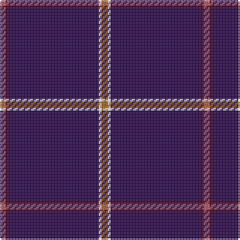

**Bands:** [RBBWR](/stripes/rbbwr/) · **Stripes:** [O DR DP W O](/stripes/stripes5/) O DR DP W O

This was sourced from register-of-tartans.  It is a [5 band tartan](/bands/bands5/).

Original link https://www.tartanregister.gov.uk/tartanDetails.aspx?ref=10522

## Register references

External register numbers recorded for this tartan.

- Scottish Register of Tartans: [10522](https://www.tartanregister.gov.uk/tartanDetails.aspx?ref=10522)

## Thread count
LT/4 DR2 DB60 W2 T/4

## Palette
Each colour and its ΔE from the base-6 reference it is a variant of.

| Colour | Shade | Base | ΔE (OKLab) |
|---|---|---|---|
| DB | <code style="background-color:#2A074B;">#2A074B</code> `#2A074B` | B <code style="background-color:#2A418A;">#2A418A</code> | 0.17 |
| DR | <code style="background-color:#530014;">#530014</code> `#530014` | B <code style="background-color:#2A418A;">#2A418A</code> | 0.23 |
| LT | <code style="background-color:#AE566C;">#AE566C</code> `#AE566C` | R <code style="background-color:#CC0000;">#CC0000</code> | 0.13 |
| T | <code style="background-color:#A46216;">#A46216</code> `#A46216` | R <code style="background-color:#CC0000;">#CC0000</code> | 0.14 |
| W | <code style="background-color:#FFFFFF;">#FFFFFF</code> `#FFFFFF` | W <code style="background-color:#F7F7F7;">#F7F7F7</code> | 0.02 |

# Sample pattern

## Nearest tartans

The nearest existing variants by ΔTartan distance.

1. [Wedding (Fashion)](/setts/s5/r2dp30w1lo2r1~x2/) — ΔT 1.20
1. [Easton (2014)](/setts/s7/lb3db2w1db50ly1db2r3~x2/) — ΔT 1.72
1. [MacLaine of Lochbuie, hunting](/setts/s5/db32r3db4k1ly3~x2/) — ΔT 1.77
1. [Easton (2014)](/setts/s7/r3db2ly1db50w1db2t3~x2/) — ΔT 1.77
1. [Wylie](/setts/s6/db45ly3db10o4k1w2~x2/) — ΔT 1.85
1. [Coogan (Personal)](/setts/s6/ly2db66r16w2r1w1~x2/) — ΔT 1.90
1. [Cairngorms National Park](/setts/s8/dp57m5dp2m8lb2dp3ly2dp14~x2/) — ΔT 1.95
1. [Inverness, Duke of York](/setts/s8/db122r11w4r15ly4db6ly4db30/) — ΔT 1.97
1. [Balmer (Personal)](/setts/s6/ly2r5ly2r5db49w2~x2/) — ΔT 1.99
1. [Carolina University, Western](/setts/s5/dg1k2dp27k2ly1~x2/) — ΔT 1.99

## Neighbour map

Every grey dot is one of 14313 variants placed by the first two principal components of the ΔTartan feature space (44% of its variance). Red is this tartan; blue dots are its nearest — click one to open its page.

<svg viewBox="0 0 640 380" role="img" style="max-width:100%;height:auto;border:1px solid #e0e0e0;border-radius:4px;display:block" xmlns="http://www.w3.org/2000/svg"><image href="/nn/cloud.v1.png" width="640" height="380"/><a href="/setts/s5/r2dp30w1lo2r1~x2/"><circle cx="590.0" cy="129.7" r="4" fill="#3465a4"><title>Wedding (Fashion)</title></circle></a><a href="/setts/s7/lb3db2w1db50ly1db2r3~x2/"><circle cx="626.0" cy="99.6" r="4" fill="#3465a4"><title>Easton (2014)</title></circle></a><a href="/setts/s5/db32r3db4k1ly3~x2/"><circle cx="597.6" cy="164.6" r="4" fill="#3465a4"><title>MacLaine of Lochbuie, hunting</title></circle></a><a href="/setts/s7/r3db2ly1db50w1db2t3~x2/"><circle cx="626.0" cy="109.1" r="4" fill="#3465a4"><title>Easton (2014)</title></circle></a><a href="/setts/s6/db45ly3db10o4k1w2~x2/"><circle cx="594.0" cy="124.3" r="4" fill="#3465a4"><title>Wylie</title></circle></a><a href="/setts/s6/ly2db66r16w2r1w1~x2/"><circle cx="542.7" cy="123.3" r="4" fill="#3465a4"><title>Coogan (Personal)</title></circle></a><a href="/setts/s8/dp57m5dp2m8lb2dp3ly2dp14~x2/"><circle cx="615.3" cy="146.3" r="4" fill="#3465a4"><title>Cairngorms National Park</title></circle></a><a href="/setts/s8/db122r11w4r15ly4db6ly4db30/"><circle cx="576.6" cy="138.1" r="4" fill="#3465a4"><title>Inverness, Duke of York</title></circle></a><a href="/setts/s6/ly2r5ly2r5db49w2~x2/"><circle cx="509.0" cy="140.8" r="4" fill="#3465a4"><title>Balmer (Personal)</title></circle></a><a href="/setts/s5/dg1k2dp27k2ly1~x2/"><circle cx="623.9" cy="161.2" r="4" fill="#3465a4"><title>Carolina University, Western</title></circle></a><circle cx="594.1" cy="143.2" r="5" fill="#c00000"/></svg>

ID: /setts/s5/o2dr1dp30w1o2~x2/
