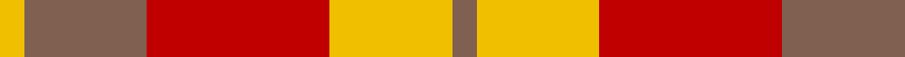
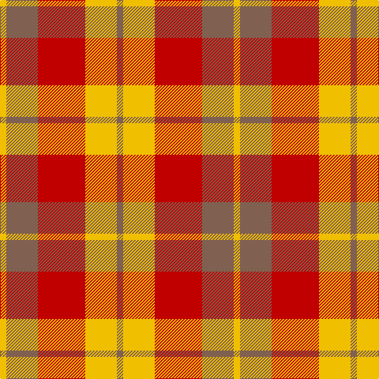

This page is one **sett** — a single exact thread-count. It belongs to the [tartan](/tartans/o2ly10r15o10ly2/)
(the same proportion at any scale), whose colour order is pattern [RYRRY](/stripes/ryrry/).

Sourced from weddslist.  It is a [5 stripe tartan](/stripes/stripes5/).

Original link http://www.weddslist.com/cgi-bin/tartans/pg.pl?source=sts

## Thread count
Y/8 LT40 R60 Y40 LT/8

## Palette

Palette: <strong>custom</strong>
<table><thead><tr><th>Colour</th><th>Threads</th><th>Shade</th><th>Base</th><th>OKLCh</th></tr></thead><tbody><tr><td>Y/</td><td style="text-align:right;font-variant-numeric:tabular-nums">8</td><td><code style="background-color:#F0C000;">#F0C000</code> <small style="color:#888">#F0C000</small></td><td>Y <code style="background-color:#F2BF00;">#F2BF00</code></td><td><small style="color:#888">oklch(82.7% 0.169 90.5)</small></td></tr><tr><td>LT</td><td style="text-align:right;font-variant-numeric:tabular-nums">40</td><td><code style="background-color:#806050;">#806050</code> <small style="color:#888">#806050</small></td><td>R <code style="background-color:#CC0000;">#CC0000</code></td><td><small style="color:#888">oklch(51.7% 0.049 47.8)</small></td></tr><tr><td>R</td><td style="text-align:right;font-variant-numeric:tabular-nums">60</td><td><code style="background-color:#C00000;">#C00000</code> <small style="color:#888">#C00000</small></td><td>R <code style="background-color:#CC0000;">#CC0000</code></td><td><small style="color:#888">oklch(50.7% 0.208 29.2)</small></td></tr><tr><td>Y</td><td style="text-align:right;font-variant-numeric:tabular-nums">40</td><td><code style="background-color:#F0C000;">#F0C000</code> <small style="color:#888">#F0C000</small></td><td>Y <code style="background-color:#F2BF00;">#F2BF00</code></td><td><small style="color:#888">oklch(82.7% 0.169 90.5)</small></td></tr><tr><td>LT/</td><td style="text-align:right;font-variant-numeric:tabular-nums">8</td><td><code style="background-color:#806050;">#806050</code> <small style="color:#888">#806050</small></td><td>R <code style="background-color:#CC0000;">#CC0000</code></td><td><small style="color:#888">oklch(51.7% 0.049 47.8)</small></td></tr></tbody></table>

# Sample pattern

## Nearest tartans

The nearest existing variants by ΔTartan distance, with this tartan at the top so the swatches line up against it.

ΔTartan

Tartan

Sett

—

<a href="/ttd/edit/#slug=o2ly10r15o10ly2~x4">Harmony, 9</a> <a class="nn-out" href="/setts/s5/o2ly10r15o10ly2~x4/" title="open its dictionary page">↗</a>

0.90

<a href="/ttd/edit/#slug=dy2ly10r15dy10ly2~x4">Harmony 9</a> <a class="nn-out" href="/setts/s5/dy2ly10r15dy10ly2~x4/" title="open its dictionary page">↗</a>

1.09

<a href="/ttd/edit/#slug=ly21r8r14ly6r3r10~x2">Kozlosky (Personal)</a> <a class="nn-out" href="/setts/s6/ly21r8r14ly6r3r10~x2/" title="open its dictionary page">↗</a>

1.12

<a href="/ttd/edit/#slug=ly42r15r28ly12r6r20">Kozlosky, Kilt</a> <a class="nn-out" href="/setts/s6/ly42r15r28ly12r6r20/" title="open its dictionary page">↗</a>

1.45

<a href="/ttd/edit/#slug=r1r7r4g7r1g1~x4">MacNab, Variant</a> <a class="nn-out" href="/setts/s6/r1r7r4g7r1g1~x4/" title="open its dictionary page">↗</a>

1.48

<a href="/ttd/edit/#slug=w1r5o5ly1~x4">Manx, Mannin Plaid</a> <a class="nn-out" href="/setts/s4/w1r5o5ly1~x4/" title="open its dictionary page">↗</a>

1.59

<a href="/ttd/edit/#slug=w1r5dy5ly1~x4">Manx Mannin Plaid</a> <a class="nn-out" href="/setts/s4/w1r5dy5ly1~x4/" title="open its dictionary page">↗</a>

1.63

<a href="/ttd/edit/#slug=g1m1g7m4r7m1~x4">MacNab #2</a> <a class="nn-out" href="/setts/s6/g1m1g7m4r7m1~x4/" title="open its dictionary page">↗</a>

1.63

<a href="/ttd/edit/#slug=lo36do15lo9r31lo5do4r16~x2">Manhattan Ethnic</a> <a class="nn-out" href="/setts/s7/lo36do15lo9r31lo5do4r16~x2/" title="open its dictionary page">↗</a>

1.63

<a href="/ttd/edit/#slug=r4ly1r3ly1ly8ly2~x4">Buchele Check (Fashion?)</a> <a class="nn-out" href="/setts/s6/r4ly1r3ly1ly8ly2~x4/" title="open its dictionary page">↗</a>

1.66

<a href="/ttd/edit/#slug=r24n5o9n2o9lb9~x4">Plaid Wine</a> <a class="nn-out" href="/setts/s6/r24n5o9n2o9lb9~x4/" title="open its dictionary page">↗</a>

## Neighbour map

Every grey dot is one of 14299 variants placed by the first two principal components of the ΔTartan feature space (44% of its variance). Red is this tartan; blue dots are its nearest — click one to open its page.

<svg viewBox="0 0 640 380" role="img" style="max-width:100%;height:auto;border:1px solid #e0e0e0;border-radius:4px;display:block" xmlns="http://www.w3.org/2000/svg"><image href="/nn/cloud.v1.png" width="640" height="380"/><a href="/setts/s5/dy2ly10r15dy10ly2~x4/"><circle cx="211.7" cy="235.2" r="4" fill="#3465a4"><title>Harmony 9</title></circle></a><a href="/setts/s6/ly21r8r14ly6r3r10~x2/"><circle cx="249.9" cy="245.8" r="4" fill="#3465a4"><title>Kozlosky (Personal)</title></circle></a><a href="/setts/s6/ly42r15r28ly12r6r20/"><circle cx="248.3" cy="241.8" r="4" fill="#3465a4"><title>Kozlosky, Kilt</title></circle></a><a href="/setts/s6/r1r7r4g7r1g1~x4/"><circle cx="251.9" cy="248.2" r="4" fill="#3465a4"><title>MacNab, Variant</title></circle></a><a href="/setts/s4/w1r5o5ly1~x4/"><circle cx="242.4" cy="263.1" r="4" fill="#3465a4"><title>Manx, Mannin Plaid</title></circle></a><a href="/setts/s4/w1r5dy5ly1~x4/"><circle cx="210.4" cy="246.9" r="4" fill="#3465a4"><title>Manx Mannin Plaid</title></circle></a><a href="/setts/s6/g1m1g7m4r7m1~x4/"><circle cx="261.6" cy="251.4" r="4" fill="#3465a4"><title>MacNab #2</title></circle></a><a href="/setts/s7/lo36do15lo9r31lo5do4r16~x2/"><circle cx="245.0" cy="220.1" r="4" fill="#3465a4"><title>Manhattan Ethnic</title></circle></a><a href="/setts/s6/r4ly1r3ly1ly8ly2~x4/"><circle cx="260.5" cy="216.1" r="4" fill="#3465a4"><title>Buchele Check (Fashion?)</title></circle></a><a href="/setts/s6/r24n5o9n2o9lb9~x4/"><circle cx="234.3" cy="206.4" r="4" fill="#3465a4"><title>Plaid Wine</title></circle></a><circle cx="233.6" cy="245.9" r="5" fill="#c00000"/></svg>

ID: /setts/s5/o2ly10r15o10ly2~x4/
