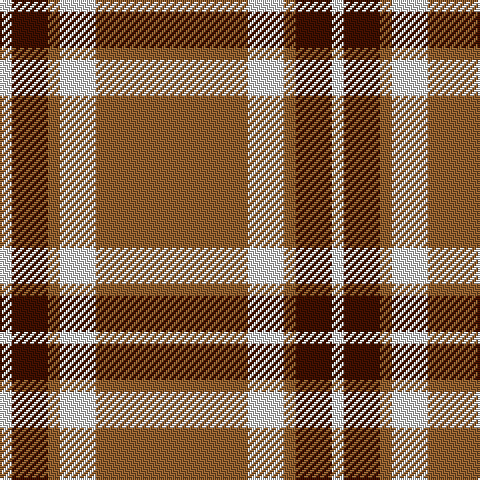

This page is one **sett** — a single exact thread-count. It belongs to the [tartan](/tartans/o38w9o3dr9w3/)
(the same proportion at any scale), whose colour order is pattern [RWRBW](/stripes/rwrbw/).

Sourced from weddslist.  It is a [5 stripe tartan](/stripes/stripes5/).

Original link http://www.weddslist.com/cgi-bin/tartans/pg.pl?source=sts

## Thread count
LT/76 LN18 LT6 DR18 LN/6

## Palette

Palette: <strong>Tartan Dictionary</strong> <small style="color:#888">(1 of 3 colours)</small>
<table><thead><tr><th>Colour</th><th>Threads</th><th>Shade</th><th>Base</th><th>OKLCh</th></tr></thead><tbody><tr><td>LT/</td><td style="text-align:right;font-variant-numeric:tabular-nums">76</td><td><code style="background-color:#906030;">#906030</code> <small style="color:#888">#906030</small></td><td>R <code style="background-color:#CC0000;">#CC0000</code></td><td><small style="color:#888">oklch(53.1% 0.089 63.7)</small></td></tr><tr><td>LN</td><td style="text-align:right;font-variant-numeric:tabular-nums">18</td><td><code style="background-color:#E0E0E0;">#E0E0E0</code> <small style="color:#888">#E0E0E0</small></td><td>W <code style="background-color:#F7F7F7;">#F7F7F7</code></td><td><small style="color:#888">oklch(90.7% 0.000 89.9)</small></td></tr><tr><td>LT</td><td style="text-align:right;font-variant-numeric:tabular-nums">6</td><td><code style="background-color:#906030;">#906030</code> <small style="color:#888">#906030</small></td><td>R <code style="background-color:#CC0000;">#CC0000</code></td><td><small style="color:#888">oklch(53.1% 0.089 63.7)</small></td></tr><tr><td>DR</td><td style="text-align:right;font-variant-numeric:tabular-nums">18</td><td><code style="background-color:#401000;">#401000</code> <small style="color:#888">#401000</small></td><td>B <code style="background-color:#2A418A;">#2A418A</code></td><td><small style="color:#888">oklch(25.3% 0.079 39.9)</small></td></tr><tr><td>LN/</td><td style="text-align:right;font-variant-numeric:tabular-nums">6</td><td><code style="background-color:#E0E0E0;">#E0E0E0</code> <small style="color:#888">#E0E0E0</small></td><td>W <code style="background-color:#F7F7F7;">#F7F7F7</code></td><td><small style="color:#888">oklch(90.7% 0.000 89.9)</small></td></tr></tbody></table>

# Sample pattern

## Nearest tartans

The nearest existing variants by ΔTartan distance, with this tartan at the top so the swatches line up against it.

ΔTartan

Tartan

Sett

—

<a href="/ttd/edit/#slug=o38w9o3dr9w3~x2">Loch Tummel</a> <a class="nn-out" href="/setts/s5/o38w9o3dr9w3~x2/" title="open its dictionary page">↗</a>

0.84

<a href="/ttd/edit/#slug=lo38w9lo3do9w3~x2">Loch Tummel Trade Tartan Tartan Number: 1751. Earliest known date: pre 2003 Nothing See products available Copyright © Blair Urquhart, Comrie, 2015</a> <a class="nn-out" href="/setts/s5/lo38w9lo3do9w3~x2/" title="open its dictionary page">↗</a>

1.19

<a href="/ttd/edit/#slug=w15dy15w15dy80r6">Coca Cola (Corporate)</a> <a class="nn-out" href="/setts/s5/w15dy15w15dy80r6/" title="open its dictionary page">↗</a>

1.27

<a href="/ttd/edit/#slug=w7dy7w7dy40r3~x2">Coca Cola</a> <a class="nn-out" href="/setts/s5/w7dy7w7dy40r3~x2/" title="open its dictionary page">↗</a>

1.27

<a href="/ttd/edit/#slug=g3lo3k10lo26k3lo3~x2">Volkswagen Orange Trim</a> <a class="nn-out" href="/setts/s6/g3lo3k10lo26k3lo3~x2/" title="open its dictionary page">↗</a>

1.27

<a href="/ttd/edit/#slug=lo26k10lo3g3lo3k3~x6">Volkswagen Orange Trim (Fashion)</a> <a class="nn-out" href="/setts/s6/lo26k10lo3g3lo3k3~x6/" title="open its dictionary page">↗</a>

1.28

<a href="/ttd/edit/#slug=dy38w9dy3k9w3~x2">Loch Tummel</a> <a class="nn-out" href="/setts/s5/dy38w9dy3k9w3~x2/" title="open its dictionary page">↗</a>

1.34

<a href="/ttd/edit/#slug=r6w2r30g12r3g12r3~x2">Crawford</a> <a class="nn-out" href="/setts/s7/r6w2r30g12r3g12r3~x2/" title="open its dictionary page">↗</a>

1.43

<a href="/ttd/edit/#slug=r13lb3r1dg3lb1~x6">Glen Shiel (Fashion)</a> <a class="nn-out" href="/setts/s5/r13lb3r1dg3lb1~x6/" title="open its dictionary page">↗</a>

1.55

<a href="/ttd/edit/#slug=ly5n1ly1n12r1~x8">Ceredigion (Personal)</a> <a class="nn-out" href="/setts/s5/ly5n1ly1n12r1~x8/" title="open its dictionary page">↗</a>

1.56

<a href="/ttd/edit/#slug=r2g6r2g6r16ly1~x2">Cameron</a> <a class="nn-out" href="/setts/s6/r2g6r2g6r16ly1~x2/" title="open its dictionary page">↗</a>

## Neighbour map

Every grey dot is one of 14359 variants placed by the first two principal components of the ΔTartan feature space (44% of its variance). Red is this tartan; blue dots are its nearest — click one to open its page.

<svg viewBox="0 0 640 380" role="img" style="max-width:100%;height:auto;border:1px solid #e0e0e0;border-radius:4px;display:block" xmlns="http://www.w3.org/2000/svg"><image href="/nn/cloud.v1.png" width="640" height="380"/><a href="/setts/s5/lo38w9lo3do9w3~x2/"><circle cx="407.9" cy="200.6" r="4" fill="#3465a4"><title>Loch Tummel Trade Tartan Tartan Number: 1751. Earliest known date: pre 2003 Nothing See products available Copyright © Blair Urquhart, Comrie, 2015</title></circle></a><a href="/setts/s5/w15dy15w15dy80r6/"><circle cx="444.0" cy="198.2" r="4" fill="#3465a4"><title>Coca Cola (Corporate)</title></circle></a><a href="/setts/s5/w7dy7w7dy40r3~x2/"><circle cx="454.2" cy="197.0" r="4" fill="#3465a4"><title>Coca Cola</title></circle></a><a href="/setts/s6/g3lo3k10lo26k3lo3~x2/"><circle cx="385.3" cy="196.1" r="4" fill="#3465a4"><title>Volkswagen Orange Trim</title></circle></a><a href="/setts/s6/lo26k10lo3g3lo3k3~x6/"><circle cx="385.3" cy="196.1" r="4" fill="#3465a4"><title>Volkswagen Orange Trim (Fashion)</title></circle></a><a href="/setts/s5/dy38w9dy3k9w3~x2/"><circle cx="381.5" cy="193.6" r="4" fill="#3465a4"><title>Loch Tummel</title></circle></a><a href="/setts/s7/r6w2r30g12r3g12r3~x2/"><circle cx="409.9" cy="198.7" r="4" fill="#3465a4"><title>Crawford</title></circle></a><a href="/setts/s5/r13lb3r1dg3lb1~x6/"><circle cx="417.0" cy="193.1" r="4" fill="#3465a4"><title>Glen Shiel (Fashion)</title></circle></a><a href="/setts/s5/ly5n1ly1n12r1~x8/"><circle cx="432.6" cy="219.4" r="4" fill="#3465a4"><title>Ceredigion (Personal)</title></circle></a><a href="/setts/s6/r2g6r2g6r16ly1~x2/"><circle cx="415.5" cy="201.3" r="4" fill="#3465a4"><title>Cameron</title></circle></a><circle cx="406.8" cy="198.7" r="5" fill="#c00000"/></svg>

ID: /setts/s5/o38w9o3dr9w3~x2/
