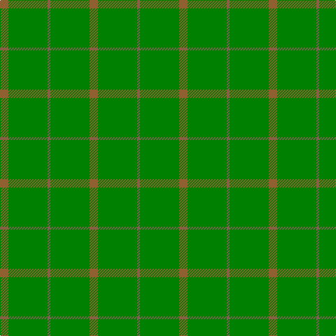

This page is one **sett** — a single exact thread-count. It belongs to the [tartan](/tartans/lt3g14lta1g14lt3/)
(the same proportion at any scale), whose colour order is pattern [RGRGR](/stripes/rgrgr/).

Sourced from weddslist.  It is a [5 stripe tartan](/stripes/stripes5/).

Original link http://www.weddslist.com/cgi-bin/tartans/pg.pl?source=sts

## Thread count
LT/12 G56 LTa4 G56 LT/12

## Palette
Each colour and the base-6 reference it is a variant of.

| Colour | Shade | Base |
|---|---|---|
| G | <code style="background-color:#008000;">#008000</code> `oklch(52.0% 0.177 142.5)` <small>#008000</small> | G <code style="background-color:#006100;">#006100</code> |
| LT | <code style="background-color:#906030;">#906030</code> `oklch(53.1% 0.089 63.7)` <small>#906030</small> | R <code style="background-color:#CC0000;">#CC0000</code> |
| LTa | <code style="background-color:#806050;">#806050</code> `oklch(51.7% 0.049 47.8)` <small>#806050</small> | R <code style="background-color:#CC0000;">#CC0000</code> |

# Sample pattern

## Nearest tartans

The nearest existing variants by ΔTartan distance, with this tartan at the top so the swatches line up against it.

ΔTartan

Tartan

Sett

—

<a href="/ttd/edit/#slug=o3g14o1g14o3~x4">Pearson</a> <a class="nn-out" href="/setts/s5/o3g14o1g14o3~x4/" title="open its dictionary page">↗</a>

1.52

<a href="/ttd/edit/#slug=lo3g14dy1g14lo3~x4">Pearson Family Tartan Tartan Number: 1734. Earliest known date: 1951 Nothing See products available Copyright © Blair Urquhart, Comrie, 2015</a> <a class="nn-out" href="/setts/s5/lo3g14dy1g14lo3~x4/" title="open its dictionary page">↗</a>

2.15

<a href="/ttd/edit/#slug=g2dy2g15dy1w1g15dy2g2~x2">Bannockbane Hunting Trade Tartan Tartan Number: 909. Earliest known date: c.1984 Nothing See products available Copyright © Blair Urquhart, Comrie, 2015</a> <a class="nn-out" href="/setts/s8/g2dy2g15dy1w1g15dy2g2~x2/" title="open its dictionary page">↗</a>

2.38

<a href="/ttd/edit/#slug=g2o2g15o1w1g15o2g2~x2">Bannockbane, hunting</a> <a class="nn-out" href="/setts/s8/g2o2g15o1w1g15o2g2~x2/" title="open its dictionary page">↗</a>

2.69

<a href="/ttd/edit/#slug=g13dy3g1do3dy1~x6">Glen Boig</a> <a class="nn-out" href="/setts/s5/g13dy3g1do3dy1~x6/" title="open its dictionary page">↗</a>

2.97

<a href="/ttd/edit/#slug=g18r6g75db6g13dy35g12db6">Glenlivet Corporate Tartan Tartan Number: 193. Earliest known date: 1989 Designed for Glenlivet Distilleries Ltd, Strathspey. See products available Copyright © Blair Urquhart, Comrie, 2015</a> <a class="nn-out" href="/setts/s8/g18r6g75db6g13dy35g12db6/" title="open its dictionary page">↗</a>

2.97

<a href="/ttd/edit/#slug=dg22k3dg25k4~x2">Campbell Simpson</a> <a class="nn-out" href="/setts/s4/dg22k3dg25k4~x2/" title="open its dictionary page">↗</a>

3.15

<a href="/ttd/edit/#slug=g40dg15g4dg4g4~x2">Celtic 2009 (Sports)</a> <a class="nn-out" href="/setts/s5/g40dg15g4dg4g4~x2/" title="open its dictionary page">↗</a>

3.16

<a href="/ttd/edit/#slug=y72k8y4dy16y7o2~x2">MacAndrew Hunting (Name)</a> <a class="nn-out" href="/setts/s6/y72k8y4dy16y7o2~x2/" title="open its dictionary page">↗</a>

3.16

<a href="/ttd/edit/#slug=g3lo1g3r1g14dg2g3dg1g3g1g2g1g2g2~x4">New South Wales</a> <a class="nn-out" href="/setts/s14/g3lo1g3r1g14dg2g3dg1g3g1g2g1g2g2~x4/" title="open its dictionary page">↗</a>

3.17

<a href="/ttd/edit/#slug=dg18r6dg75db6dg13dy35dg12db6">Gayre Bodyguard</a> <a class="nn-out" href="/setts/s8/dg18r6dg75db6dg13dy35dg12db6/" title="open its dictionary page">↗</a>

## Neighbour map

Every grey dot is one of 14299 variants placed by the first two principal components of the ΔTartan feature space (44% of its variance). Red is this tartan; blue dots are its nearest — click one to open its page.

<svg viewBox="0 0 640 380" role="img" style="max-width:100%;height:auto;border:1px solid #e0e0e0;border-radius:4px;display:block" xmlns="http://www.w3.org/2000/svg"><image href="/nn/cloud.v1.png" width="640" height="380"/><a href="/setts/s5/lo3g14dy1g14lo3~x4/"><circle cx="609.2" cy="298.2" r="4" fill="#3465a4"><title>Pearson Family Tartan Tartan Number: 1734. Earliest known date: 1951 Nothing See products available Copyright © Blair Urquhart, Comrie, 2015</title></circle></a><a href="/setts/s8/g2dy2g15dy1w1g15dy2g2~x2/"><circle cx="626.0" cy="258.6" r="4" fill="#3465a4"><title>Bannockbane Hunting Trade Tartan Tartan Number: 909. Earliest known date: c.1984 Nothing See products available Copyright © Blair Urquhart, Comrie, 2015</title></circle></a><a href="/setts/s8/g2o2g15o1w1g15o2g2~x2/"><circle cx="626.0" cy="249.1" r="4" fill="#3465a4"><title>Bannockbane, hunting</title></circle></a><a href="/setts/s5/g13dy3g1do3dy1~x6/"><circle cx="568.5" cy="307.0" r="4" fill="#3465a4"><title>Glen Boig</title></circle></a><a href="/setts/s8/g18r6g75db6g13dy35g12db6/"><circle cx="498.3" cy="244.0" r="4" fill="#3465a4"><title>Glenlivet Corporate Tartan Tartan Number: 193. Earliest known date: 1989 Designed for Glenlivet Distilleries Ltd, Strathspey. See products available Copyright © Blair Urquhart, Comrie, 2015</title></circle></a><a href="/setts/s4/dg22k3dg25k4~x2/"><circle cx="626.0" cy="362.6" r="4" fill="#3465a4"><title>Campbell Simpson</title></circle></a><a href="/setts/s5/g40dg15g4dg4g4~x2/"><circle cx="487.9" cy="307.2" r="4" fill="#3465a4"><title>Celtic 2009 (Sports)</title></circle></a><a href="/setts/s6/y72k8y4dy16y7o2~x2/"><circle cx="626.0" cy="208.7" r="4" fill="#3465a4"><title>MacAndrew Hunting (Name)</title></circle></a><a href="/setts/s14/g3lo1g3r1g14dg2g3dg1g3g1g2g1g2g2~x4/"><circle cx="554.0" cy="209.3" r="4" fill="#3465a4"><title>New South Wales</title></circle></a><a href="/setts/s8/dg18r6dg75db6dg13dy35dg12db6/"><circle cx="541.2" cy="270.1" r="4" fill="#3465a4"><title>Gayre Bodyguard</title></circle></a><circle cx="626.0" cy="316.7" r="5" fill="#c00000"/></svg>

ID: /setts/s5/o3g14o1g14o3~x4/
