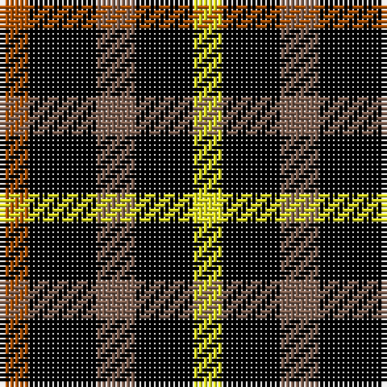

In pattern [RKRKY](/stripes/rkrky/).

This was sourced from weddslist.  It is a [5 stripe tartan](/stripes/stripes5/).

Original link http://www.weddslist.com/cgi-bin/tartans/pg.pl?source=sts

## Thread count
DO/6 K14 LT8 K12 Y/6

## Palette
Each colour and the base-6 reference it is a variant of.

| Colour | Shade | Base |
|---|---|---|
| DO | <code style="background-color:#B05000;">#B05000</code> `oklch(54.4% 0.145 49.4)` <small>#B05000</small> | R <code style="background-color:#CC0000;">#CC0000</code> |
| K | <code style="background-color:#000000;">#000000</code> `oklch(0.0% 0.000 0.0)` <small>#000000</small> | K <code style="background-color:#000000;">#000000</code> |
| LT | <code style="background-color:#806050;">#806050</code> `oklch(51.7% 0.049 47.8)` <small>#806050</small> | R <code style="background-color:#CC0000;">#CC0000</code> |
| Y | <code style="background-color:#F0F020;">#F0F020</code> `oklch(92.5% 0.196 109.7)` <small>#F0F020</small> | Y <code style="background-color:#F2BF00;">#F2BF00</code> |

# Sample pattern

## Nearest tartans

The nearest existing variants by ΔTartan distance.

1. [Daks, Black (Fashion)](/setts/s5/r3k6dy4k6ly3~x2/) — ΔT 1.06
1. [Wilson's, No 94](/setts/s3/k5g4r2~x2/) — ΔT 1.76
1. [Glen Lyon](/setts/s3/k6g5r2~x2/) — ΔT 1.85
1. [Zwijnenberg, Frans (Personal)](/setts/s3/k23g8lo8~x4/) — ΔT 1.90
1. [Boxer Beauty](/setts/s7/k13dy28lo13dy28k18w18k13~x2/) — ΔT 1.93
1. [Glen Lyon, or Mull (No.53)](/setts/s3/k5g3t2~x2/) — ΔT 2.02
1. [Daks (Black)](/setts/s5/r3k6dy4k6y3~x2/) — ΔT 2.09
1. [Zwijnenberg, Frans (Personal)](/setts/s3/k23g8ly8~x4/) — ΔT 2.12
1. [Wilson's No.113](/setts/s6/g3dp3w1dp3g3r1~x4/) — ΔT 2.13
1. [MacDuff](/setts/s7/r10db6k8g10r6g3r6~x2/) — ΔT 2.15

## Neighbour map

Every grey dot is one of 14299 variants placed by the first two principal components of the ΔTartan feature space (44% of its variance). Red is this tartan; blue dots are its nearest — click one to open its page.

<svg viewBox="0 0 640 380" role="img" style="max-width:100%;height:auto;border:1px solid #e0e0e0;border-radius:4px;display:block" xmlns="http://www.w3.org/2000/svg"><image href="/nn/cloud.v1.png" width="640" height="380"/><a href="/setts/s5/r3k6dy4k6ly3~x2/"><circle cx="147.0" cy="327.0" r="4" fill="#3465a4"><title>Daks, Black (Fashion)</title></circle></a><a href="/setts/s3/k5g4r2~x2/"><circle cx="148.0" cy="354.0" r="4" fill="#3465a4"><title>Wilson's, No 94</title></circle></a><a href="/setts/s3/k6g5r2~x2/"><circle cx="168.7" cy="341.6" r="4" fill="#3465a4"><title>Glen Lyon</title></circle></a><a href="/setts/s3/k23g8lo8~x4/"><circle cx="241.6" cy="323.3" r="4" fill="#3465a4"><title>Zwijnenberg, Frans (Personal)</title></circle></a><a href="/setts/s7/k13dy28lo13dy28k18w18k13~x2/"><circle cx="83.8" cy="297.5" r="4" fill="#3465a4"><title>Boxer Beauty</title></circle></a><a href="/setts/s3/k5g3t2~x2/"><circle cx="165.0" cy="354.5" r="4" fill="#3465a4"><title>Glen Lyon, or Mull (No.53)</title></circle></a><a href="/setts/s5/r3k6dy4k6y3~x2/"><circle cx="184.9" cy="348.2" r="4" fill="#3465a4"><title>Daks (Black)</title></circle></a><a href="/setts/s3/k23g8ly8~x4/"><circle cx="241.4" cy="319.0" r="4" fill="#3465a4"><title>Zwijnenberg, Frans (Personal)</title></circle></a><a href="/setts/s6/g3dp3w1dp3g3r1~x4/"><circle cx="148.9" cy="296.7" r="4" fill="#3465a4"><title>Wilson's No.113</title></circle></a><a href="/setts/s7/r10db6k8g10r6g3r6~x2/"><circle cx="115.7" cy="283.1" r="4" fill="#3465a4"><title>MacDuff</title></circle></a><circle cx="153.0" cy="310.8" r="5" fill="#c00000"/></svg>

ID: /setts/s5/o3k7o4k6ly3~x2/
