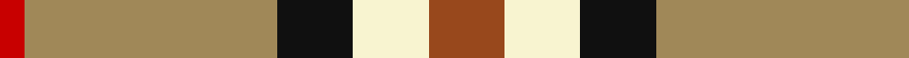

**Bands:** [RYKWR](/stripes/rykwr/) · **Stripes:** [R LO K W O](/stripes/stripes5/) R LO K W O

This was sourced from register-of-tartans.  It is a [5 band tartan](/bands/bands5/).

Original link https://www.tartanregister.gov.uk/tartanDetails.aspx?ref=441

## Register references

External register numbers recorded for this tartan.

- Scottish Register of Tartans: [441](https://www.tartanregister.gov.uk/tartanDetails.aspx?ref=441)
- Scottish Tartans Authority (ITI): 7049

## Thread count
T/18 LYa18 K18 LT60 R/6

## Palette
Each colour and its ΔE from the base-6 reference it is a variant of.

| Colour | Shade | Base | ΔE (OKLab) |
|---|---|---|---|
| DO | <code style="background-color:#B84C00;">#B84C00</code> `#B84C00` | R <code style="background-color:#CC0000;">#CC0000</code> | 0.08 |
| DR | <code style="background-color:#880000;">#880000</code> `#880000` | R <code style="background-color:#CC0000;">#CC0000</code> | 0.15 |
| K | <code style="background-color:#101010;">#101010</code> `#101010` | K <code style="background-color:#000000;">#000000</code> | 0.17 |
| LT | <code style="background-color:#A08858;">#A08858</code> `#A08858` | Y <code style="background-color:#F2BF00;">#F2BF00</code> | 0.21 |
| LY | <code style="background-color:#F8F4D0;">#F8F4D0</code> `#F8F4D0` | W <code style="background-color:#F7F7F7;">#F7F7F7</code> | 0.05 |
| LYa | <code style="background-color:#F8F4D0;">#F8F4D0</code> `#F8F4D0` | W <code style="background-color:#F7F7F7;">#F7F7F7</code> | 0.05 |
| N | <code style="background-color:#C0C0C0;">#C0C0C0</code> `#C0C0C0` | W <code style="background-color:#F7F7F7;">#F7F7F7</code> | 0.17 |
| R | <code style="background-color:#C80000;">#C80000</code> `#C80000` | R <code style="background-color:#CC0000;">#CC0000</code> | 0.01 |
| T | <code style="background-color:#98481C;">#98481C</code> `#98481C` | R <code style="background-color:#CC0000;">#CC0000</code> | 0.11 |

# Sample pattern

## Nearest tartans

The nearest existing variants by ΔTartan distance.

1. [Samye](/setts/s5/ly25r10g10db11w2~x2/) — ΔT 1.10
1. [MacKintosh Dress (Dance)](/setts/s6/r3w33dp8dg18r9g3~x2/) — ΔT 1.16
1. [Sachie Hara Scottish Check (Personal)](/setts/s5/k5db4g24r21w3~x2/) — ΔT 1.22
1. [S.I.D.E. (Corporate)](/setts/s5/ly15r9t30w3db4~x2/) — ΔT 1.25
1. [Rose White Dress](/setts/s6/r24n4k4g4w13k2~x4/) — ΔT 1.27
1. [Burberry Check Corporate Tartan Tartan Number: 1239. Earliest known date: 1984 Nothing See products available Copyright © Blair Urquhart, Comrie, 2015](/setts/s5/k6w6k6lo21r2~x4/) — ΔT 1.28
1. [Burberry (Genuine)](/setts/s5/k3w3k3ly10r1~x6/) — ΔT 1.30
1. [ChuMac (Personal)](/setts/s5/g15ly3r3dp8w2~x6/) — ΔT 1.30
1. [Prince of Orange](/setts/s5/db6lo25o16k2db3~x2/) — ΔT 1.32
1. [Ikelman No 2](/setts/s5/y26k10r10ly10y3~x2/) — ΔT 1.33

## Neighbour map

Every grey dot is one of 14299 variants placed by the first two principal components of the ΔTartan feature space (44% of its variance). Red is this tartan; blue dots are its nearest — click one to open its page.

<svg viewBox="0 0 640 380" role="img" style="max-width:100%;height:auto;border:1px solid #e0e0e0;border-radius:4px;display:block" xmlns="http://www.w3.org/2000/svg"><image href="/nn/cloud.v1.png" width="640" height="380"/><a href="/setts/s5/ly25r10g10db11w2~x2/"><circle cx="159.8" cy="183.6" r="4" fill="#3465a4"><title>Samye</title></circle></a><a href="/setts/s6/r3w33dp8dg18r9g3~x2/"><circle cx="176.2" cy="158.0" r="4" fill="#3465a4"><title>MacKintosh Dress (Dance)</title></circle></a><a href="/setts/s5/k5db4g24r21w3~x2/"><circle cx="194.2" cy="201.6" r="4" fill="#3465a4"><title>Sachie Hara Scottish Check (Personal)</title></circle></a><a href="/setts/s5/ly15r9t30w3db4~x2/"><circle cx="230.9" cy="192.9" r="4" fill="#3465a4"><title>S.I.D.E. (Corporate)</title></circle></a><a href="/setts/s6/r24n4k4g4w13k2~x4/"><circle cx="202.2" cy="151.4" r="4" fill="#3465a4"><title>Rose White Dress</title></circle></a><a href="/setts/s5/k6w6k6lo21r2~x4/"><circle cx="244.9" cy="197.7" r="4" fill="#3465a4"><title>Burberry Check Corporate Tartan Tartan Number: 1239. Earliest known date: 1984 Nothing See products available Copyright © Blair Urquhart, Comrie, 2015</title></circle></a><a href="/setts/s5/k3w3k3ly10r1~x6/"><circle cx="223.6" cy="194.8" r="4" fill="#3465a4"><title>Burberry (Genuine)</title></circle></a><a href="/setts/s5/g15ly3r3dp8w2~x6/"><circle cx="205.8" cy="210.4" r="4" fill="#3465a4"><title>ChuMac (Personal)</title></circle></a><a href="/setts/s5/db6lo25o16k2db3~x2/"><circle cx="266.5" cy="189.1" r="4" fill="#3465a4"><title>Prince of Orange</title></circle></a><a href="/setts/s5/y26k10r10ly10y3~x2/"><circle cx="200.0" cy="215.3" r="4" fill="#3465a4"><title>Ikelman No 2</title></circle></a><circle cx="212.7" cy="186.2" r="5" fill="#c00000"/></svg>

ID: /setts/s5/o3w3k3lo10r1~x6/
