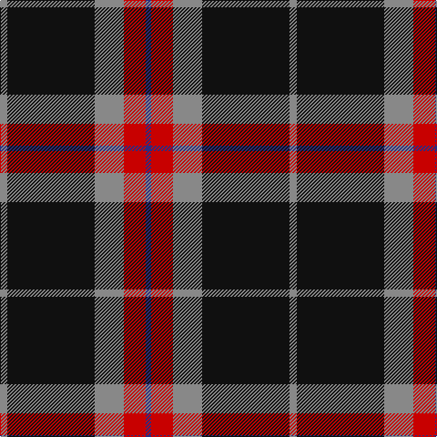

In pattern [BRRKR](/stripes/brrkr/).

This was sourced from tartans-authority.  It is a [5 stripe tartan](/stripes/stripes5/).

Original link http://www.tartansauthority.com/tartan-ferret/display/10484/

## Thread count
N/8 K96 N32 R24 DB/6

## Palette
Each colour and the base-6 reference it is a variant of.

| Colour | Shade | Base |
|---|---|---|
| DB | <code style="background-color:#2C2C80;">#2C2C80</code> `oklch(35.0% 0.138 276.6)` <small>#2C2C80</small> | B <code style="background-color:#2A418A;">#2A418A</code> |
| K | <code style="background-color:#101010;">#101010</code> `oklch(17.3% 0.000 89.9)` <small>#101010</small> | K <code style="background-color:#000000;">#000000</code> |
| N | <code style="background-color:#888888;">#888888</code> `oklch(62.7% 0.000 89.9)` <small>#888888</small> | R <code style="background-color:#CC0000;">#CC0000</code> |
| R | <code style="background-color:#C80000;">#C80000</code> `oklch(52.3% 0.215 29.2)` <small>#C80000</small> | R <code style="background-color:#CC0000;">#CC0000</code> |

# Sample pattern

## Nearest tartans

The nearest existing variants by ΔTartan distance.

1. [Calgary Firefighters](/setts/s5/y4k48y16r12b3~x2/) — ΔT 0.24
1. [Kelley Oliphint (Commemorative)](/setts/s5/k3w2n27k31lr3~x2/) — ΔT 0.85
1. [Phantom (Corporate)](/setts/s7/w3dr10k38o11dr6k2w3~x2/) — ΔT 0.95
1. [Kelley Oliphint](/setts/s5/k3w2n27k31p3~x2/) — ΔT 1.07
1. [Perry, Alex (Personal)](/setts/s4/k62n24lo5w8~x2/) — ΔT 1.11
1. [MacShimsi](/setts/s5/r11r5g5k40ly3~x2/) — ΔT 1.12
1. [Perry (2014)](/setts/s5/k31r12ly2n5k2~x4/) — ΔT 1.18
1. [Bro-Wened](/setts/s6/k43r10w3k3w15db3~x2/) — ΔT 1.19
1. [Ikelman No 4](/setts/s7/r10k15g2k2w1k1w1~x4/) — ΔT 1.20
1. [Dunfermline Athletic (2008) (Corp)](/setts/s7/k11w1k1w1k4o8r1~x8/) — ΔT 1.21

## Neighbour map

Every grey dot is one of 14299 variants placed by the first two principal components of the ΔTartan feature space (44% of its variance). Red is this tartan; blue dots are its nearest — click one to open its page.

<svg viewBox="0 0 640 380" role="img" style="max-width:100%;height:auto;border:1px solid #e0e0e0;border-radius:4px;display:block" xmlns="http://www.w3.org/2000/svg"><image href="/nn/cloud.v1.png" width="640" height="380"/><a href="/setts/s5/y4k48y16r12b3~x2/"><circle cx="342.5" cy="192.8" r="4" fill="#3465a4"><title>Calgary Firefighters</title></circle></a><a href="/setts/s5/k3w2n27k31lr3~x2/"><circle cx="328.9" cy="199.6" r="4" fill="#3465a4"><title>Kelley Oliphint (Commemorative)</title></circle></a><a href="/setts/s7/w3dr10k38o11dr6k2w3~x2/"><circle cx="314.8" cy="156.8" r="4" fill="#3465a4"><title>Phantom (Corporate)</title></circle></a><a href="/setts/s5/k3w2n27k31p3~x2/"><circle cx="341.1" cy="206.8" r="4" fill="#3465a4"><title>Kelley Oliphint</title></circle></a><a href="/setts/s4/k62n24lo5w8~x2/"><circle cx="342.7" cy="212.0" r="4" fill="#3465a4"><title>Perry, Alex (Personal)</title></circle></a><a href="/setts/s5/r11r5g5k40ly3~x2/"><circle cx="349.7" cy="179.4" r="4" fill="#3465a4"><title>MacShimsi</title></circle></a><a href="/setts/s5/k31r12ly2n5k2~x4/"><circle cx="401.2" cy="201.9" r="4" fill="#3465a4"><title>Perry (2014)</title></circle></a><a href="/setts/s6/k43r10w3k3w15db3~x2/"><circle cx="317.2" cy="162.1" r="4" fill="#3465a4"><title>Bro-Wened</title></circle></a><a href="/setts/s7/r10k15g2k2w1k1w1~x4/"><circle cx="318.1" cy="158.8" r="4" fill="#3465a4"><title>Ikelman No 4</title></circle></a><a href="/setts/s7/k11w1k1w1k4o8r1~x8/"><circle cx="311.8" cy="182.6" r="4" fill="#3465a4"><title>Dunfermline Athletic (2008) (Corp)</title></circle></a><circle cx="336.1" cy="188.8" r="5" fill="#c00000"/></svg>

ID: /setts/s5/o4k48o16r12db3~x2/
