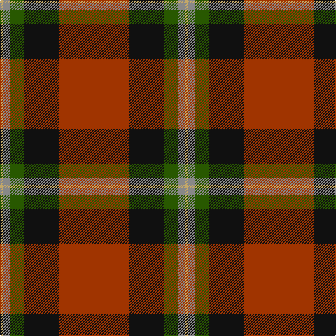

**Bands:** [RKGRY](/stripes/rkgry/) · **Stripes:** [O K DG O LY](/stripes/stripes5/) O K DG O LY

This was sourced from register-of-tartans.  It is a [5 band tartan](/bands/bands5/).

Original link https://www.tartanregister.gov.uk/tartanDetails.aspx?ref=10289

## Register references

External register numbers recorded for this tartan.

- Scottish Register of Tartans: [10289](https://www.tartanregister.gov.uk/tartanDetails.aspx?ref=10289)

## Thread count
LG/4 N10 G20 K50 R/100

## Palette
Each colour and its ΔE from the base-6 reference it is a variant of.

| Colour | Shade | Base | ΔE (OKLab) |
|---|---|---|---|
| G | <code style="background-color:#285800;">#285800</code> `#285800` | G <code style="background-color:#006100;">#006100</code> | 0.03 |
| K | <code style="background-color:#101010;">#101010</code> `#101010` | K <code style="background-color:#000000;">#000000</code> | 0.17 |
| LG | <code style="background-color:#C4A868;">#C4A868</code> `#C4A868` | Y <code style="background-color:#F2BF00;">#F2BF00</code> | 0.12 |
| N | <code style="background-color:#888888;">#888888</code> `#888888` | R <code style="background-color:#CC0000;">#CC0000</code> | 0.24 |
| R | <code style="background-color:#A03400;">#A03400</code> `#A03400` | R <code style="background-color:#CC0000;">#CC0000</code> | 0.09 |

# Sample pattern

## Nearest tartans

The nearest existing variants by ΔTartan distance.

1. [MacPhail](/setts/s6/r25db7r3g13t1k2~x4/) — ΔT 0.89
1. [MacPhail (Blue Bands)](/setts/s6/r40b8r6g24t1k4~x2/) — ΔT 1.13
1. [MacGleish Formal (Personal)](/setts/s5/r50k25g10o5ly2~x2/) — ΔT 1.14
1. [Jardine](/setts/s5/dr18o9y9r1t1~x4/) — ΔT 1.16
1. [MacDuff](/setts/s7/r96db16dg34g48r18k6r9/) — ΔT 1.20
1. [MacPhail](/setts/s6/r25k7r3g13y1k2~x4/) — ΔT 1.22
1. [Plummer (Personal)](/setts/s6/r100k15g48db5r7db16~x2/) — ΔT 1.27
1. [MacLeay (Clan)](/setts/s7/r27g4k4g4k4db6lo1~x4/) — ΔT 1.29
1. [Leach (1995)](/setts/s9/r24lb1k3lb1g14r8k3dp3lb2~x4/) — ΔT 1.29
1. [MacAulay](/setts/s6/k2r16dg6r3dg8lr1~x2/) — ΔT 1.31

## Neighbour map

Every grey dot is one of 14313 variants placed by the first two principal components of the ΔTartan feature space (44% of its variance). Red is this tartan; blue dots are its nearest — click one to open its page.

<svg viewBox="0 0 640 380" role="img" style="max-width:100%;height:auto;border:1px solid #e0e0e0;border-radius:4px;display:block" xmlns="http://www.w3.org/2000/svg"><image href="/nn/cloud.v1.png" width="640" height="380"/><a href="/setts/s6/r25db7r3g13t1k2~x4/"><circle cx="328.7" cy="142.7" r="4" fill="#3465a4"><title>MacPhail</title></circle></a><a href="/setts/s6/r40b8r6g24t1k4~x2/"><circle cx="364.7" cy="130.6" r="4" fill="#3465a4"><title>MacPhail (Blue Bands)</title></circle></a><a href="/setts/s5/r50k25g10o5ly2~x2/"><circle cx="322.5" cy="146.4" r="4" fill="#3465a4"><title>MacGleish Formal (Personal)</title></circle></a><a href="/setts/s5/dr18o9y9r1t1~x4/"><circle cx="287.3" cy="192.0" r="4" fill="#3465a4"><title>Jardine</title></circle></a><a href="/setts/s7/r96db16dg34g48r18k6r9/"><circle cx="293.9" cy="159.5" r="4" fill="#3465a4"><title>MacDuff</title></circle></a><a href="/setts/s6/r25k7r3g13y1k2~x4/"><circle cx="351.9" cy="158.3" r="4" fill="#3465a4"><title>MacPhail</title></circle></a><a href="/setts/s6/r100k15g48db5r7db16~x2/"><circle cx="356.6" cy="163.5" r="4" fill="#3465a4"><title>Plummer (Personal)</title></circle></a><a href="/setts/s7/r27g4k4g4k4db6lo1~x4/"><circle cx="326.2" cy="120.6" r="4" fill="#3465a4"><title>MacLeay (Clan)</title></circle></a><a href="/setts/s9/r24lb1k3lb1g14r8k3dp3lb2~x4/"><circle cx="330.9" cy="129.6" r="4" fill="#3465a4"><title>Leach (1995)</title></circle></a><a href="/setts/s6/k2r16dg6r3dg8lr1~x2/"><circle cx="343.3" cy="197.7" r="4" fill="#3465a4"><title>MacAulay</title></circle></a><circle cx="342.1" cy="164.9" r="5" fill="#c00000"/></svg>

ID: /setts/s5/o50k25dg10o5ly2~x2/
