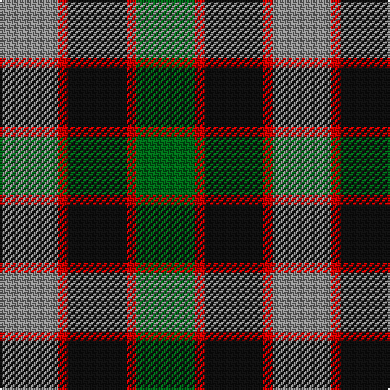

This page is one **sett** — a single exact thread-count. It belongs to the [tartan](/tartans/n6r1k6r1g6/)
(the same proportion at any scale), whose colour order is pattern [GRKRR](/stripes/grkrr/).

Sourced from register-of-tartans.  It is a [5 stripe tartan](/stripes/stripes5/).

Original link https://www.tartanregister.gov.uk/tartanDetails.aspx?ref=4127

## Also known as

This cloth is also recorded under:

- Timespan,

3 attestations — the source records this cloth was collapsed from (oldest owns this page)

<ul>
<li>01/01/2002 — Timespan (register-of-tartans, <a href="https://www.tartanregister.gov.uk/tartanDetails.aspx?ref=4127">record</a>)</li>
<li>pre 2002 — Timespan (Corporate) (tartans-authority, <a href="http://www.tartansauthority.com/tartan-ferret/display/1002/">record</a>)</li>
<li>undated — Timespan (MacKay) Corporate Tartan Tartan Number: 1002. Earliest known date: 1989 Based on MacKay of Strathnaver for 'Timespan Heritage Centre' at Helmsdale See products available Copyright © Blair Urquhart, Comrie, 2015 (house-of-tartan, <a href="http://www.house-of-tartan.scotland.net/house/TartanViewjs.asp?colr=Def&tnam=1002">record</a>)</li>
</ul>

## Register references

External register numbers recorded for this tartan.

- Scottish Register of Tartans: [4127](https://www.tartanregister.gov.uk/tartanDetails.aspx?ref=4127)
- Scottish Tartans Authority (ITI): 1002
- Scottish Tartans World Register: 1002

## Thread count
N/36 R6 K36 R6 G/36

## Palette
Each colour and the base-6 reference it is a variant of.

| Colour | Shade | Base |
|---|---|---|
| G | <code style="background-color:#006818;">#006818</code> `oklch(45.0% 0.142 145.0)` <small>#006818</small> | G <code style="background-color:#006100;">#006100</code> |
| K | <code style="background-color:#101010;">#101010</code> `oklch(17.3% 0.000 89.9)` <small>#101010</small> | K <code style="background-color:#000000;">#000000</code> |
| N | <code style="background-color:#888888;">#888888</code> `oklch(62.7% 0.000 89.9)` <small>#888888</small> | R <code style="background-color:#CC0000;">#CC0000</code> |
| R | <code style="background-color:#C80000;">#C80000</code> `oklch(52.3% 0.215 29.2)` <small>#C80000</small> | R <code style="background-color:#CC0000;">#CC0000</code> |

# Sample pattern

## Nearest tartans

The nearest existing variants by ΔTartan distance, with this tartan at the top so the swatches line up against it.

ΔTartan

Tartan

Sett

—

<a href="/ttd/edit/#slug=o6r1k6r1g6~x6">Timespan</a> <a class="nn-out" href="/setts/s5/o6r1k6r1g6~x6/" title="open its dictionary page">↗</a>

0.91

<a href="/ttd/edit/#slug=y3dg6k6y4r1y1~x2">Waterloo</a> <a class="nn-out" href="/setts/s6/y3dg6k6y4r1y1~x2/" title="open its dictionary page">↗</a>

1.06

<a href="/ttd/edit/#slug=g4r3t1k1t3~x4">Wilson's, No 214</a> <a class="nn-out" href="/setts/s5/g4r3t1k1t3~x4/" title="open its dictionary page">↗</a>

1.07

<a href="/ttd/edit/#slug=y6r1k6r1g6~x6">Timespan, (MacKay)</a> <a class="nn-out" href="/setts/s5/y6r1k6r1g6~x6/" title="open its dictionary page">↗</a>

1.15

<a href="/ttd/edit/#slug=db2g4ly1db1r2~x12">Creek Indian Nation</a> <a class="nn-out" href="/setts/s5/db2g4ly1db1r2~x12/" title="open its dictionary page">↗</a>

1.15

<a href="/ttd/edit/#slug=r4g11k11g2n11ly3~x4">Casely (Name)</a> <a class="nn-out" href="/setts/s6/r4g11k11g2n11ly3~x4/" title="open its dictionary page">↗</a>

1.19

<a href="/ttd/edit/#slug=k3g14k14g2b14r3~x2">Morrison Society</a> <a class="nn-out" href="/setts/s6/k3g14k14g2b14r3~x2/" title="open its dictionary page">↗</a>

1.19

<a href="/ttd/edit/#slug=b10k3b10k14r2g14r5~x2">Fletcher of Dunans</a> <a class="nn-out" href="/setts/s7/b10k3b10k14r2g14r5~x2/" title="open its dictionary page">↗</a>

1.22

<a href="/ttd/edit/#slug=ly5g16k16db16k2db2~x2">Hudson Valley Reg. Police P &amp; D (Cor</a> <a class="nn-out" href="/setts/s6/ly5g16k16db16k2db2~x2/" title="open its dictionary page">↗</a>

1.22

<a href="/ttd/edit/#slug=k2g10t2k9dp8g2~x2">Lennie Family Tartan Tartan Number: 725. Earliest known date: 1819 Wilson's No 231. See products available Copyright © Blair Urquhart, Comrie, 2015</a> <a class="nn-out" href="/setts/s6/k2g10t2k9dp8g2~x2/" title="open its dictionary page">↗</a>

1.23

<a href="/ttd/edit/#slug=r1g7r3db7t1~x2">Hebridean 4</a> <a class="nn-out" href="/setts/s5/r1g7r3db7t1~x2/" title="open its dictionary page">↗</a>

## Neighbour map

Every grey dot is one of 14299 variants placed by the first two principal components of the ΔTartan feature space (44% of its variance). Red is this tartan; blue dots are its nearest — click one to open its page.

<svg viewBox="0 0 640 380" role="img" style="max-width:100%;height:auto;border:1px solid #e0e0e0;border-radius:4px;display:block" xmlns="http://www.w3.org/2000/svg"><image href="/nn/cloud.v1.png" width="640" height="380"/><a href="/setts/s6/y3dg6k6y4r1y1~x2/"><circle cx="157.5" cy="254.1" r="4" fill="#3465a4"><title>Waterloo</title></circle></a><a href="/setts/s5/g4r3t1k1t3~x4/"><circle cx="108.9" cy="276.0" r="4" fill="#3465a4"><title>Wilson's, No 214</title></circle></a><a href="/setts/s5/y6r1k6r1g6~x6/"><circle cx="101.8" cy="245.0" r="4" fill="#3465a4"><title>Timespan, (MacKay)</title></circle></a><a href="/setts/s5/db2g4ly1db1r2~x12/"><circle cx="144.5" cy="273.3" r="4" fill="#3465a4"><title>Creek Indian Nation</title></circle></a><a href="/setts/s6/r4g11k11g2n11ly3~x4/"><circle cx="98.5" cy="243.1" r="4" fill="#3465a4"><title>Casely (Name)</title></circle></a><a href="/setts/s6/k3g14k14g2b14r3~x2/"><circle cx="163.1" cy="247.3" r="4" fill="#3465a4"><title>Morrison Society</title></circle></a><a href="/setts/s7/b10k3b10k14r2g14r5~x2/"><circle cx="141.8" cy="250.5" r="4" fill="#3465a4"><title>Fletcher of Dunans</title></circle></a><a href="/setts/s6/ly5g16k16db16k2db2~x2/"><circle cx="151.5" cy="238.7" r="4" fill="#3465a4"><title>Hudson Valley Reg. Police P &amp; D (Cor</title></circle></a><a href="/setts/s6/k2g10t2k9dp8g2~x2/"><circle cx="165.7" cy="261.8" r="4" fill="#3465a4"><title>Lennie Family Tartan Tartan Number: 725. Earliest known date: 1819 Wilson's No 231. See products available Copyright © Blair Urquhart, Comrie, 2015</title></circle></a><a href="/setts/s5/r1g7r3db7t1~x2/"><circle cx="201.1" cy="250.4" r="4" fill="#3465a4"><title>Hebridean 4</title></circle></a><circle cx="129.5" cy="256.2" r="5" fill="#c00000"/></svg>

ID: /setts/s5/o6r1k6r1g6~x6/
