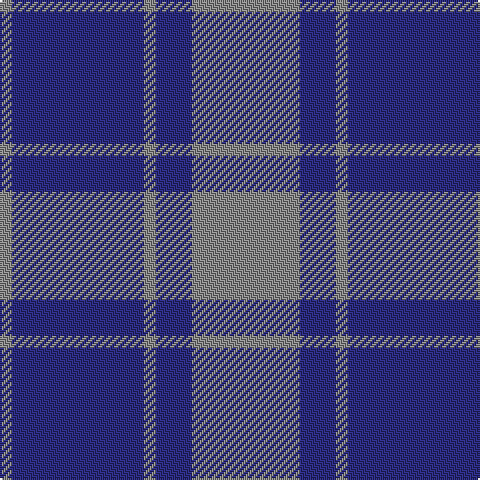

This page is one **sett** — a single exact thread-count. It belongs to the [tartan](/tartans/o9db3o1db11o1/)
(the same proportion at any scale), whose colour order is pattern [RBRBR](/stripes/rbrbr/).

Sourced from house-of-tartan.  It is a [5 stripe tartan](/stripes/stripes5/).

Original link http://www.house-of-tartan.scotland.net/house/TartanViewjs.asp?colr=Def&tnam=1279

## Thread count
N/54 DB18 N6 DB66 N/6

## Palette

Palette: <strong>Tartan Register</strong>
<table><thead><tr><th>Colour</th><th>Threads</th><th>Shade</th><th>Base</th><th>OKLCh</th></tr></thead><tbody><tr><td>N/</td><td style="text-align:right;font-variant-numeric:tabular-nums">54</td><td><code style="background-color:#888888;">#888888</code> <small style="color:#888">#888888</small></td><td>R <code style="background-color:#CC0000;">#CC0000</code></td><td><small style="color:#888">oklch(62.7% 0.000 89.9)</small></td></tr><tr><td>DB</td><td style="text-align:right;font-variant-numeric:tabular-nums">18</td><td><code style="background-color:#2C2C80;">#2C2C80</code> <small style="color:#888">#2C2C80</small></td><td>B <code style="background-color:#2A418A;">#2A418A</code></td><td><small style="color:#888">oklch(35.0% 0.138 276.6)</small></td></tr><tr><td>N</td><td style="text-align:right;font-variant-numeric:tabular-nums">6</td><td><code style="background-color:#888888;">#888888</code> <small style="color:#888">#888888</small></td><td>R <code style="background-color:#CC0000;">#CC0000</code></td><td><small style="color:#888">oklch(62.7% 0.000 89.9)</small></td></tr><tr><td>DB</td><td style="text-align:right;font-variant-numeric:tabular-nums">66</td><td><code style="background-color:#2C2C80;">#2C2C80</code> <small style="color:#888">#2C2C80</small></td><td>B <code style="background-color:#2A418A;">#2A418A</code></td><td><small style="color:#888">oklch(35.0% 0.138 276.6)</small></td></tr><tr><td>N/</td><td style="text-align:right;font-variant-numeric:tabular-nums">6</td><td><code style="background-color:#888888;">#888888</code> <small style="color:#888">#888888</small></td><td>R <code style="background-color:#CC0000;">#CC0000</code></td><td><small style="color:#888">oklch(62.7% 0.000 89.9)</small></td></tr></tbody></table>

# Sample pattern

## Nearest tartans

The nearest existing variants by ΔTartan distance, with this tartan at the top so the swatches line up against it.

ΔTartan

Tartan

Sett

—

<a href="/ttd/edit/#slug=o9db3o1db11o1~x6">MacCallum High School Corporate Tartan Tartan Number: 1279. Earliest known date: 0 From the J. Rutledge Collection, Belfast. MacCallum High School, Philadelphia See products available Copyright © Blair Urquhart, Comrie, 2015</a> <a class="nn-out" href="/setts/s5/o9db3o1db11o1~x6/" title="open its dictionary page">↗</a>

1.46

<a href="/ttd/edit/#slug=t9dt3t1dt12ly1~x4">North Sea Commission</a> <a class="nn-out" href="/setts/s5/t9dt3t1dt12ly1~x4/" title="open its dictionary page">↗</a>

1.50

<a href="/ttd/edit/#slug=db24n13db4n4w2~x2">Gallaecia - Galicia National</a> <a class="nn-out" href="/setts/s5/db24n13db4n4w2~x2/" title="open its dictionary page">↗</a>

1.61

<a href="/ttd/edit/#slug=db24t13db4t4w2~x2">Gallaecia (Unofficial) (District)</a> <a class="nn-out" href="/setts/s5/db24t13db4t4w2~x2/" title="open its dictionary page">↗</a>

1.64

<a href="/ttd/edit/#slug=db5t1db15t25db1t5~x4">Dram! (Corporate)</a> <a class="nn-out" href="/setts/s6/db5t1db15t25db1t5~x4/" title="open its dictionary page">↗</a>

1.72

<a href="/ttd/edit/#slug=y9db3y1db11y1~x6">MacCallum, High School</a> <a class="nn-out" href="/setts/s5/y9db3y1db11y1~x6/" title="open its dictionary page">↗</a>

1.74

<a href="/setts/s4/t8dg1r2~x20/">Gyle</a>

1.75

<a href="/ttd/edit/#slug=db13b1db3b6ly1b1~x4">Hepburn #2</a> <a class="nn-out" href="/setts/s6/db13b1db3b6ly1b1~x4/" title="open its dictionary page">↗</a>

1.76

<a href="/ttd/edit/#slug=g4db36lg6g16db16g3~x2">City of Kincardine</a> <a class="nn-out" href="/setts/s6/g4db36lg6g16db16g3~x2/" title="open its dictionary page">↗</a>

1.85

<a href="/ttd/edit/#slug=db2k11db5k1db5k1~x6">Gagetown (School)</a> <a class="nn-out" href="/setts/s6/db2k11db5k1db5k1~x6/" title="open its dictionary page">↗</a>

1.87

<a href="/ttd/edit/#slug=t50dr4t12dr23ly4dr4~x2">Sligo</a> <a class="nn-out" href="/setts/s6/t50dr4t12dr23ly4dr4~x2/" title="open its dictionary page">↗</a>

## Neighbour map

Every grey dot is one of 14359 variants placed by the first two principal components of the ΔTartan feature space (44% of its variance). Red is this tartan; blue dots are its nearest — click one to open its page.

<svg viewBox="0 0 640 380" role="img" style="max-width:100%;height:auto;border:1px solid #e0e0e0;border-radius:4px;display:block" xmlns="http://www.w3.org/2000/svg"><image href="/nn/cloud.v1.png" width="640" height="380"/><a href="/setts/s5/t9dt3t1dt12ly1~x4/"><circle cx="397.6" cy="252.7" r="4" fill="#3465a4"><title>North Sea Commission</title></circle></a><a href="/setts/s5/db24n13db4n4w2~x2/"><circle cx="397.1" cy="255.0" r="4" fill="#3465a4"><title>Gallaecia - Galicia National</title></circle></a><a href="/setts/s5/db24t13db4t4w2~x2/"><circle cx="365.4" cy="235.6" r="4" fill="#3465a4"><title>Gallaecia (Unofficial) (District)</title></circle></a><a href="/setts/s6/db5t1db15t25db1t5~x4/"><circle cx="467.1" cy="225.5" r="4" fill="#3465a4"><title>Dram! (Corporate)</title></circle></a><a href="/setts/s5/y9db3y1db11y1~x6/"><circle cx="449.5" cy="290.1" r="4" fill="#3465a4"><title>MacCallum, High School</title></circle></a><a href="/setts/s4/t8dg1r2~x20/"><circle cx="405.4" cy="256.1" r="4" fill="#3465a4"><title>Gyle</title></circle></a><a href="/setts/s6/db13b1db3b6ly1b1~x4/"><circle cx="424.0" cy="225.3" r="4" fill="#3465a4"><title>Hepburn #2</title></circle></a><a href="/setts/s6/g4db36lg6g16db16g3~x2/"><circle cx="410.3" cy="250.4" r="4" fill="#3465a4"><title>City of Kincardine</title></circle></a><a href="/setts/s6/db2k11db5k1db5k1~x6/"><circle cx="413.4" cy="281.2" r="4" fill="#3465a4"><title>Gagetown (School)</title></circle></a><a href="/setts/s6/t50dr4t12dr23ly4dr4~x2/"><circle cx="399.6" cy="207.6" r="4" fill="#3465a4"><title>Sligo</title></circle></a><circle cx="403.8" cy="265.5" r="5" fill="#c00000"/></svg>

ID: /setts/s5/o9db3o1db11o1~x6/
