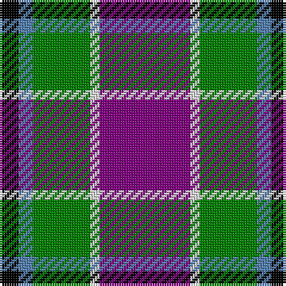

In pattern [BWGBK](/stripes/bwgbk/).

This was sourced from weddslist.  It is a [5 stripe tartan](/stripes/stripes5/).

Original link http://www.weddslist.com/cgi-bin/tartans/pg.pl?source=sts

## Thread count
P/38 LN4 G24 B6 K/8

## Palette
Each colour and the base-6 reference it is a variant of.

| Colour | Shade | Base |
|---|---|---|
| B | <code style="background-color:#5480B0;">#5480B0</code> `oklch(58.8% 0.089 251.5)` <small>#5480B0</small> | B <code style="background-color:#2A418A;">#2A418A</code> |
| G | <code style="background-color:#008000;">#008000</code> `oklch(52.0% 0.177 142.5)` <small>#008000</small> | G <code style="background-color:#006100;">#006100</code> |
| K | <code style="background-color:#000000;">#000000</code> `oklch(0.0% 0.000 0.0)` <small>#000000</small> | K <code style="background-color:#000000;">#000000</code> |
| LN | <code style="background-color:#E0E0E0;">#E0E0E0</code> `oklch(90.7% 0.000 89.9)` <small>#E0E0E0</small> | W <code style="background-color:#F7F7F7;">#F7F7F7</code> |
| P | <code style="background-color:#800080;">#800080</code> `oklch(42.1% 0.193 328.4)` <small>#800080</small> | B <code style="background-color:#2A418A;">#2A418A</code> |

# Sample pattern

## Nearest tartans

The nearest existing variants by ΔTartan distance.

1. [Jewell of Kernow (Personal)](/setts/s6/w6k29o29dp7k3r3~x2/) — ΔT 0.83
1. [Ballater Victoria Week](/setts/s5/dp8ly6k2y1w1~x8/) — ΔT 1.08
1. [Fife (McGill)](/setts/s6/db31t4db6k19r20ly4~x2/) — ΔT 1.10
1. [Douglas, brown](/setts/s5/k7t3o30dt30w3~x2/) — ΔT 1.13
1. [Afternoon Tea / Darjeeling](/setts/s6/w15y98db72r25db8ly15/) — ΔT 1.15
1. [Clunie (Name)](/setts/s6/w6db24k7o11k2ly6~x2/) — ΔT 1.17
1. [Dunbog Primary (School)](/setts/s6/r12db3g5db16ly2g2~x2/) — ΔT 1.18
1. [Highland Spring Dress (2004) (Corp)](/setts/s5/w4db30g10r25w2~x2/) — ΔT 1.20
1. [Clunie (Personal)](/setts/s6/w12db48k13o22k3ly6/) — ΔT 1.23
1. [University of Notre Dame](/setts/s6/r5db35k25db8ly10r5~x2/) — ΔT 1.24

## Neighbour map

Every grey dot is one of 14299 variants placed by the first two principal components of the ΔTartan feature space (44% of its variance). Red is this tartan; blue dots are its nearest — click one to open its page.

<svg viewBox="0 0 640 380" role="img" style="max-width:100%;height:auto;border:1px solid #e0e0e0;border-radius:4px;display:block" xmlns="http://www.w3.org/2000/svg"><image href="/nn/cloud.v1.png" width="640" height="380"/><a href="/setts/s6/w6k29o29dp7k3r3~x2/"><circle cx="188.8" cy="177.3" r="4" fill="#3465a4"><title>Jewell of Kernow (Personal)</title></circle></a><a href="/setts/s5/dp8ly6k2y1w1~x8/"><circle cx="172.8" cy="183.8" r="4" fill="#3465a4"><title>Ballater Victoria Week</title></circle></a><a href="/setts/s6/db31t4db6k19r20ly4~x2/"><circle cx="188.6" cy="209.0" r="4" fill="#3465a4"><title>Fife (McGill)</title></circle></a><a href="/setts/s5/k7t3o30dt30w3~x2/"><circle cx="216.5" cy="201.7" r="4" fill="#3465a4"><title>Douglas, brown</title></circle></a><a href="/setts/s6/w15y98db72r25db8ly15/"><circle cx="203.2" cy="180.3" r="4" fill="#3465a4"><title>Afternoon Tea / Darjeeling</title></circle></a><a href="/setts/s6/w6db24k7o11k2ly6~x2/"><circle cx="154.7" cy="176.3" r="4" fill="#3465a4"><title>Clunie (Name)</title></circle></a><a href="/setts/s6/r12db3g5db16ly2g2~x2/"><circle cx="223.9" cy="209.5" r="4" fill="#3465a4"><title>Dunbog Primary (School)</title></circle></a><a href="/setts/s5/w4db30g10r25w2~x2/"><circle cx="227.8" cy="194.2" r="4" fill="#3465a4"><title>Highland Spring Dress (2004) (Corp)</title></circle></a><a href="/setts/s6/w12db48k13o22k3ly6/"><circle cx="197.6" cy="160.5" r="4" fill="#3465a4"><title>Clunie (Personal)</title></circle></a><a href="/setts/s6/r5db35k25db8ly10r5~x2/"><circle cx="220.8" cy="221.1" r="4" fill="#3465a4"><title>University of Notre Dame</title></circle></a><circle cx="208.9" cy="191.2" r="5" fill="#c00000"/></svg>

ID: /setts/s5/p19w2g12t3k4~x2/
