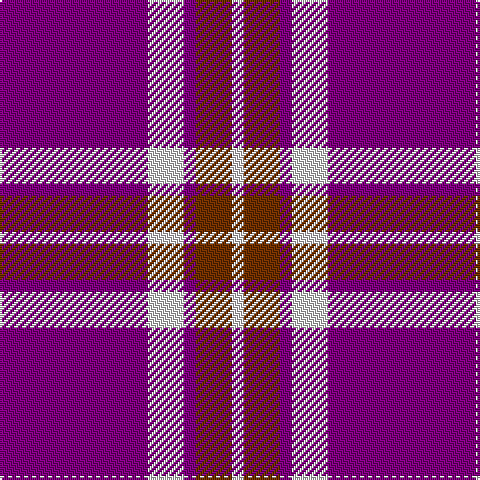

In pattern [BWBRW](/stripes/bwbrw/).

This was sourced from weddslist.  It is a [5 stripe tartan](/stripes/stripes5/).

Original link http://www.weddslist.com/cgi-bin/tartans/pg.pl?source=sts

## Thread count
P/74 LN18 P6 T18 LN/6

## Palette
Each colour and the base-6 reference it is a variant of.

| Colour | Shade | Base |
|---|---|---|
| LN | <code style="background-color:#E0E0E0;">#E0E0E0</code> `oklch(90.7% 0.000 89.9)` <small>#E0E0E0</small> | W <code style="background-color:#F7F7F7;">#F7F7F7</code> |
| P | <code style="background-color:#800080;">#800080</code> `oklch(42.1% 0.193 328.4)` <small>#800080</small> | B <code style="background-color:#2A418A;">#2A418A</code> |
| T | <code style="background-color:#703000;">#703000</code> `oklch(39.1% 0.105 49.1)` <small>#703000</small> | R <code style="background-color:#CC0000;">#CC0000</code> |

# Sample pattern

## Nearest tartans

The nearest existing variants by ΔTartan distance.

1. [Glen App Trade Tartan Tartan Number: 636. Earliest known date: pre 2003 A fashion check See products available Copyright © Blair Urquhart, Comrie, 2015](/setts/s5/dp37w9dp3dr9w3~x2/) — ΔT 0.35
1. [MacQueen variant](/setts/s6/db2r7db2r7db22ly2~x2/) — ΔT 1.54
1. [Unnamed C21st (Lady's Jacket) (Fash)](/setts/s7/m3dg8m3db8m20w2m2~x4/) — ΔT 1.55
1. [Coronation (1936) #2](/setts/s7/db11w1r12db6r1db6w1~x4/) — ΔT 1.57
1. [International Festival of Authors (C](/setts/s6/dp30m5dp5b4dp4g12~x2/) — ΔT 1.59
1. [Glen App](/setts/s5/m13w3m1k3w1~x6/) — ΔT 1.64
1. [Masai Shuka 25 (Artefact)](/setts/s5/db15w2r20db2r4~x2/) — ΔT 1.67
1. [Edinburgh TIC (Corporate)](/setts/s8/db32r3db3r4w3r5db4r7~x2/) — ΔT 1.73
1. [Matthews (Personal)](/setts/s6/db3r24db3r3db25w3~x2/) — ΔT 1.75
1. [Butler](/setts/s6/db48r18db6r13ly4r14~x2/) — ΔT 1.75

## Neighbour map

Every grey dot is one of 14299 variants placed by the first two principal components of the ΔTartan feature space (44% of its variance). Red is this tartan; blue dots are its nearest — click one to open its page.

<svg viewBox="0 0 640 380" role="img" style="max-width:100%;height:auto;border:1px solid #e0e0e0;border-radius:4px;display:block" xmlns="http://www.w3.org/2000/svg"><image href="/nn/cloud.v1.png" width="640" height="380"/><a href="/setts/s5/dp37w9dp3dr9w3~x2/"><circle cx="397.2" cy="191.6" r="4" fill="#3465a4"><title>Glen App Trade Tartan Tartan Number: 636. Earliest known date: pre 2003 A fashion check See products available Copyright © Blair Urquhart, Comrie, 2015</title></circle></a><a href="/setts/s6/db2r7db2r7db22ly2~x2/"><circle cx="394.4" cy="206.7" r="4" fill="#3465a4"><title>MacQueen variant</title></circle></a><a href="/setts/s7/m3dg8m3db8m20w2m2~x4/"><circle cx="334.5" cy="185.1" r="4" fill="#3465a4"><title>Unnamed C21st (Lady's Jacket) (Fash)</title></circle></a><a href="/setts/s7/db11w1r12db6r1db6w1~x4/"><circle cx="361.5" cy="208.9" r="4" fill="#3465a4"><title>Coronation (1936) #2</title></circle></a><a href="/setts/s6/dp30m5dp5b4dp4g12~x2/"><circle cx="364.8" cy="209.6" r="4" fill="#3465a4"><title>International Festival of Authors (C</title></circle></a><a href="/setts/s5/m13w3m1k3w1~x6/"><circle cx="392.1" cy="184.9" r="4" fill="#3465a4"><title>Glen App</title></circle></a><a href="/setts/s5/db15w2r20db2r4~x2/"><circle cx="358.9" cy="218.9" r="4" fill="#3465a4"><title>Masai Shuka 25 (Artefact)</title></circle></a><a href="/setts/s8/db32r3db3r4w3r5db4r7~x2/"><circle cx="412.2" cy="185.6" r="4" fill="#3465a4"><title>Edinburgh TIC (Corporate)</title></circle></a><a href="/setts/s6/db3r24db3r3db25w3~x2/"><circle cx="332.0" cy="211.1" r="4" fill="#3465a4"><title>Matthews (Personal)</title></circle></a><a href="/setts/s6/db48r18db6r13ly4r14~x2/"><circle cx="348.9" cy="213.1" r="4" fill="#3465a4"><title>Butler</title></circle></a><circle cx="402.7" cy="192.3" r="5" fill="#c00000"/></svg>

ID: /setts/s5/p37w9p3o9w3~x2/
