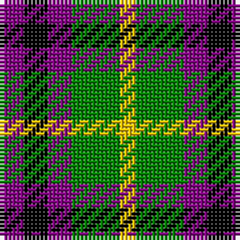

In pattern [BKBGY](/stripes/bkbgy/).

This was sourced from weddslist.  It is a [5 stripe tartan](/stripes/stripes5/).

Original link http://www.weddslist.com/cgi-bin/tartans/pg.pl?source=sts

## Also known as

This cloth is also recorded under:

- Austin / Wilson's No 173

## Thread count
P/6 K6 P6 G12 Y/4

## Palette
Each colour and the base-6 reference it is a variant of.

| Colour | Shade | Base |
|---|---|---|
| G | <code style="background-color:#008000;">#008000</code> `oklch(52.0% 0.177 142.5)` <small>#008000</small> | G <code style="background-color:#006100;">#006100</code> |
| K | <code style="background-color:#000000;">#000000</code> `oklch(0.0% 0.000 0.0)` <small>#000000</small> | K <code style="background-color:#000000;">#000000</code> |
| P | <code style="background-color:#800080;">#800080</code> `oklch(42.1% 0.193 328.4)` <small>#800080</small> | B <code style="background-color:#2A418A;">#2A418A</code> |
| Y | <code style="background-color:#F0C000;">#F0C000</code> `oklch(82.7% 0.169 90.5)` <small>#F0C000</small> | Y <code style="background-color:#F2BF00;">#F2BF00</code> |

# Sample pattern

## Nearest tartans

The nearest existing variants by ΔTartan distance.

1. [Austin / Wilson's No 137](/setts/s5/p3k3p3g6r2~x2/) — ΔT 0.67
1. [Austin (Wilson's No 173)](/setts/s5/dp3k3dp3dg6ly2~x2/) — ΔT 1.14
1. [Boxer Beauty](/setts/s7/k13dy28lo13dy28k18w18k13~x2/) — ΔT 1.26
1. [Wilson's No.113](/setts/s6/g3dp3w1dp3g3r1~x4/) — ΔT 1.34
1. [Wilson's, No 214](/setts/s5/g4r3t1k1t3~x4/) — ΔT 1.37
1. [Clark](/setts/s5/r3k1dg1k1b3~x8/) — ΔT 1.38
1. [Clark](/setts/s5/r3k1dg1k1b3~x4/) — ΔT 1.38
1. [Wilson's, No 113](/setts/s4/r1g3p3w1~x4/) — ΔT 1.39
1. [Wilson's, No 220](/setts/s4/p8k11g9w2~x2/) — ΔT 1.42
1. [Ramsay (Orange)](/setts/s7/k4lo9k13g6lo3g9w4~x2/) — ΔT 1.43

## Neighbour map

Every grey dot is one of 14299 variants placed by the first two principal components of the ΔTartan feature space (44% of its variance). Red is this tartan; blue dots are its nearest — click one to open its page.

<svg viewBox="0 0 640 380" role="img" style="max-width:100%;height:auto;border:1px solid #e0e0e0;border-radius:4px;display:block" xmlns="http://www.w3.org/2000/svg"><image href="/nn/cloud.v1.png" width="640" height="380"/><a href="/setts/s5/p3k3p3g6r2~x2/"><circle cx="85.3" cy="293.4" r="4" fill="#3465a4"><title>Austin / Wilson's No 137</title></circle></a><a href="/setts/s5/dp3k3dp3dg6ly2~x2/"><circle cx="93.6" cy="304.0" r="4" fill="#3465a4"><title>Austin (Wilson's No 173)</title></circle></a><a href="/setts/s7/k13dy28lo13dy28k18w18k13~x2/"><circle cx="83.8" cy="297.5" r="4" fill="#3465a4"><title>Boxer Beauty</title></circle></a><a href="/setts/s6/g3dp3w1dp3g3r1~x4/"><circle cx="148.9" cy="296.7" r="4" fill="#3465a4"><title>Wilson's No.113</title></circle></a><a href="/setts/s5/g4r3t1k1t3~x4/"><circle cx="108.9" cy="276.0" r="4" fill="#3465a4"><title>Wilson's, No 214</title></circle></a><a href="/setts/s5/r3k1dg1k1b3~x8/"><circle cx="100.6" cy="277.4" r="4" fill="#3465a4"><title>Clark</title></circle></a><a href="/setts/s5/r3k1dg1k1b3~x4/"><circle cx="100.6" cy="277.4" r="4" fill="#3465a4"><title>Clark</title></circle></a><a href="/setts/s4/r1g3p3w1~x4/"><circle cx="119.7" cy="284.7" r="4" fill="#3465a4"><title>Wilson's, No 113</title></circle></a><a href="/setts/s4/p8k11g9w2~x2/"><circle cx="109.8" cy="275.9" r="4" fill="#3465a4"><title>Wilson's, No 220</title></circle></a><a href="/setts/s7/k4lo9k13g6lo3g9w4~x2/"><circle cx="95.1" cy="254.7" r="4" fill="#3465a4"><title>Ramsay (Orange)</title></circle></a><circle cx="71.4" cy="288.6" r="5" fill="#c00000"/></svg>

ID: /setts/s5/p3k3p3g6ly2~x2/
