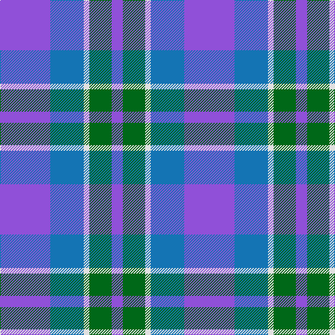

**Bands:** [BGWBB](/stripes/bgwbb/) · **Stripes:** [P G W B P](/stripes/stripes5/) P G W B P

This was sourced from tartans-authority.  It is a [5 band tartan](/bands/bands5/).

Original link http://www.tartansauthority.com/tartan-ferret/display/7354/

## Thread count
P/72 B48 LN8 G32 P/16

## Palette
Each colour and its ΔE from the base-6 reference it is a variant of.

| Colour | Shade | Base | ΔE (OKLab) |
|---|---|---|---|
| B | <code style="background-color:#1474B4;">#1474B4</code> `#1474B4` | B <code style="background-color:#2A418A;">#2A418A</code> | 0.15 |
| G | <code style="background-color:#006818;">#006818</code> `#006818` | G <code style="background-color:#006100;">#006100</code> | 0.02 |
| LN | <code style="background-color:#E0E0E0;">#E0E0E0</code> `#E0E0E0` | W <code style="background-color:#F7F7F7;">#F7F7F7</code> | 0.07 |
| P | <code style="background-color:#9050D8;">#9050D8</code> `#9050D8` | B <code style="background-color:#2A418A;">#2A418A</code> | 0.21 |

# Sample pattern

## Nearest tartans

The nearest existing variants by ΔTartan distance.

1. [von Prondzynski (2016)](/setts/s7/b4lb4b8o8b12lb12ly1~x2/) — ΔT 1.43
1. [Murdoch, Ellis (Personal)](/setts/s4/p20db25w3k2~x2/) — ΔT 1.46
1. [Loch Ness Water](/setts/s6/lb3t11db8t10lb6dp1~x2/) — ΔT 1.47
1. [Manx, Cornaa](/setts/s4/b1db5b5w1~x4/) — ΔT 1.49
1. [Cathro](/setts/s5/dp9db6w1dg4dp2~x4/) — ΔT 1.57
1. [Lands of Liberty](/setts/s5/r10w5db30b20r3~x4/) — ΔT 1.67
1. [Joker Fancy Tartan Tartan Number: 6769. Earliest known date: 2005 I have a photo of a fabric swatch that I am trying to match as close as possible. I have been commissioned to make a life size mannequin of Jack Nicholson as the Joker and he wore plaid/tartan pants. I could send you some photos through email and possibly you could help me. Thanks, Andy Garringer USA, January 2008. (96 threads @ 40 epi heavyweight = 2.5 inch repeat) See products available Copyright © Blair Urquhart, Comrie, 2015](/setts/s6/b11k1b3k5dp9lo1~x2/) — ΔT 1.68
1. [SABA](/setts/s5/w3dt2db15t15r2~x4/) — ΔT 1.74
1. [Mercer, Charles](/setts/s8/db9b2db2ly1b7db2r1b4~x4/) — ΔT 1.75
1. [Pitt (Glasgow)](/setts/s6/n23dt18w5dt2r14dt18~x2/) — ΔT 1.78

## Neighbour map

Every grey dot is one of 14299 variants placed by the first two principal components of the ΔTartan feature space (44% of its variance). Red is this tartan; blue dots are its nearest — click one to open its page.

<svg viewBox="0 0 640 380" role="img" style="max-width:100%;height:auto;border:1px solid #e0e0e0;border-radius:4px;display:block" xmlns="http://www.w3.org/2000/svg"><image href="/nn/cloud.v1.png" width="640" height="380"/><a href="/setts/s7/b4lb4b8o8b12lb12ly1~x2/"><circle cx="240.6" cy="224.2" r="4" fill="#3465a4"><title>von Prondzynski (2016)</title></circle></a><a href="/setts/s4/p20db25w3k2~x2/"><circle cx="326.5" cy="238.2" r="4" fill="#3465a4"><title>Murdoch, Ellis (Personal)</title></circle></a><a href="/setts/s6/lb3t11db8t10lb6dp1~x2/"><circle cx="241.4" cy="225.3" r="4" fill="#3465a4"><title>Loch Ness Water</title></circle></a><a href="/setts/s4/b1db5b5w1~x4/"><circle cx="294.9" cy="295.0" r="4" fill="#3465a4"><title>Manx, Cornaa</title></circle></a><a href="/setts/s5/dp9db6w1dg4dp2~x4/"><circle cx="288.1" cy="263.5" r="4" fill="#3465a4"><title>Cathro</title></circle></a><a href="/setts/s5/r10w5db30b20r3~x4/"><circle cx="210.6" cy="215.7" r="4" fill="#3465a4"><title>Lands of Liberty</title></circle></a><a href="/setts/s6/b11k1b3k5dp9lo1~x2/"><circle cx="263.8" cy="228.3" r="4" fill="#3465a4"><title>Joker Fancy Tartan Tartan Number: 6769. Earliest known date: 2005 I have a photo of a fabric swatch that I am trying to match as close as possible. I have been commissioned to make a life size mannequin of Jack Nicholson as the Joker and he wore plaid/tartan pants. I could send you some photos through email and possibly you could help me. Thanks, Andy Garringer USA, January 2008. (96 threads @ 40 epi heavyweight = 2.5 inch repeat) See products available Copyright © Blair Urquhart, Comrie, 2015</title></circle></a><a href="/setts/s5/w3dt2db15t15r2~x4/"><circle cx="203.2" cy="218.5" r="4" fill="#3465a4"><title>SABA</title></circle></a><a href="/setts/s8/db9b2db2ly1b7db2r1b4~x4/"><circle cx="305.8" cy="237.8" r="4" fill="#3465a4"><title>Mercer, Charles</title></circle></a><a href="/setts/s6/n23dt18w5dt2r14dt18~x2/"><circle cx="243.7" cy="243.1" r="4" fill="#3465a4"><title>Pitt (Glasgow)</title></circle></a><circle cx="270.6" cy="250.8" r="5" fill="#c00000"/></svg>

ID: /setts/s5/p9b6w1g4p2~x8/
