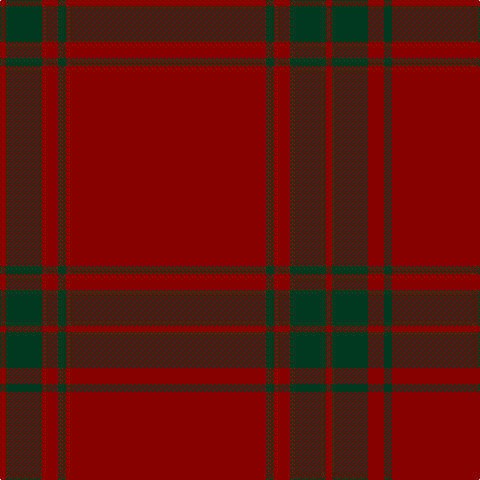

In pattern [RGRGR](/patterns/rgrgr/).

This was sourced from tartans-authority.  It is a [5 stripes tartan](/stripes/stripes5/).

Original link http://www.tartansauthority.com/tartan-ferret/display/2696/

## Thread count
DR/6 DG36 DR16 DG8 DR/200

## Palette
Each colour and its ΔE from the base-6 reference it is a variant of.

| Colour | Shade | Base | ΔE (OKLab) |
|---|---|---|---|
| DG | <code style="background-color:#003820;">#003820</code> `#003820` | G <code style="background-color:#006100;">#006100</code> | 0.15 |
| DR | <code style="background-color:#880000;">#880000</code> `#880000` | R <code style="background-color:#CC0000;">#CC0000</code> | 0.15 |

# Sample pattern

## Nearest tartans

The nearest existing variants by ΔTartan distance.

1. [KaDeWe](/setts/s8/r100g4r8g18r3g18r8g4~g003820-r880000~x2/) — ΔT 1.93
1. [Killiechassie](/setts/s6/r2g1r4ra1r12y1~g604000-r880000-rae87878-ya08858~x2/) — ΔT 2.47
1. [Inverness Augustus](/setts/s7/r18g1k5g1k1g1r9~g005020-k101010-r781c38~x2/) — ΔT 2.57
1. [Lomond](/setts/s8/r32b5r2b5r6b2r1b7~b5c5c5c-rc80000~x4/) — ΔT 2.57
1. [Dunbar, John Telfer (Personal)](/setts/s7/r5k2r28k10r26k4r4~k101010-r883000~x2/) — ΔT 2.68
1. [MacKintosh (Moy Hall) Clan Tartan Tartan Number: 1509. Earliest known date: 1821 The Setts No: 253. Of the same pattern as a fragment in the Moy Hall collection claimed to be a part of a kilt worn by Prince Charles at the time of the '45. Author and weaver, James Scarlet, has investigated further and has found at least four other piec See products available Copyright © Blair Urquhart, Comrie, 2015](/setts/s7/r75g12r3k2r2k2r36~g006818-k101010-rc80000~x2/) — ΔT 2.77
1. [Brooks Brothers Tattersall Red](/setts/s5/b1r9b2r9y1~b202060-r880000-ya08858~x4/) — ΔT 2.80
1. [Connacht](/setts/s10/r64g6r2g3r2g6r64b2r2b6~b401000-g008000-r806050~x2/) — ΔT 2.85
1. [Masai Shuka 06 (Artefact)](/setts/s10/r50b1r4b3r8b15r2b2r3b4~b780078-rc40000~x2/) — ΔT 2.88
1. [Fitzgibbon Red](/setts/s9/r2b6r24g2r2ra1r6b1ra2~b2d2d2d-g1c5627-ra3262a-rabd2125~x2/) — ΔT 2.95

## Neighbour map

Every grey dot is one of 15726 variants placed by the first two principal components of the ΔTartan feature space (44% of its variance). Red is this tartan; blue dots are its nearest — click one to open its page.

<svg viewBox="0 0 640 380" role="img" style="max-width:100%;height:auto;border:1px solid #e0e0e0;border-radius:4px;display:block" xmlns="http://www.w3.org/2000/svg"><image href="/nn/cloud.v1.png" width="640" height="380"/><a href="/setts/s8/r100g4r8g18r3g18r8g4~g003820-r880000~x2/"><circle cx="626.0" cy="190.0" r="4" fill="#3465a4"><title>KaDeWe</title></circle></a><a href="/setts/s6/r2g1r4ra1r12y1~g604000-r880000-rae87878-ya08858~x2/"><circle cx="626.0" cy="230.9" r="4" fill="#3465a4"><title>Killiechassie</title></circle></a><a href="/setts/s7/r18g1k5g1k1g1r9~g005020-k101010-r781c38~x2/"><circle cx="589.0" cy="218.5" r="4" fill="#3465a4"><title>Inverness Augustus</title></circle></a><a href="/setts/s8/r32b5r2b5r6b2r1b7~b5c5c5c-rc80000~x4/"><circle cx="610.6" cy="190.9" r="4" fill="#3465a4"><title>Lomond</title></circle></a><a href="/setts/s7/r5k2r28k10r26k4r4~k101010-r883000~x2/"><circle cx="603.5" cy="252.9" r="4" fill="#3465a4"><title>Dunbar, John Telfer (Personal)</title></circle></a><a href="/setts/s7/r75g12r3k2r2k2r36~g006818-k101010-rc80000~x2/"><circle cx="626.0" cy="161.8" r="4" fill="#3465a4"><title>MacKintosh (Moy Hall) Clan Tartan Tartan Number: 1509. Earliest known date: 1821 The Setts No: 253. Of the same pattern as a fragment in the Moy Hall collection claimed to be a part of a kilt worn by Prince Charles at the time of the '45. Author and weaver, James Scarlet, has investigated further and has found at least four other piec See products available Copyright © Blair Urquhart, Comrie, 2015</title></circle></a><a href="/setts/s5/b1r9b2r9y1~b202060-r880000-ya08858~x4/"><circle cx="608.8" cy="274.7" r="4" fill="#3465a4"><title>Brooks Brothers Tattersall Red</title></circle></a><a href="/setts/s10/r64g6r2g3r2g6r64b2r2b6~b401000-g008000-r806050~x2/"><circle cx="626.0" cy="182.9" r="4" fill="#3465a4"><title>Connacht</title></circle></a><a href="/setts/s10/r50b1r4b3r8b15r2b2r3b4~b780078-rc40000~x2/"><circle cx="626.0" cy="149.0" r="4" fill="#3465a4"><title>Masai Shuka 06 (Artefact)</title></circle></a><a href="/setts/s9/r2b6r24g2r2ra1r6b1ra2~b2d2d2d-g1c5627-ra3262a-rabd2125~x2/"><circle cx="603.9" cy="172.3" r="4" fill="#3465a4"><title>Fitzgibbon Red</title></circle></a><circle cx="626.0" cy="225.9" r="5" fill="#c00000"/></svg>

ID: /setts/s5/r100g4r8g18r3~g003820-r880000~x2/
