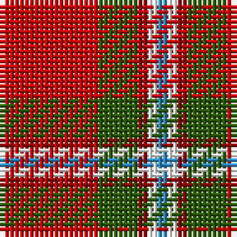

This page is one **sett** — a single exact thread-count. It belongs to the [tartan](/tartans/r10dg4ri1w1t1/)
(the same proportion at any scale), whose colour order is pattern [BWRGR](/stripes/bwrgr/).

Sourced from register-of-tartans.  It is a [5 stripe tartan](/stripes/stripes5/).

Original link https://www.tartanregister.gov.uk/tartanDetails.aspx?ref=3910

## Register references

External register numbers recorded for this tartan.

- Scottish Register of Tartans: [3910](https://www.tartanregister.gov.uk/tartanDetails.aspx?ref=3910)
- Scottish Tartans Authority (ITI): 6611

## Thread count
R/20 G8 DR2 W2 B/2

## Palette

Palette: <strong>Tartan Register</strong>
<table><thead><tr><th>Colour</th><th>Threads</th><th>Shade</th><th>Base</th><th>OKLCh</th></tr></thead><tbody><tr><td>R/</td><td style="text-align:right;font-variant-numeric:tabular-nums">20</td><td><code style="background-color:#C80000;">#C80000</code> <small style="color:#888">#C80000</small></td><td>R <code style="background-color:#CC0000;">#CC0000</code></td><td><small style="color:#888">oklch(52.3% 0.215 29.2)</small></td></tr><tr><td>G</td><td style="text-align:right;font-variant-numeric:tabular-nums">8</td><td><code style="background-color:#285800;">#285800</code> <small style="color:#888">#285800</small></td><td>G <code style="background-color:#006100;">#006100</code></td><td><small style="color:#888">oklch(41.0% 0.122 135.8)</small></td></tr><tr><td>DR</td><td style="text-align:right;font-variant-numeric:tabular-nums">2</td><td><code style="background-color:#880000;">#880000</code> <small style="color:#888">#880000</small></td><td>R <code style="background-color:#CC0000;">#CC0000</code></td><td><small style="color:#888">oklch(39.4% 0.162 29.2)</small></td></tr><tr><td>W</td><td style="text-align:right;font-variant-numeric:tabular-nums">2</td><td><code style="background-color:#FFFFFF;">#FFFFFF</code> <small style="color:#888">#FFFFFF</small></td><td>W <code style="background-color:#F7F7F7;">#F7F7F7</code></td><td><small style="color:#888">oklch(100.0% 0.000 89.9)</small></td></tr><tr><td>B/</td><td style="text-align:right;font-variant-numeric:tabular-nums">2</td><td><code style="background-color:#2888C4;">#2888C4</code> <small style="color:#888">#2888C4</small></td><td>B <code style="background-color:#2A418A;">#2A418A</code></td><td><small style="color:#888">oklch(60.1% 0.125 241.5)</small></td></tr></tbody></table>

# Sample pattern

## Nearest tartans

The nearest existing variants by ΔTartan distance, with this tartan at the top so the swatches line up against it.

ΔTartan

Tartan

Sett

—

<a href="/ttd/edit/#slug=r10dg4ri1w1t1~x2">Staves (Personal)</a> <a class="nn-out" href="/setts/s5/r10dg4ri1w1t1~x2/" title="open its dictionary page">↗</a>

0.03

<a href="/ttd/edit/#slug=r10dg4ri1w1t1~x6">Staves (Personal)</a> <a class="nn-out" href="/setts/s5/r10dg4ri1w1t1~x6/" title="open its dictionary page">↗</a>

1.16

<a href="/ttd/edit/#slug=dt13r50ly7m6g4k4~x2">Harding (Florida) (Personal)</a> <a class="nn-out" href="/setts/s6/dt13r50ly7m6g4k4~x2/" title="open its dictionary page">↗</a>

1.25

<a href="/ttd/edit/#slug=r2db10r2g10r25w2~x2">Grant of Lurg</a> <a class="nn-out" href="/setts/s6/r2db10r2g10r25w2~x2/" title="open its dictionary page">↗</a>

1.26

<a href="/ttd/edit/#slug=r10g3k1g3b1~x16">Espy (Fashion?)</a> <a class="nn-out" href="/setts/s5/r10g3k1g3b1~x16/" title="open its dictionary page">↗</a>

1.27

<a href="/ttd/edit/#slug=r6g14r6db12r31lb2r4ly3~x2">Loch Lochy (District)</a> <a class="nn-out" href="/setts/s8/r6g14r6db12r31lb2r4ly3~x2/" title="open its dictionary page">↗</a>

1.37

<a href="/ttd/edit/#slug=g4lb4k2r15ly4~x4">Benedict (Personal)</a> <a class="nn-out" href="/setts/s5/g4lb4k2r15ly4~x4/" title="open its dictionary page">↗</a>

1.37

<a href="/ttd/edit/#slug=r3g16r4k6r28g2lo3~x2">McInally (Name)</a> <a class="nn-out" href="/setts/s7/r3g16r4k6r28g2lo3~x2/" title="open its dictionary page">↗</a>

1.38

<a href="/ttd/edit/#slug=r96db16dg34dgi48r18k6r9">MacDuff</a> <a class="nn-out" href="/setts/s7/r96db16dg34dgi48r18k6r9/" title="open its dictionary page">↗</a>

1.40

<a href="/ttd/edit/#slug=r5g3lb3db5r16ly3~x2">McCartney (2015)</a> <a class="nn-out" href="/setts/s6/r5g3lb3db5r16ly3~x2/" title="open its dictionary page">↗</a>

1.41

<a href="/ttd/edit/#slug=dg4lb4k2r15ly4~x4">Benedict (Personal)</a> <a class="nn-out" href="/setts/s5/dg4lb4k2r15ly4~x4/" title="open its dictionary page">↗</a>

## Neighbour map

Every grey dot is one of 14359 variants placed by the first two principal components of the ΔTartan feature space (44% of its variance). Red is this tartan; blue dots are its nearest — click one to open its page.

<svg viewBox="0 0 640 380" role="img" style="max-width:100%;height:auto;border:1px solid #e0e0e0;border-radius:4px;display:block" xmlns="http://www.w3.org/2000/svg"><image href="/nn/cloud.v1.png" width="640" height="380"/><a href="/setts/s5/r10dg4ri1w1t1~x6/"><circle cx="327.1" cy="175.3" r="4" fill="#3465a4"><title>Staves (Personal)</title></circle></a><a href="/setts/s6/dt13r50ly7m6g4k4~x2/"><circle cx="318.1" cy="133.0" r="4" fill="#3465a4"><title>Harding (Florida) (Personal)</title></circle></a><a href="/setts/s6/r2db10r2g10r25w2~x2/"><circle cx="327.2" cy="179.8" r="4" fill="#3465a4"><title>Grant of Lurg</title></circle></a><a href="/setts/s5/r10g3k1g3b1~x16/"><circle cx="337.3" cy="209.1" r="4" fill="#3465a4"><title>Espy (Fashion?)</title></circle></a><a href="/setts/s8/r6g14r6db12r31lb2r4ly3~x2/"><circle cx="333.6" cy="149.6" r="4" fill="#3465a4"><title>Loch Lochy (District)</title></circle></a><a href="/setts/s5/g4lb4k2r15ly4~x4/"><circle cx="231.0" cy="192.7" r="4" fill="#3465a4"><title>Benedict (Personal)</title></circle></a><a href="/setts/s7/r3g16r4k6r28g2lo3~x2/"><circle cx="344.4" cy="171.9" r="4" fill="#3465a4"><title>McInally (Name)</title></circle></a><a href="/setts/s7/r96db16dg34dgi48r18k6r9/"><circle cx="293.0" cy="156.4" r="4" fill="#3465a4"><title>MacDuff</title></circle></a><a href="/setts/s6/r5g3lb3db5r16ly3~x2/"><circle cx="270.7" cy="200.0" r="4" fill="#3465a4"><title>McCartney (2015)</title></circle></a><a href="/setts/s5/dg4lb4k2r15ly4~x4/"><circle cx="225.6" cy="190.1" r="4" fill="#3465a4"><title>Benedict (Personal)</title></circle></a><circle cx="326.2" cy="174.8" r="5" fill="#c00000"/></svg>

ID: /setts/s5/r10dg4ri1w1t1~x2/
