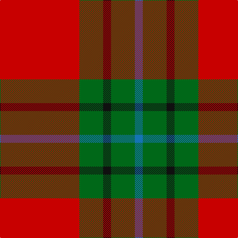

**Bands:** [RGKGB](/stripes/rgkgb/) · **Stripes:** [R G K G B](/stripes/stripes5/) R G K G B

This was sourced from tartans-authority.  It is a [5 band tartan](/bands/bands5/).

Original link http://www.tartansauthority.com/tartan-ferret/display/8391/

## Thread count
R/160 G48 K16 G48 B/16

## Palette
Each colour and its ΔE from the base-6 reference it is a variant of.

| Colour | Shade | Base | ΔE (OKLab) |
|---|---|---|---|
| B | <code style="background-color:#1474B4;">#1474B4</code> `#1474B4` | B <code style="background-color:#2A418A;">#2A418A</code> | 0.15 |
| G | <code style="background-color:#006818;">#006818</code> `#006818` | G <code style="background-color:#006100;">#006100</code> | 0.02 |
| K | <code style="background-color:#101010;">#101010</code> `#101010` | K <code style="background-color:#000000;">#000000</code> | 0.17 |
| R | <code style="background-color:#C80000;">#C80000</code> `#C80000` | R <code style="background-color:#CC0000;">#CC0000</code> | 0.01 |

# Sample pattern

## Nearest tartans

The nearest existing variants by ΔTartan distance.

1. [MacAulay](/setts/s6/k2r16g6r3g8lb1~x2/) — ΔT 0.91
1. [MacAulay (Clan)](/setts/s6/k2r16g6r3g8w1~x4/) — ΔT 0.94
1. [Wilson's, No 5](/setts/s6/r32t5g17r4g5w2~x2/) — ΔT 0.96
1. [McInally (Name)](/setts/s7/r3g16r4k6r28g2lo3~x2/) — ΔT 0.97
1. [Kirk (Name)](/setts/s7/r4g21r4k7r34lo3r4~x2/) — ΔT 1.03
1. [Nisbet](/setts/s6/r10g24k10r28lb3r6~x2/) — ΔT 1.06
1. [MacDonald, Lord of The Isles (Artef)](/setts/s5/g16r5g2r18k2~x2/) — ΔT 1.07
1. [Chisholm, The](/setts/s8/r12db2w1db2r3g8r3db1~x2/) — ΔT 1.08
1. [MacDonald Lord of the Isles #2](/setts/s5/dg16r5dg2r18k2~x2/) — ΔT 1.08
1. [Grant of Lurg](/setts/s6/r2db10r2g10r25w2~x2/) — ΔT 1.12

## Neighbour map

Every grey dot is one of 14299 variants placed by the first two principal components of the ΔTartan feature space (44% of its variance). Red is this tartan; blue dots are its nearest — click one to open its page.

<svg viewBox="0 0 640 380" role="img" style="max-width:100%;height:auto;border:1px solid #e0e0e0;border-radius:4px;display:block" xmlns="http://www.w3.org/2000/svg"><image href="/nn/cloud.v1.png" width="640" height="380"/><a href="/setts/s6/k2r16g6r3g8lb1~x2/"><circle cx="335.7" cy="189.8" r="4" fill="#3465a4"><title>MacAulay</title></circle></a><a href="/setts/s6/k2r16g6r3g8w1~x4/"><circle cx="331.6" cy="187.7" r="4" fill="#3465a4"><title>MacAulay (Clan)</title></circle></a><a href="/setts/s6/r32t5g17r4g5w2~x2/"><circle cx="352.5" cy="177.7" r="4" fill="#3465a4"><title>Wilson's, No 5</title></circle></a><a href="/setts/s7/r3g16r4k6r28g2lo3~x2/"><circle cx="345.5" cy="171.4" r="4" fill="#3465a4"><title>McInally (Name)</title></circle></a><a href="/setts/s7/r4g21r4k7r34lo3r4~x2/"><circle cx="376.2" cy="194.0" r="4" fill="#3465a4"><title>Kirk (Name)</title></circle></a><a href="/setts/s6/r10g24k10r28lb3r6~x2/"><circle cx="286.6" cy="216.8" r="4" fill="#3465a4"><title>Nisbet</title></circle></a><a href="/setts/s5/g16r5g2r18k2~x2/"><circle cx="352.4" cy="240.2" r="4" fill="#3465a4"><title>MacDonald, Lord of The Isles (Artef)</title></circle></a><a href="/setts/s8/r12db2w1db2r3g8r3db1~x2/"><circle cx="324.2" cy="178.1" r="4" fill="#3465a4"><title>Chisholm, The</title></circle></a><a href="/setts/s5/dg16r5dg2r18k2~x2/"><circle cx="343.2" cy="232.8" r="4" fill="#3465a4"><title>MacDonald Lord of the Isles #2</title></circle></a><a href="/setts/s6/r2db10r2g10r25w2~x2/"><circle cx="328.3" cy="179.0" r="4" fill="#3465a4"><title>Grant of Lurg</title></circle></a><circle cx="338.3" cy="208.3" r="5" fill="#c00000"/></svg>

ID: /setts/s5/r10g3k1g3b1~x16/
