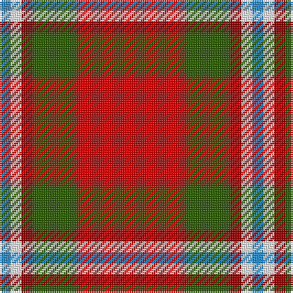

In pattern [BWRGR](/patterns/bwrgr/).

This was sourced from tartans-authority.  It is a [5 stripes tartan](/stripes/stripes5/).

Original link http://www.tartansauthority.com/tartan-ferret/display/6611/

## Thread count
B/6 W6 DR6 G24 R/60

## Palette
Each colour and its ΔE from the base-6 reference it is a variant of.

| Colour | Shade | Base | ΔE (OKLab) |
|---|---|---|---|
| B | <code style="background-color:#2888C4;">#2888C4</code> `#2888C4` | B <code style="background-color:#2A418A;">#2A418A</code> | 0.21 |
| DR | <code style="background-color:#880000;">#880000</code> `#880000` | R <code style="background-color:#CC0000;">#CC0000</code> | 0.15 |
| G | <code style="background-color:#285800;">#285800</code> `#285800` | G <code style="background-color:#006100;">#006100</code> | 0.03 |
| R | <code style="background-color:#C80000;">#C80000</code> `#C80000` | R <code style="background-color:#CC0000;">#CC0000</code> | 0.01 |
| W | <code style="background-color:#FCFCFC;">#FCFCFC</code> `#FCFCFC` | W <code style="background-color:#F7F7F7;">#F7F7F7</code> | 0.01 |

# Sample pattern

## Nearest tartans

The nearest existing variants by ΔTartan distance.

1. [Staves (Personal)](/setts/s5/r10g4ra1w1b1~b2888c4-g285800-rc80000-ra880000-wffffff~x2/) — ΔT 0.03
1. [Harding (Florida) (Personal)](/setts/s6/b13r50y7ra6g4k4~b003c64-g006818-k101010-rc80000-rab468ac-ye8c000~x2/) — ΔT 1.16
1. [Espy (Fashion?)](/setts/s5/r10g3k1g3b1~b1474b4-g006818-k101010-rc80000~x16/) — ΔT 1.25
1. [Grant of Lurg](/setts/s6/r2b10r2g10r25w2~b2c2c80-g006818-rc80000-wf8f8f8~x2/) — ΔT 1.25
1. [Loch Lochy (District)](/setts/s8/r6g14r6b12r31w2r4y3~b2c2c80-g006818-rc80000-wc0c0c0-yfccc00~x2/) — ΔT 1.27
1. [McInally (Name)](/setts/s7/r3g16r4k6r28g2y3~g006818-k101010-rc80000-yd09800~x2/) — ΔT 1.37
1. [MacDuff](/setts/s7/r96b16g34ga48r18k6r9~b2c4084-g002814-ga005020-k101010-rdc0000/) — ΔT 1.38
1. [Benedict (Personal)](/setts/s5/g4w4k2r15y4~g006438-k101010-rc80000-wc0c0c0-yd8b000~x4/) — ΔT 1.38
1. [McCartney (2015)](/setts/s6/r5g3w3b5r16y3~b2c2c80-g006818-rc80000-w98c8e8-ye8c000~x2/) — ΔT 1.39
1. [McCartney (2015)](/setts/s6/r5g3w3b5r16y3~b2c2c80-g008b00-rc8000c-w98c8e8-ye8c000~x2/) — ΔT 1.41

## Neighbour map

Every grey dot is one of 15726 variants placed by the first two principal components of the ΔTartan feature space (44% of its variance). Red is this tartan; blue dots are its nearest — click one to open its page.

<svg viewBox="0 0 640 380" role="img" style="max-width:100%;height:auto;border:1px solid #e0e0e0;border-radius:4px;display:block" xmlns="http://www.w3.org/2000/svg"><image href="/nn/cloud.v1.png" width="640" height="380"/><a href="/setts/s5/r10g4ra1w1b1~b2888c4-g285800-rc80000-ra880000-wffffff~x2/"><circle cx="327.9" cy="177.8" r="4" fill="#3465a4"><title>Staves (Personal)</title></circle></a><a href="/setts/s6/b13r50y7ra6g4k4~b003c64-g006818-k101010-rc80000-rab468ac-ye8c000~x2/"><circle cx="319.7" cy="135.4" r="4" fill="#3465a4"><title>Harding (Florida) (Personal)</title></circle></a><a href="/setts/s5/r10g3k1g3b1~b1474b4-g006818-k101010-rc80000~x16/"><circle cx="338.2" cy="210.7" r="4" fill="#3465a4"><title>Espy (Fashion?)</title></circle></a><a href="/setts/s6/r2b10r2g10r25w2~b2c2c80-g006818-rc80000-wf8f8f8~x2/"><circle cx="328.2" cy="182.8" r="4" fill="#3465a4"><title>Grant of Lurg</title></circle></a><a href="/setts/s8/r6g14r6b12r31w2r4y3~b2c2c80-g006818-rc80000-wc0c0c0-yfccc00~x2/"><circle cx="335.2" cy="152.0" r="4" fill="#3465a4"><title>Loch Lochy (District)</title></circle></a><a href="/setts/s7/r3g16r4k6r28g2y3~g006818-k101010-rc80000-yd09800~x2/"><circle cx="345.5" cy="174.1" r="4" fill="#3465a4"><title>McInally (Name)</title></circle></a><a href="/setts/s7/r96b16g34ga48r18k6r9~b2c4084-g002814-ga005020-k101010-rdc0000/"><circle cx="293.8" cy="157.8" r="4" fill="#3465a4"><title>MacDuff</title></circle></a><a href="/setts/s5/g4w4k2r15y4~g006438-k101010-rc80000-wc0c0c0-yd8b000~x4/"><circle cx="232.1" cy="195.4" r="4" fill="#3465a4"><title>Benedict (Personal)</title></circle></a><a href="/setts/s6/r5g3w3b5r16y3~b2c2c80-g006818-rc80000-w98c8e8-ye8c000~x2/"><circle cx="273.8" cy="204.5" r="4" fill="#3465a4"><title>McCartney (2015)</title></circle></a><a href="/setts/s6/r5g3w3b5r16y3~b2c2c80-g008b00-rc8000c-w98c8e8-ye8c000~x2/"><circle cx="272.1" cy="203.7" r="4" fill="#3465a4"><title>McCartney (2015)</title></circle></a><circle cx="328.7" cy="178.1" r="5" fill="#c00000"/></svg>

ID: /setts/s5/r10g4ra1w1b1~b2888c4-g285800-rc80000-ra880000-wfcfcfc~x6/
