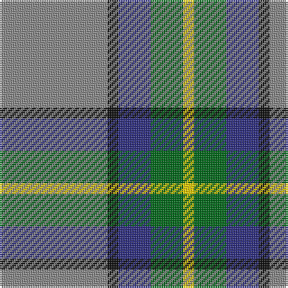

In pattern [RKBGY](/patterns/rkbgy/).

This was sourced from tartans-authority.  It is a [5 stripes tartan](/stripes/stripes5/).

Original link http://www.tartansauthority.com/tartan-ferret/display/11093/

## Thread count
N/60 K6 DB18 G18 Y/6

## Palette
Each colour and its ΔE from the base-6 reference it is a variant of.

| Colour | Shade | Base | ΔE (OKLab) |
|---|---|---|---|
| DB | <code style="background-color:#2C2C80;">#2C2C80</code> `#2C2C80` | B <code style="background-color:#2A418A;">#2A418A</code> | 0.06 |
| G | <code style="background-color:#006818;">#006818</code> `#006818` | G <code style="background-color:#006100;">#006100</code> | 0.02 |
| K | <code style="background-color:#101010;">#101010</code> `#101010` | K <code style="background-color:#000000;">#000000</code> | 0.17 |
| N | <code style="background-color:#888888;">#888888</code> `#888888` | R <code style="background-color:#CC0000;">#CC0000</code> | 0.24 |
| Y | <code style="background-color:#FCCC00;">#FCCC00</code> `#FCCC00` | Y <code style="background-color:#F2BF00;">#F2BF00</code> | 0.04 |

# Sample pattern

## Nearest tartans

The nearest existing variants by ΔTartan distance.

1. [Celtic Norse Heritage Society](/setts/s5/r10k1b3g3y1~b00008c-g289c18-k101010-r888888-yffe600~x6/) — ΔT 0.72
1. [Bagpipe Shop (Corporate)](/setts/s5/b10w3wa3g1r1~b5c5c5c-g289c18-rc80000-we0e0e0-wac0c0c0~x10/) — ΔT 0.81
1. [Manx Laxey (Blue)](/setts/s6/b4g16y2ba7b28w4~b6098b4-ba780078-g005834-we0e0e0-ye8c000~x2/) — ΔT 0.97
1. [Bagpipe Shop (Switzerland)](/setts/s5/b10w3y3g1r1~b646464-g4ca412-rff0000-wf8f4d0-ya4a8a8~x10/) — ΔT 0.99
1. [Allanton (Fashion)](/setts/s6/b4g16y2ba7b28w4~b5c8ca8-ba2c2c80-g006818-we0e0e0-ye8c000~x2/) — ΔT 1.14
1. [Roseberry (Name)](/setts/s6/w8b30g5w3ba8r5~b5c8ca8-ba2c2c80-g289c18-rc80000-we0e0e0/) — ΔT 1.17
1. [Inglis](/setts/s6/w4g28b18r4b18y3~b304080-g008000-rc00000-we0e0e0-yf0c000~x2/) — ΔT 1.19
1. [Lawrence of Broughty Ferry (Corporat](/setts/s6/g20k2g20b25w2ba3~b780078-ba5c8ca8-g006818-k101010-we0e0e0~x2/) — ΔT 1.20
1. [Sterling, Rob (Florida) (Personal)](/setts/s5/g11y10b11ba33w3~b433a5a-ba1870a4-g649848-wf9f5ef-ye0a126~x2/) — ΔT 1.21
1. [Manx Laxey](/setts/s6/b4g16y2ba7b28w4~b8080d0-ba800080-g008000-we0e0e0-yf0c000~x2/) — ΔT 1.22

## Neighbour map

Every grey dot is one of 15726 variants placed by the first two principal components of the ΔTartan feature space (44% of its variance). Red is this tartan; blue dots are its nearest — click one to open its page.

<svg viewBox="0 0 640 380" role="img" style="max-width:100%;height:auto;border:1px solid #e0e0e0;border-radius:4px;display:block" xmlns="http://www.w3.org/2000/svg"><image href="/nn/cloud.v1.png" width="640" height="380"/><a href="/setts/s5/r10k1b3g3y1~b00008c-g289c18-k101010-r888888-yffe600~x6/"><circle cx="258.3" cy="191.0" r="4" fill="#3465a4"><title>Celtic Norse Heritage Society</title></circle></a><a href="/setts/s5/b10w3wa3g1r1~b5c5c5c-g289c18-rc80000-we0e0e0-wac0c0c0~x10/"><circle cx="273.4" cy="188.7" r="4" fill="#3465a4"><title>Bagpipe Shop (Corporate)</title></circle></a><a href="/setts/s6/b4g16y2ba7b28w4~b6098b4-ba780078-g005834-we0e0e0-ye8c000~x2/"><circle cx="271.4" cy="179.6" r="4" fill="#3465a4"><title>Manx Laxey (Blue)</title></circle></a><a href="/setts/s5/b10w3y3g1r1~b646464-g4ca412-rff0000-wf8f4d0-ya4a8a8~x10/"><circle cx="276.6" cy="188.7" r="4" fill="#3465a4"><title>Bagpipe Shop (Switzerland)</title></circle></a><a href="/setts/s6/b4g16y2ba7b28w4~b5c8ca8-ba2c2c80-g006818-we0e0e0-ye8c000~x2/"><circle cx="278.9" cy="186.2" r="4" fill="#3465a4"><title>Allanton (Fashion)</title></circle></a><a href="/setts/s6/w8b30g5w3ba8r5~b5c8ca8-ba2c2c80-g289c18-rc80000-we0e0e0/"><circle cx="233.7" cy="179.4" r="4" fill="#3465a4"><title>Roseberry (Name)</title></circle></a><a href="/setts/s6/w4g28b18r4b18y3~b304080-g008000-rc00000-we0e0e0-yf0c000~x2/"><circle cx="226.5" cy="207.8" r="4" fill="#3465a4"><title>Inglis</title></circle></a><a href="/setts/s6/g20k2g20b25w2ba3~b780078-ba5c8ca8-g006818-k101010-we0e0e0~x2/"><circle cx="301.7" cy="196.9" r="4" fill="#3465a4"><title>Lawrence of Broughty Ferry (Corporat</title></circle></a><a href="/setts/s5/g11y10b11ba33w3~b433a5a-ba1870a4-g649848-wf9f5ef-ye0a126~x2/"><circle cx="227.0" cy="210.2" r="4" fill="#3465a4"><title>Sterling, Rob (Florida) (Personal)</title></circle></a><a href="/setts/s6/b4g16y2ba7b28w4~b8080d0-ba800080-g008000-we0e0e0-yf0c000~x2/"><circle cx="270.1" cy="174.5" r="4" fill="#3465a4"><title>Manx Laxey</title></circle></a><circle cx="279.7" cy="198.0" r="5" fill="#c00000"/></svg>

ID: /setts/s5/r10k1b3g3y1~b2c2c80-g006818-k101010-r888888-yfccc00~x6/
