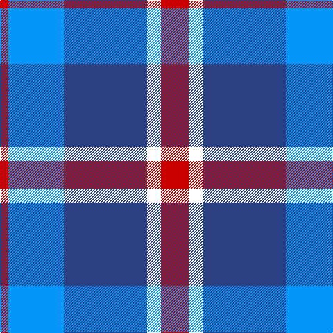

In pattern [RBBWR](/stripes/rbbwr/).

This was sourced from register-of-tartans.  It is a [5 stripe tartan](/stripes/stripes5/).

Original link https://www.tartanregister.gov.uk/tartanDetails.aspx?ref=10928

## Register references

External register numbers recorded for this tartan.

- Scottish Register of Tartans: [10928](https://www.tartanregister.gov.uk/tartanDetails.aspx?ref=10928)

## Thread count
R/40 W20 B120 Ba80 R/12

## Palette
Each colour and the base-6 reference it is a variant of.

| Colour | Shade | Base |
|---|---|---|
| B | <code style="background-color:#2C4084;">#2C4084</code> `oklch(39.4% 0.117 268.3)` <small>#2C4084</small> | B <code style="background-color:#2A418A;">#2A418A</code> |
| Ba | <code style="background-color:#0596FA;">#0596FA</code> `oklch(66.0% 0.180 248.9)` <small>#0596FA</small> | B <code style="background-color:#2A418A;">#2A418A</code> |
| R | <code style="background-color:#C80000;">#C80000</code> `oklch(52.3% 0.215 29.2)` <small>#C80000</small> | R <code style="background-color:#CC0000;">#CC0000</code> |
| W | <code style="background-color:#FFFFFF;">#FFFFFF</code> `oklch(100.0% 0.000 89.9)` <small>#FFFFFF</small> | W <code style="background-color:#F7F7F7;">#F7F7F7</code> |

# Sample pattern

## Nearest tartans

The nearest existing variants by ΔTartan distance.

1. [Lands of Liberty (Fashion)](/setts/s5/r15w10db48t32r6~x2/) — ΔT 0.86
1. [RSCDS Australia? (Corporate)](/setts/s5/r2db12k5t16w2~x4/) — ΔT 1.21
1. [Thorntons Law (Corporate)](/setts/s4/db10g10r5w1~x2/) — ΔT 1.25
1. [Bryson (1988) (Name)](/setts/s5/lr2r1t7db7lb1~x8/) — ΔT 1.27
1. [Crombie House Check](/setts/s6/k3lb10db2g6db18g2~x2/) — ΔT 1.29
1. [Pitt (Name)](/setts/s6/b23dt18w5dt2r14dt18~x2/) — ΔT 1.33
1. [Yale College, Wrexham](/setts/s8/t57k5t9m29k18w9m9w5/) — ΔT 1.34
1. [Lauder Primary School](/setts/s6/ly2b9r2db6ly1r1~x4/) — ΔT 1.35
1. [Newall (Dumbarton) (Personal)](/setts/s7/t30dp15w4dg12w9t8w3~x2/) — ΔT 1.35
1. [Tilburg (District)](/setts/s5/db9ly9db9t23r3~x2/) — ΔT 1.38

## Neighbour map

Every grey dot is one of 14299 variants placed by the first two principal components of the ΔTartan feature space (44% of its variance). Red is this tartan; blue dots are its nearest — click one to open its page.

<svg viewBox="0 0 640 380" role="img" style="max-width:100%;height:auto;border:1px solid #e0e0e0;border-radius:4px;display:block" xmlns="http://www.w3.org/2000/svg"><image href="/nn/cloud.v1.png" width="640" height="380"/><a href="/setts/s5/r15w10db48t32r6~x2/"><circle cx="186.1" cy="222.9" r="4" fill="#3465a4"><title>Lands of Liberty (Fashion)</title></circle></a><a href="/setts/s5/r2db12k5t16w2~x4/"><circle cx="182.3" cy="214.5" r="4" fill="#3465a4"><title>RSCDS Australia? (Corporate)</title></circle></a><a href="/setts/s4/db10g10r5w1~x2/"><circle cx="178.3" cy="241.5" r="4" fill="#3465a4"><title>Thorntons Law (Corporate)</title></circle></a><a href="/setts/s5/lr2r1t7db7lb1~x8/"><circle cx="161.2" cy="211.8" r="4" fill="#3465a4"><title>Bryson (1988) (Name)</title></circle></a><a href="/setts/s6/k3lb10db2g6db18g2~x2/"><circle cx="227.3" cy="208.4" r="4" fill="#3465a4"><title>Crombie House Check</title></circle></a><a href="/setts/s6/b23dt18w5dt2r14dt18~x2/"><circle cx="223.8" cy="233.8" r="4" fill="#3465a4"><title>Pitt (Name)</title></circle></a><a href="/setts/s8/t57k5t9m29k18w9m9w5/"><circle cx="223.8" cy="166.7" r="4" fill="#3465a4"><title>Yale College, Wrexham</title></circle></a><a href="/setts/s6/ly2b9r2db6ly1r1~x4/"><circle cx="178.3" cy="194.6" r="4" fill="#3465a4"><title>Lauder Primary School</title></circle></a><a href="/setts/s7/t30dp15w4dg12w9t8w3~x2/"><circle cx="214.2" cy="206.4" r="4" fill="#3465a4"><title>Newall (Dumbarton) (Personal)</title></circle></a><a href="/setts/s5/db9ly9db9t23r3~x2/"><circle cx="194.6" cy="245.3" r="4" fill="#3465a4"><title>Tilburg (District)</title></circle></a><circle cx="210.6" cy="215.7" r="5" fill="#c00000"/></svg>

ID: /setts/s5/r10w5db30b20r3~x4/
