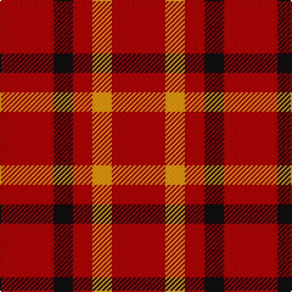

**Bands:** [RKRYR](/stripes/rkryr/) · **Stripes:** [R K R LO R](/stripes/stripes5/) R K R LO R

This was sourced from register-of-tartans.  It is a [5 band tartan](/bands/bands5/).

Original link https://www.tartanregister.gov.uk/tartanDetails.aspx?ref=1814

## Also known as

This cloth is also recorded under:

- Ikelman #4

## Attestations

This cloth appears in 2 source records; the oldest owns this page.

- 01/01/2002 — Ikelman #4 (Personal) (register-of-tartans, [record](https://www.tartanregister.gov.uk/tartanDetails.aspx?ref=1814))
- pre 2002 — Ikelman #3 (Personal) (tartans-authority, [record](http://www.tartansauthority.com/tartan-ferret/display/5243/))

## Register references

External register numbers recorded for this tartan.

- Scottish Register of Tartans: [1814](https://www.tartanregister.gov.uk/tartanDetails.aspx?ref=1814)
- Scottish Tartans Authority (ITI): 5243

## Thread count
DR/44 K16 DR16 DY16 DR/44

## Palette
Each colour and its ΔE from the base-6 reference it is a variant of.

| Colour | Shade | Base | ΔE (OKLab) |
|---|---|---|---|
| DR | <code style="background-color:#880000;">#880000</code> `#880000` | R <code style="background-color:#CC0000;">#CC0000</code> | 0.15 |
| DY | <code style="background-color:#D09800;">#D09800</code> `#D09800` | Y <code style="background-color:#F2BF00;">#F2BF00</code> | 0.12 |
| K | <code style="background-color:#101010;">#101010</code> `#101010` | K <code style="background-color:#000000;">#000000</code> | 0.17 |

# Sample pattern

## Nearest tartans

The nearest existing variants by ΔTartan distance.

1. [Wilson's, No 134](/setts/s2/r3g1~x14/) — ΔT 2.32
1. [Wilson's No.134](/setts/s2/r3dg1~x14/) — ΔT 2.34
1. [Wilson's No.234](/setts/s2/r8k3~x2/) — ΔT 2.36
1. [Sinclair](/setts/s5/r30dg12k5lb8r30/) — ΔT 2.40
1. [Wilson's No.138](/setts/s2/r3t1~x14/) — ΔT 2.55
1. [MacAn of Lurgyvallan (Hose)](/setts/s6/r9k1r5g6r4k2~x4/) — ΔT 2.56
1. [Sinclair Dress](/setts/s5/r28dg16k4lb7r28/) — ΔT 2.59
1. [Unidentified Early 18th Centuary #2](/setts/s12/r9dg2r3dg2r9dg3r3db3r3dg3r3db3~x2/) — ΔT 2.64
1. [Macan, of Lurgyvallan (Hose)](/setts/s6/r10k1r4g6~x2/) — ΔT 2.71
1. [Waverley Care Aids Trust (Corporate)](/setts/s6/r8g2r2k1r1g2~x10/) — ΔT 2.81

## Neighbour map

Every grey dot is one of 14299 variants placed by the first two principal components of the ΔTartan feature space (44% of its variance). Red is this tartan; blue dots are its nearest — click one to open its page.

<svg viewBox="0 0 640 380" role="img" style="max-width:100%;height:auto;border:1px solid #e0e0e0;border-radius:4px;display:block" xmlns="http://www.w3.org/2000/svg"><image href="/nn/cloud.v1.png" width="640" height="380"/><a href="/setts/s2/r3g1~x14/"><circle cx="470.5" cy="366.0" r="4" fill="#3465a4"><title>Wilson's, No 134</title></circle></a><a href="/setts/s2/r3dg1~x14/"><circle cx="485.7" cy="366.0" r="4" fill="#3465a4"><title>Wilson's No.134</title></circle></a><a href="/setts/s2/r8k3~x2/"><circle cx="417.7" cy="363.6" r="4" fill="#3465a4"><title>Wilson's No.234</title></circle></a><a href="/setts/s5/r30dg12k5lb8r30/"><circle cx="364.7" cy="234.4" r="4" fill="#3465a4"><title>Sinclair</title></circle></a><a href="/setts/s2/r3t1~x14/"><circle cx="487.2" cy="366.0" r="4" fill="#3465a4"><title>Wilson's No.138</title></circle></a><a href="/setts/s6/r9k1r5g6r4k2~x4/"><circle cx="421.7" cy="277.1" r="4" fill="#3465a4"><title>MacAn of Lurgyvallan (Hose)</title></circle></a><a href="/setts/s5/r28dg16k4lb7r28/"><circle cx="347.4" cy="233.8" r="4" fill="#3465a4"><title>Sinclair Dress</title></circle></a><a href="/setts/s12/r9dg2r3dg2r9dg3r3db3r3dg3r3db3~x2/"><circle cx="340.9" cy="238.5" r="4" fill="#3465a4"><title>Unidentified Early 18th Centuary #2</title></circle></a><a href="/setts/s6/r10k1r4g6~x2/"><circle cx="407.9" cy="224.9" r="4" fill="#3465a4"><title>Macan, of Lurgyvallan (Hose)</title></circle></a><a href="/setts/s6/r8g2r2k1r1g2~x10/"><circle cx="471.5" cy="253.9" r="4" fill="#3465a4"><title>Waverley Care Aids Trust (Corporate)</title></circle></a><circle cx="429.7" cy="321.4" r="5" fill="#c00000"/></svg>

ID: /setts/s5/r11k4r4lo4r11~x4/
