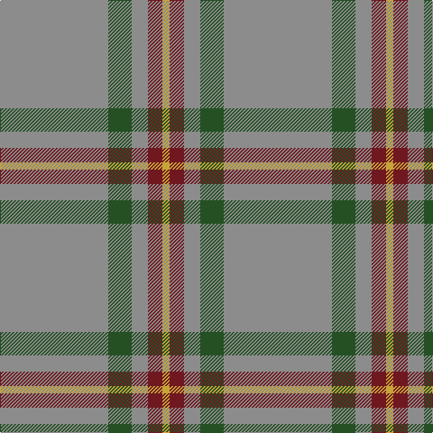

In pattern [RGRRY](/patterns/rgrry/).

This was sourced from house-of-tartan.  It is a [5 stripes tartan](/stripes/stripes5/).

Original link http://www.house-of-tartan.scotland.net/house/TartanViewjs.asp?colr=Def&tnam=7563

## Thread count
N/120 G26 N18 DR16 O/8

## Palette
Each colour and its ΔE from the base-6 reference it is a variant of.

| Colour | Shade | Base | ΔE (OKLab) |
|---|---|---|---|
| DR | <code style="background-color:#701820;">#701820</code> `#701820` | R <code style="background-color:#C80000;">#C80000</code> | 0.19 |
| G | <code style="background-color:#245024;">#245024</code> `#245024` | G <code style="background-color:#006400;">#006400</code> | 0.08 |
| N | <code style="background-color:#8C8C8C;">#8C8C8C</code> `#8C8C8C` | R <code style="background-color:#C80000;">#C80000</code> | 0.24 |
| O | <code style="background-color:#C8A438;">#C8A438</code> `#C8A438` | Y <code style="background-color:#E8C000;">#E8C000</code> | 0.10 |

# Sample pattern

ID: /setts/s5/r120g26r18ra16y8-g245024-r8c8c8c-ra701820-yc8a438/
