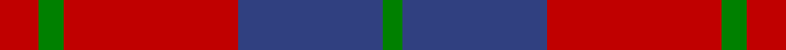
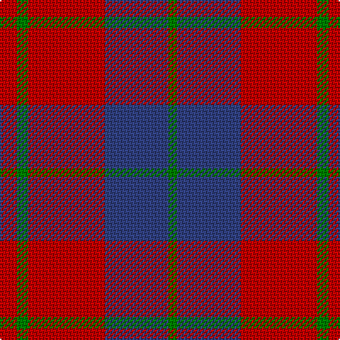

In pattern [GBRGR](/stripes/gbrgr/).

This was sourced from weddslist.  It is a [5 stripe tartan](/stripes/stripes5/).

Original link http://www.weddslist.com/cgi-bin/tartans/pg.pl?source=sts

## Attestations

This cloth appears in 2 source records; the oldest owns this page.

- undated — Wotherspoon (weddslist, [record](http://www.weddslist.com/cgi-bin/tartans/pg.pl?source=sts))
- undated — Wotherspoon Family Tartan Tartan Number: 741. Earliest known date: c.1941 This sett comes from the MacGregor-Hastie collection which is housed at the Scottish Tartans Society. It was obtained from Andersons in 1947, one of several designs produced between 1930 and 1950 for Septs and Families of Scottish lineage. Wotherspoons are recorded in the Lowlands of Scotland from the beginning of the 14th century. The Rev. John Witherspoon (1722-94), born in Yester, East Lothian, was President of 'Princeton University' in 1768 and took an active part in the American Revolution. See products available Copyright © Blair Urquhart, Comrie, 2015 (house-of-tartan, [record](http://www.house-of-tartan.scotland.net/house/TartanViewjs.asp?colr=Def&tnam=741))

## Thread count
R/12 G8 R54 B45 G/6

## Palette
Each colour and the base-6 reference it is a variant of.

| Colour | Shade | Base |
|---|---|---|
| B | <code style="background-color:#304080;">#304080</code> `oklch(39.4% 0.109 270.2)` <small>#304080</small> | B <code style="background-color:#2A418A;">#2A418A</code> |
| G | <code style="background-color:#008000;">#008000</code> `oklch(52.0% 0.177 142.5)` <small>#008000</small> | G <code style="background-color:#006100;">#006100</code> |
| R | <code style="background-color:#C00000;">#C00000</code> `oklch(50.7% 0.208 29.2)` <small>#C00000</small> | R <code style="background-color:#CC0000;">#CC0000</code> |

# Sample pattern

## Nearest tartans

The nearest existing variants by ΔTartan distance.

1. [Fraser of Boblainy, Hugh (Personal)](/setts/s5/db1r14g7db7r1~x4/) — ΔT 0.94
1. [Hugh Fraser of Boblainy](/setts/s5/r1r14g7db7r1~x4/) — ΔT 1.00
1. [Rajput](/setts/s6/db6r39db10r10db21ly5~x2/) — ΔT 1.03
1. [Grant of Lurg](/setts/s6/db2r25g10r2db10r2~x2/) — ΔT 1.03
1. [Hamilton, (Red)](/setts/s5/db6r1db6r9w1~x2/) — ΔT 1.09
1. [Wotherspoon](/setts/s5/r5dg3r18db18dg3~x4/) — ΔT 1.12
1. [British European](/setts/s6/r12db2r12db17w2r2~x2/) — ΔT 1.15
1. [British European (Corporate)](/setts/s6/r12db2r12db17w2r2~x4/) — ΔT 1.15
1. [Finnigan (Estimated threadcount)](/setts/s6/r3db15r3g8r20k2~x2/) — ΔT 1.17
1. [MacFadyan (MacGregor Hastie)](/setts/s7/db3r25db17r5g22r9db3~x2/) — ΔT 1.24

## Neighbour map

Every grey dot is one of 14299 variants placed by the first two principal components of the ΔTartan feature space (44% of its variance). Red is this tartan; blue dots are its nearest — click one to open its page.

<svg viewBox="0 0 640 380" role="img" style="max-width:100%;height:auto;border:1px solid #e0e0e0;border-radius:4px;display:block" xmlns="http://www.w3.org/2000/svg"><image href="/nn/cloud.v1.png" width="640" height="380"/><a href="/setts/s5/db1r14g7db7r1~x4/"><circle cx="319.2" cy="220.3" r="4" fill="#3465a4"><title>Fraser of Boblainy, Hugh (Personal)</title></circle></a><a href="/setts/s5/r1r14g7db7r1~x4/"><circle cx="341.5" cy="222.8" r="4" fill="#3465a4"><title>Hugh Fraser of Boblainy</title></circle></a><a href="/setts/s6/db6r39db10r10db21ly5~x2/"><circle cx="349.0" cy="247.3" r="4" fill="#3465a4"><title>Rajput</title></circle></a><a href="/setts/s6/db2r25g10r2db10r2~x2/"><circle cx="370.3" cy="206.8" r="4" fill="#3465a4"><title>Grant of Lurg</title></circle></a><a href="/setts/s5/db6r1db6r9w1~x2/"><circle cx="332.6" cy="250.7" r="4" fill="#3465a4"><title>Hamilton, (Red)</title></circle></a><a href="/setts/s5/r5dg3r18db18dg3~x4/"><circle cx="290.4" cy="255.8" r="4" fill="#3465a4"><title>Wotherspoon</title></circle></a><a href="/setts/s6/r12db2r12db17w2r2~x2/"><circle cx="347.9" cy="235.0" r="4" fill="#3465a4"><title>British European</title></circle></a><a href="/setts/s6/r12db2r12db17w2r2~x4/"><circle cx="347.9" cy="235.0" r="4" fill="#3465a4"><title>British European (Corporate)</title></circle></a><a href="/setts/s6/r3db15r3g8r20k2~x2/"><circle cx="286.5" cy="207.5" r="4" fill="#3465a4"><title>Finnigan (Estimated threadcount)</title></circle></a><a href="/setts/s7/db3r25db17r5g22r9db3~x2/"><circle cx="266.1" cy="233.3" r="4" fill="#3465a4"><title>MacFadyan (MacGregor Hastie)</title></circle></a><circle cx="341.4" cy="240.6" r="5" fill="#c00000"/></svg>

ID: /setts/s5/r12g8r54db45g6/
