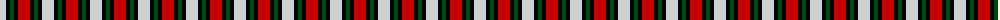

In pattern [RKGKW](/patterns/rkgkw/).

This was sourced from weddslist.  It is a [5 stripes tartan](/stripes/stripes5/).

Original link http://www.weddslist.com/cgi-bin/tartans/pg.pl?source=rb

## Thread count
N/12 K4 G4 K4 R/12

## Palette
Each colour and its ΔE from the base-6 reference it is a variant of.

| Colour | Shade | Base | ΔE (OKLab) |
|---|---|---|---|
| G | <code style="background-color:#004C00;">#004C00</code> `#004C00` | G <code style="background-color:#006100;">#006100</code> | 0.07 |
| K | <code style="background-color:#000000;">#000000</code> `#000000` | K <code style="background-color:#000000;">#000000</code> | 0.00 |
| N | <code style="background-color:#D0D0D0;">#D0D0D0</code> `#D0D0D0` | W <code style="background-color:#F7F7F7;">#F7F7F7</code> | 0.12 |
| R | <code style="background-color:#C80000;">#C80000</code> `#C80000` | R <code style="background-color:#CC0000;">#CC0000</code> | 0.01 |

# Sample pattern

## Nearest tartans

The nearest existing variants by ΔTartan distance.

1. [SAL Glindrande Stiernan](/setts/s4/r60g20k60w20-g008b00-k101010-rff0000-wffffff/) — ΔT 0.82
1. [SAL Grindrande Stiernan (Corporate)](/setts/s4/r60g20k60w20-g006818-k101010-rc80000-wfcfcfc/) — ΔT 0.89
1. [Thomas Newcomen's Combustion Engine](/setts/s4/k28r20w12b8-b202060-k101010-rc80000-wfcfcfc/) — ΔT 1.22
1. [Brodie Dress](/setts/s5/b12w40k36r66k12-b2c2c80-k101010-rc80000-wfcfcfc/) — ΔT 1.25
1. [Thomas Newcomen's Combustion Engine](/setts/s4/k28r20w12b8-b0000cd-k101010-rff0000-wffffff/) — ΔT 1.25
1. [Wilson's, No 113](/setts/s4/r4g12b12w4-b800080-g008000-rc00000-we0e0e0/) — ΔT 1.35
1. [Austin / Wilson's No 173](/setts/s5/b6k6b6g12y4-b800080-g008000-k000000-yf0c000/) — ΔT 1.46
1. [Austin / Wilson's No 137](/setts/s5/b6k6b6g12r4-b800080-g008000-k000000-rc00000/) — ΔT 1.56
1. [Heidrick Family (Personal)](/setts/s5/w28k60b18r16ra18-b0596fa-k101010-r960000-rae86000-we0e0e0/) — ΔT 1.56
1. [Aboyne II (Fashion)](/setts/s6/r8y4r20k16g20w4-g006818-k101010-rc80000-wfcfcfc-yfccc00/) — ΔT 1.60

## Neighbour map

Every grey dot is one of 15726 variants placed by the first two principal components of the ΔTartan feature space (44% of its variance). Red is this tartan; blue dots are its nearest — click one to open its page.

<svg viewBox="0 0 640 380" role="img" style="max-width:100%;height:auto;border:1px solid #e0e0e0;border-radius:4px;display:block" xmlns="http://www.w3.org/2000/svg"><image href="/nn/cloud.v1.png" width="640" height="380"/><a href="/setts/s4/r60g20k60w20-g008b00-k101010-rff0000-wffffff/"><circle cx="104.7" cy="273.8" r="4" fill="#3465a4"><title>SAL Glindrande Stiernan</title></circle></a><a href="/setts/s4/r60g20k60w20-g006818-k101010-rc80000-wfcfcfc/"><circle cx="110.8" cy="280.9" r="4" fill="#3465a4"><title>SAL Grindrande Stiernan (Corporate)</title></circle></a><a href="/setts/s4/k28r20w12b8-b202060-k101010-rc80000-wfcfcfc/"><circle cx="111.5" cy="280.1" r="4" fill="#3465a4"><title>Thomas Newcomen's Combustion Engine</title></circle></a><a href="/setts/s5/b12w40k36r66k12-b2c2c80-k101010-rc80000-wfcfcfc/"><circle cx="136.4" cy="228.0" r="4" fill="#3465a4"><title>Brodie Dress</title></circle></a><a href="/setts/s4/k28r20w12b8-b0000cd-k101010-rff0000-wffffff/"><circle cx="105.8" cy="275.3" r="4" fill="#3465a4"><title>Thomas Newcomen's Combustion Engine</title></circle></a><a href="/setts/s4/r4g12b12w4-b800080-g008000-rc00000-we0e0e0/"><circle cx="120.1" cy="286.6" r="4" fill="#3465a4"><title>Wilson's, No 113</title></circle></a><a href="/setts/s5/b6k6b6g12y4-b800080-g008000-k000000-yf0c000/"><circle cx="71.2" cy="290.7" r="4" fill="#3465a4"><title>Austin / Wilson's No 173</title></circle></a><a href="/setts/s5/b6k6b6g12r4-b800080-g008000-k000000-rc00000/"><circle cx="85.1" cy="294.8" r="4" fill="#3465a4"><title>Austin / Wilson's No 137</title></circle></a><a href="/setts/s5/w28k60b18r16ra18-b0596fa-k101010-r960000-rae86000-we0e0e0/"><circle cx="95.2" cy="236.0" r="4" fill="#3465a4"><title>Heidrick Family (Personal)</title></circle></a><a href="/setts/s6/r8y4r20k16g20w4-g006818-k101010-rc80000-wfcfcfc-yfccc00/"><circle cx="113.1" cy="223.7" r="4" fill="#3465a4"><title>Aboyne II (Fashion)</title></circle></a><circle cx="74.7" cy="258.3" r="5" fill="#c00000"/></svg>

ID: /setts/s5/r12k4g4k4w12-g004c00-k000000-rc80000-wd0d0d0/
