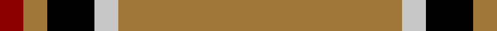
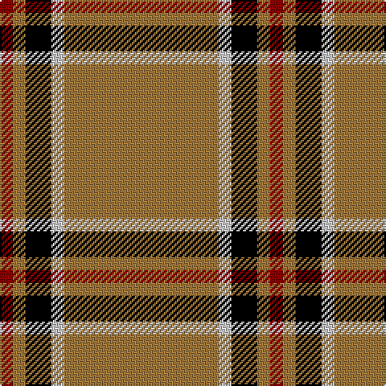

In pattern [RRKWR](/patterns/rrkwr/).

This was sourced from register-of-tartans.  It is a [5 stripes tartan](/stripes/stripes5/).

Original link https://www.tartanregister.gov.uk/tartanDetails.aspx?ref=2168

## Thread count
DR/8 LT8 K16 N8 LT/96

## Palette
Each colour and its ΔE from the base-6 reference it is a variant of.

| Colour | Shade | Base | ΔE (OKLab) |
|---|---|---|---|
| DR | <code style="background-color:#8C0000;">#8C0000</code> `#8C0000` | R <code style="background-color:#CC0000;">#CC0000</code> | 0.14 |
| K | <code style="background-color:#000000;">#000000</code> `#000000` | K <code style="background-color:#000000;">#000000</code> | 0.00 |
| LT | <code style="background-color:#A0783C;">#A0783C</code> `#A0783C` | R <code style="background-color:#CC0000;">#CC0000</code> | 0.18 |
| N | <code style="background-color:#C8C8C8;">#C8C8C8</code> `#C8C8C8` | W <code style="background-color:#F7F7F7;">#F7F7F7</code> | 0.14 |

# Sample pattern

## Nearest tartans

The nearest existing variants by ΔTartan distance.

1. [Lochcarron, Camel (Fashion)](/setts/s5/r12k1r2r1k1x8~k000000-ra0783c/) — ΔT 0.73
1. [Coca Cola](/setts/s5/w7g7w7g40r3x2~g604000-rc80000-wd4e8f4/) — ΔT 1.09
1. [Coca Cola (Corporate)](/setts/s5/w15g15w15g80r6~g604000-rc80000-wd4e8f4/) — ΔT 1.17
1. [Bro-Dreger](/setts/s7/w3k5y3r3y32k2y3x2~k101010-r880000-we0e0e0-yb0840c/) — ΔT 1.18
1. [Glenlivet Dress Reproduction (Corp)](/setts/s8/g6r2g42b2g5w16g5b2x2~b2c2c80-g604000-rb03000-we0e0e0/) — ΔT 1.44
1. [Wilbers](/setts/s8/y5k9y2k7ya35r4ya35k4x2~k101010-rc80000-ye8c000-yab49440/) — ΔT 1.71
1. [Loch Tummel](/setts/s5/r38w9r3b9w3x2~b401000-r906030-we0e0e0/) — ΔT 1.73
1. [Volkswagen Orange Trim](/setts/s6/g3y3k10y26k3y3x2~g289c18-k101010-yd87c00/) — ΔT 1.74
1. [Volkswagen Orange Trim (Fashion)](/setts/s6/y26k10y3g3y3k3x6~g289c18-k101010-yd87c00/) — ΔT 1.74
1. [Highlands at Wyomissing, The](/setts/s5/r35w3r8y2g11x2~g146400-r880000-wffffff-yfccc00/) — ΔT 1.77

## Neighbour map

Every grey dot is one of 15726 variants placed by the first two principal components of the ΔTartan feature space (44% of its variance). Red is this tartan; blue dots are its nearest — click one to open its page.

<svg viewBox="0 0 640 380" role="img" style="max-width:100%;height:auto;border:1px solid #e0e0e0;border-radius:4px;display:block" xmlns="http://www.w3.org/2000/svg"><image href="/nn/cloud.v1.png" width="640" height="380"/><a href="/setts/s5/r12k1r2r1k1x8~k000000-ra0783c/"><circle cx="482.8" cy="189.4" r="4" fill="#3465a4"><title>Lochcarron, Camel (Fashion)</title></circle></a><a href="/setts/s5/w7g7w7g40r3x2~g604000-rc80000-wd4e8f4/"><circle cx="454.9" cy="204.6" r="4" fill="#3465a4"><title>Coca Cola</title></circle></a><a href="/setts/s5/w15g15w15g80r6~g604000-rc80000-wd4e8f4/"><circle cx="444.7" cy="205.8" r="4" fill="#3465a4"><title>Coca Cola (Corporate)</title></circle></a><a href="/setts/s7/w3k5y3r3y32k2y3x2~k101010-r880000-we0e0e0-yb0840c/"><circle cx="469.3" cy="150.5" r="4" fill="#3465a4"><title>Bro-Dreger</title></circle></a><a href="/setts/s8/g6r2g42b2g5w16g5b2x2~b2c2c80-g604000-rb03000-we0e0e0/"><circle cx="451.9" cy="142.2" r="4" fill="#3465a4"><title>Glenlivet Dress Reproduction (Corp)</title></circle></a><a href="/setts/s8/y5k9y2k7ya35r4ya35k4x2~k101010-rc80000-ye8c000-yab49440/"><circle cx="399.4" cy="156.2" r="4" fill="#3465a4"><title>Wilbers</title></circle></a><a href="/setts/s5/r38w9r3b9w3x2~b401000-r906030-we0e0e0/"><circle cx="407.7" cy="203.9" r="4" fill="#3465a4"><title>Loch Tummel</title></circle></a><a href="/setts/s6/g3y3k10y26k3y3x2~g289c18-k101010-yd87c00/"><circle cx="386.4" cy="203.7" r="4" fill="#3465a4"><title>Volkswagen Orange Trim</title></circle></a><a href="/setts/s6/y26k10y3g3y3k3x6~g289c18-k101010-yd87c00/"><circle cx="386.4" cy="203.7" r="4" fill="#3465a4"><title>Volkswagen Orange Trim (Fashion)</title></circle></a><a href="/setts/s5/r35w3r8y2g11x2~g146400-r880000-wffffff-yfccc00/"><circle cx="469.3" cy="187.0" r="4" fill="#3465a4"><title>Highlands at Wyomissing, The</title></circle></a><circle cx="467.4" cy="181.4" r="5" fill="#c00000"/></svg>

ID: /setts/s5/r12w1k2r1ra1x8~k000000-ra0783c-ra8c0000-wc8c8c8/
