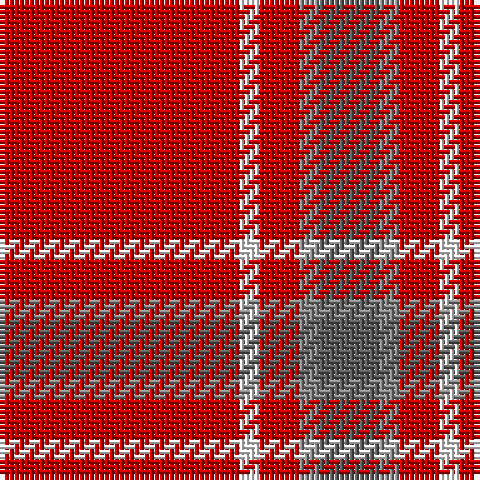

In pattern [BRRWR](/stripes/brrwr/).

This was sourced from tartans-authority.  It is a [5 stripe tartan](/stripes/stripes5/).

Original link http://www.tartansauthority.com/tartan-ferret/display/1297/

## Thread count
R/48 W4 R8 Na4 N/12

## Palette
Each colour and the base-6 reference it is a variant of.

| Colour | Shade | Base |
|---|---|---|
| N | <code style="background-color:#5C5C5C;">#5C5C5C</code> `oklch(47.5% 0.000 89.9)` <small>#5C5C5C</small> | B <code style="background-color:#2A418A;">#2A418A</code> |
| Na | <code style="background-color:#888888;">#888888</code> `oklch(62.7% 0.000 89.9)` <small>#888888</small> | R <code style="background-color:#CC0000;">#CC0000</code> |
| R | <code style="background-color:#C80000;">#C80000</code> `oklch(52.3% 0.215 29.2)` <small>#C80000</small> | R <code style="background-color:#CC0000;">#CC0000</code> |
| W | <code style="background-color:#FCFCFC;">#FCFCFC</code> `oklch(99.1% 0.000 89.9)` <small>#FCFCFC</small> | W <code style="background-color:#F7F7F7;">#F7F7F7</code> |

# Sample pattern

## Nearest tartans

The nearest existing variants by ΔTartan distance, with this tartan at the top so the swatches line up against it.

ΔTartan

Tartan

Sett

—

<a href="/ttd/edit/#slug=r12w1r2o1n3~x4">Glen Shee Plaid (Fashion)</a> <a class="nn-out" href="/setts/s5/r12w1r2o1n3~x4/" title="open its dictionary page">↗</a>

0.48

<a href="/ttd/edit/#slug=r12w1r2lb1n3~x4">Glenshee</a> <a class="nn-out" href="/setts/s5/r12w1r2lb1n3~x4/" title="open its dictionary page">↗</a>

1.29

<a href="/ttd/edit/#slug=r65dg16r4dp4r4w5~x2">Howard, Vincent (Personal)</a> <a class="nn-out" href="/setts/s6/r65dg16r4dp4r4w5~x2/" title="open its dictionary page">↗</a>

1.36

<a href="/ttd/edit/#slug=r65g16r4dp4r4w5~x2">Howard, Vincent (Personal)</a> <a class="nn-out" href="/setts/s6/r65g16r4dp4r4w5~x2/" title="open its dictionary page">↗</a>

1.51

<a href="/ttd/edit/#slug=ly6k3r40w3~x2">Masai Shuka 18 (Artefact)</a> <a class="nn-out" href="/setts/s4/ly6k3r40w3~x2/" title="open its dictionary page">↗</a>

1.70

<a href="/ttd/edit/#slug=r32dg8t4ly1~x2">MacLaine of Lochbuie (Coburn)</a> <a class="nn-out" href="/setts/s4/r32dg8t4ly1~x2/" title="open its dictionary page">↗</a>

1.70

<a href="/ttd/edit/#slug=r58ly3r6dg16r12dg16r6">Cameron Ancient</a> <a class="nn-out" href="/setts/s7/r58ly3r6dg16r12dg16r6/" title="open its dictionary page">↗</a>

1.77

<a href="/ttd/edit/#slug=g4r32db9r6db2r3db2r12w3~x2">Rose</a> <a class="nn-out" href="/setts/s9/g4r32db9r6db2r3db2r12w3~x2/" title="open its dictionary page">↗</a>

1.80

<a href="/ttd/edit/#slug=r5db10r5dg5r25ly1~x4">AON</a> <a class="nn-out" href="/setts/s6/r5db10r5dg5r25ly1~x4/" title="open its dictionary page">↗</a>

1.81

<a href="/ttd/edit/#slug=r32g8t4ly1~x2">MacLaine of Lochbuie</a> <a class="nn-out" href="/setts/s4/r32g8t4ly1~x2/" title="open its dictionary page">↗</a>

1.82

<a href="/ttd/edit/#slug=r34w4t7lo10t7r18~x2">Ploysongsang, Edward Thiravej (Personal)</a> <a class="nn-out" href="/setts/s6/r34w4t7lo10t7r18~x2/" title="open its dictionary page">↗</a>

## Neighbour map

Every grey dot is one of 14299 variants placed by the first two principal components of the ΔTartan feature space (44% of its variance). Red is this tartan; blue dots are its nearest — click one to open its page.

<svg viewBox="0 0 640 380" role="img" style="max-width:100%;height:auto;border:1px solid #e0e0e0;border-radius:4px;display:block" xmlns="http://www.w3.org/2000/svg"><image href="/nn/cloud.v1.png" width="640" height="380"/><a href="/setts/s5/r12w1r2lb1n3~x4/"><circle cx="494.0" cy="185.7" r="4" fill="#3465a4"><title>Glenshee</title></circle></a><a href="/setts/s6/r65dg16r4dp4r4w5~x2/"><circle cx="508.6" cy="151.9" r="4" fill="#3465a4"><title>Howard, Vincent (Personal)</title></circle></a><a href="/setts/s6/r65g16r4dp4r4w5~x2/"><circle cx="503.4" cy="149.2" r="4" fill="#3465a4"><title>Howard, Vincent (Personal)</title></circle></a><a href="/setts/s4/ly6k3r40w3~x2/"><circle cx="507.5" cy="173.5" r="4" fill="#3465a4"><title>Masai Shuka 18 (Artefact)</title></circle></a><a href="/setts/s4/r32dg8t4ly1~x2/"><circle cx="519.9" cy="171.5" r="4" fill="#3465a4"><title>MacLaine of Lochbuie (Coburn)</title></circle></a><a href="/setts/s7/r58ly3r6dg16r12dg16r6/"><circle cx="488.9" cy="173.0" r="4" fill="#3465a4"><title>Cameron Ancient</title></circle></a><a href="/setts/s9/g4r32db9r6db2r3db2r12w3~x2/"><circle cx="463.5" cy="145.3" r="4" fill="#3465a4"><title>Rose</title></circle></a><a href="/setts/s6/r5db10r5dg5r25ly1~x4/"><circle cx="453.9" cy="165.9" r="4" fill="#3465a4"><title>AON</title></circle></a><a href="/setts/s4/r32g8t4ly1~x2/"><circle cx="511.9" cy="169.4" r="4" fill="#3465a4"><title>MacLaine of Lochbuie</title></circle></a><a href="/setts/s6/r34w4t7lo10t7r18~x2/"><circle cx="374.1" cy="210.7" r="4" fill="#3465a4"><title>Ploysongsang, Edward Thiravej (Personal)</title></circle></a><circle cx="501.4" cy="193.6" r="5" fill="#c00000"/></svg>

ID: /setts/s5/r12w1r2o1n3~x4/
