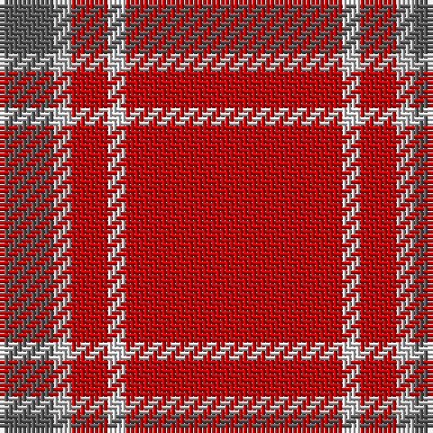

In pattern [BWRWR](/patterns/bwrwr/).

This was sourced from house-of-tartan.  It is a [5 stripes tartan](/stripes/stripes5/).

Original link http://www.house-of-tartan.scotland.net/house/TartanViewjs.asp?colr=Def&tnam=1297

## Thread count
N/12 Na4 R8 LN4 R/48

## Palette
Each colour and its ΔE from the base-6 reference it is a variant of.

| Colour | Shade | Base | ΔE (OKLab) |
|---|---|---|---|
| LN | <code style="background-color:#E0E0E0;">#E0E0E0</code> `#E0E0E0` | W <code style="background-color:#F7F7F7;">#F7F7F7</code> | 0.07 |
| N | <code style="background-color:#5C5C5C;">#5C5C5C</code> `#5C5C5C` | B <code style="background-color:#2A418A;">#2A418A</code> | 0.15 |
| Na | <code style="background-color:#C0C0C0;">#C0C0C0</code> `#C0C0C0` | W <code style="background-color:#F7F7F7;">#F7F7F7</code> | 0.17 |
| R | <code style="background-color:#C80000;">#C80000</code> `#C80000` | R <code style="background-color:#CC0000;">#CC0000</code> | 0.01 |

# Sample pattern

## Nearest tartans

The nearest existing variants by ΔTartan distance.

1. [Glen Shee Plaid (Fashion)](/setts/s5/r12w1r2ra1b3x4~b5c5c5c-rc80000-ra888888-wfcfcfc/) — ΔT 0.11
1. [Glenshee](/setts/s5/r12w1r2wa1b3x4~b505050-rc00000-we0e0e0-wac0c0c0/) — ΔT 0.24
1. [Glenshee](/setts/s5/r12w1r2wa1b3x4~b505050-rdc0000-we0e0e0-wac0c0c0/) — ΔT 0.41
1. [Howard, Vincent (Personal)](/setts/s6/r65g16r4b4r4w5x2~b440044-g004c00-rc80000-we0e0e0/) — ΔT 1.27
1. [Howard, Vincent (Personal)](/setts/s6/r65g16r4b4r4w5x2~b440044-g006818-rc80000-wfcfcfc/) — ΔT 1.33
1. [Masai Shuka 18 (Artefact)](/setts/s4/y6k3r40w3x2~k101010-rc80000-we0e0e0-ye8c000/) — ΔT 1.47
1. [Rose](/setts/s9/g4r32b9r6b2r3b2r12w3x2~b304080-g008000-rc00000-we0e0e0/) — ΔT 1.52
1. [Rose Clan Tartan Tartan Number: 845. Earliest known date: 1842 The text of the Vestiarium gives the colours as purple and crimson but in the plate they appear as mid blue and scarlet. The Lord Lyon records crimson as red. D.C. Stewart regarded this sett as a 'dress' tartan. ('The Setts..' 1950) James Logan records a 'hunting' version. ('The Scottish Gael' 1831). The castle of Kilravock which has been the residence of the Roses for over five centuries is still the seat of the chief. See products available Copyright © Blair Urquhart, Comrie, 2015](/setts/s9/g4r32b9r6b2r3b2r12w3x2~b2c2c80-g006818-rc80000-we0e0e0/) — ΔT 1.65
1. [Cameron Ancient](/setts/s7/r58y3r6g16r12g16r6~g005020-rdc0000-ye8c000/) — ΔT 1.69
1. [MacLaine of Lochbuie (Coburn)](/setts/s4/r32g8b4y1x2~b5c8ca8-g285800-rc80000-ye8c000/) — ΔT 1.70

## Neighbour map

Every grey dot is one of 15726 variants placed by the first two principal components of the ΔTartan feature space (44% of its variance). Red is this tartan; blue dots are its nearest — click one to open its page.

<svg viewBox="0 0 640 380" role="img" style="max-width:100%;height:auto;border:1px solid #e0e0e0;border-radius:4px;display:block" xmlns="http://www.w3.org/2000/svg"><image href="/nn/cloud.v1.png" width="640" height="380"/><a href="/setts/s5/r12w1r2ra1b3x4~b5c5c5c-rc80000-ra888888-wfcfcfc/"><circle cx="503.5" cy="198.0" r="4" fill="#3465a4"><title>Glen Shee Plaid (Fashion)</title></circle></a><a href="/setts/s5/r12w1r2wa1b3x4~b505050-rc00000-we0e0e0-wac0c0c0/"><circle cx="498.4" cy="197.0" r="4" fill="#3465a4"><title>Glenshee</title></circle></a><a href="/setts/s5/r12w1r2wa1b3x4~b505050-rdc0000-we0e0e0-wac0c0c0/"><circle cx="496.4" cy="191.6" r="4" fill="#3465a4"><title>Glenshee</title></circle></a><a href="/setts/s6/r65g16r4b4r4w5x2~b440044-g004c00-rc80000-we0e0e0/"><circle cx="510.2" cy="158.6" r="4" fill="#3465a4"><title>Howard, Vincent (Personal)</title></circle></a><a href="/setts/s6/r65g16r4b4r4w5x2~b440044-g006818-rc80000-wfcfcfc/"><circle cx="505.0" cy="156.3" r="4" fill="#3465a4"><title>Howard, Vincent (Personal)</title></circle></a><a href="/setts/s4/y6k3r40w3x2~k101010-rc80000-we0e0e0-ye8c000/"><circle cx="509.6" cy="183.2" r="4" fill="#3465a4"><title>Masai Shuka 18 (Artefact)</title></circle></a><a href="/setts/s9/g4r32b9r6b2r3b2r12w3x2~b304080-g008000-rc00000-we0e0e0/"><circle cx="478.9" cy="158.4" r="4" fill="#3465a4"><title>Rose</title></circle></a><a href="/setts/s9/g4r32b9r6b2r3b2r12w3x2~b2c2c80-g006818-rc80000-we0e0e0/"><circle cx="471.1" cy="154.2" r="4" fill="#3465a4"><title>Rose Clan Tartan Tartan Number: 845. Earliest known date: 1842 The text of the Vestiarium gives the colours as purple and crimson but in the plate they appear as mid blue and scarlet. The Lord Lyon records crimson as red. D.C. Stewart regarded this sett as a 'dress' tartan. ('The Setts..' 1950) James Logan records a 'hunting' version. ('The Scottish Gael' 1831). The castle of Kilravock which has been the residence of the Roses for over five centuries is still the seat of the chief. See products available Copyright © Blair Urquhart, Comrie, 2015</title></circle></a><a href="/setts/s7/r58y3r6g16r12g16r6~g005020-rdc0000-ye8c000/"><circle cx="490.5" cy="179.4" r="4" fill="#3465a4"><title>Cameron Ancient</title></circle></a><a href="/setts/s4/r32g8b4y1x2~b5c8ca8-g285800-rc80000-ye8c000/"><circle cx="521.7" cy="175.3" r="4" fill="#3465a4"><title>MacLaine of Lochbuie (Coburn)</title></circle></a><circle cx="502.9" cy="197.2" r="5" fill="#c00000"/></svg>

ID: /setts/s5/r12w1r2wa1b3x4~b5c5c5c-rc80000-we0e0e0-wac0c0c0/
