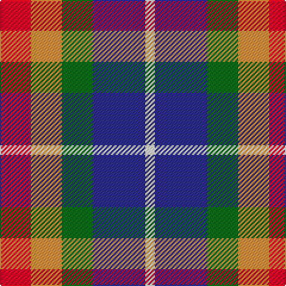

This page is one **sett** — a single exact thread-count. It belongs to the [tartan](/tartans/r13lo13g13db22w4/)
(the same proportion at any scale), whose colour order is pattern [RYGBW](/stripes/rygbw/).

Sourced from tartans-authority.  It is a [5 stripe tartan](/stripes/stripes5/).

Original link http://www.tartansauthority.com/tartan-ferret/display/10781/

## Thread count
R/26 O26 G26 DB44 W/8

## Palette

Palette: <strong>Tartan Register</strong>
<table><thead><tr><th>Colour</th><th>Threads</th><th>Shade</th><th>Base</th><th>OKLCh</th></tr></thead><tbody><tr><td>R/</td><td style="text-align:right;font-variant-numeric:tabular-nums">26</td><td><code style="background-color:#C8002C;">#C8002C</code> <small style="color:#888">#C8002C</small></td><td>R <code style="background-color:#CC0000;">#CC0000</code></td><td><small style="color:#888">oklch(52.6% 0.212 22.0)</small></td></tr><tr><td>O</td><td style="text-align:right;font-variant-numeric:tabular-nums">26</td><td><code style="background-color:#DC943C;">#DC943C</code> <small style="color:#888">#DC943C</small></td><td>Y <code style="background-color:#F2BF00;">#F2BF00</code></td><td><small style="color:#888">oklch(72.3% 0.133 67.9)</small></td></tr><tr><td>G</td><td style="text-align:right;font-variant-numeric:tabular-nums">26</td><td><code style="background-color:#006818;">#006818</code> <small style="color:#888">#006818</small></td><td>G <code style="background-color:#006100;">#006100</code></td><td><small style="color:#888">oklch(45.0% 0.142 145.0)</small></td></tr><tr><td>DB</td><td style="text-align:right;font-variant-numeric:tabular-nums">44</td><td><code style="background-color:#2C2C80;">#2C2C80</code> <small style="color:#888">#2C2C80</small></td><td>B <code style="background-color:#2A418A;">#2A418A</code></td><td><small style="color:#888">oklch(35.0% 0.138 276.6)</small></td></tr><tr><td>W/</td><td style="text-align:right;font-variant-numeric:tabular-nums">8</td><td><code style="background-color:#FCFCFC;">#FCFCFC</code> <small style="color:#888">#FCFCFC</small></td><td>W <code style="background-color:#F7F7F7;">#F7F7F7</code></td><td><small style="color:#888">oklch(99.1% 0.000 89.9)</small></td></tr></tbody></table>

# Sample pattern

## Nearest tartans

The nearest existing variants by ΔTartan distance, with this tartan at the top so the swatches line up against it.

ΔTartan

Tartan

Sett

—

<a href="/ttd/edit/#slug=r13lo13g13db22w4~x2">Clan Haggis World (Corporate)</a> <a class="nn-out" href="/setts/s5/r13lo13g13db22w4~x2/" title="open its dictionary page">↗</a>

0.97

<a href="/ttd/edit/#slug=r5t12ly11dt21lo5~x2">Inspiration</a> <a class="nn-out" href="/setts/s5/r5t12ly11dt21lo5~x2/" title="open its dictionary page">↗</a>

1.05

<a href="/ttd/edit/#slug=r5db12ly11n21ly5~x2">Inspiration</a> <a class="nn-out" href="/setts/s5/r5db12ly11n21ly5~x2/" title="open its dictionary page">↗</a>

1.21

<a href="/ttd/edit/#slug=g15dg18db23w4r8~x2">Friebe (2014)</a> <a class="nn-out" href="/setts/s5/g15dg18db23w4r8~x2/" title="open its dictionary page">↗</a>

1.24

<a href="/ttd/edit/#slug=r13ly13g13b22w4~x2">Clan Haggis World (Corporate)</a> <a class="nn-out" href="/setts/s5/r13ly13g13b22w4~x2/" title="open its dictionary page">↗</a>

1.27

<a href="/ttd/edit/#slug=dp11t2k10g10ly3~x2">Nobiliary Fraternity</a> <a class="nn-out" href="/setts/s5/dp11t2k10g10ly3~x2/" title="open its dictionary page">↗</a>

1.31

<a href="/ttd/edit/#slug=r1dy6db2lb4k4lb1~x6">Thompson's Fancy (Fashion)</a> <a class="nn-out" href="/setts/s6/r1dy6db2lb4k4lb1~x6/" title="open its dictionary page">↗</a>

1.35

<a href="/ttd/edit/#slug=db9r12dg9db5w2~x4">Battle of Prestonpans (1745) Herit</a> <a class="nn-out" href="/setts/s5/db9r12dg9db5w2~x4/" title="open its dictionary page">↗</a>

1.38

<a href="/ttd/edit/#slug=db16r14g16ly3g16r14db16w3~x2">Forrester (James) (Personal)</a> <a class="nn-out" href="/setts/s8/db16r14g16ly3g16r14db16w3~x2/" title="open its dictionary page">↗</a>

1.44

<a href="/ttd/edit/#slug=k8r12w8dg15n30ly5~x2">Reekie (Edmonton)</a> <a class="nn-out" href="/setts/s6/k8r12w8dg15n30ly5~x2/" title="open its dictionary page">↗</a>

1.46

<a href="/ttd/edit/#slug=lo2db4k1db4m4lo4db1~x8">Isle of Gigha (District)</a> <a class="nn-out" href="/setts/s7/lo2db4k1db4m4lo4db1~x8/" title="open its dictionary page">↗</a>

## Neighbour map

Every grey dot is one of 14299 variants placed by the first two principal components of the ΔTartan feature space (44% of its variance). Red is this tartan; blue dots are its nearest — click one to open its page.

<svg viewBox="0 0 640 380" role="img" style="max-width:100%;height:auto;border:1px solid #e0e0e0;border-radius:4px;display:block" xmlns="http://www.w3.org/2000/svg"><image href="/nn/cloud.v1.png" width="640" height="380"/><a href="/setts/s5/r5t12ly11dt21lo5~x2/"><circle cx="98.1" cy="246.4" r="4" fill="#3465a4"><title>Inspiration</title></circle></a><a href="/setts/s5/r5db12ly11n21ly5~x2/"><circle cx="95.1" cy="239.9" r="4" fill="#3465a4"><title>Inspiration</title></circle></a><a href="/setts/s5/g15dg18db23w4r8~x2/"><circle cx="91.2" cy="249.9" r="4" fill="#3465a4"><title>Friebe (2014)</title></circle></a><a href="/setts/s5/r13ly13g13b22w4~x2/"><circle cx="51.7" cy="236.6" r="4" fill="#3465a4"><title>Clan Haggis World (Corporate)</title></circle></a><a href="/setts/s5/dp11t2k10g10ly3~x2/"><circle cx="88.0" cy="245.8" r="4" fill="#3465a4"><title>Nobiliary Fraternity</title></circle></a><a href="/setts/s6/r1dy6db2lb4k4lb1~x6/"><circle cx="87.7" cy="218.9" r="4" fill="#3465a4"><title>Thompson's Fancy (Fashion)</title></circle></a><a href="/setts/s5/db9r12dg9db5w2~x4/"><circle cx="150.6" cy="262.8" r="4" fill="#3465a4"><title>Battle of Prestonpans (1745) Herit</title></circle></a><a href="/setts/s8/db16r14g16ly3g16r14db16w3~x2/"><circle cx="93.0" cy="239.6" r="4" fill="#3465a4"><title>Forrester (James) (Personal)</title></circle></a><a href="/setts/s6/k8r12w8dg15n30ly5~x2/"><circle cx="87.0" cy="197.2" r="4" fill="#3465a4"><title>Reekie (Edmonton)</title></circle></a><a href="/setts/s7/lo2db4k1db4m4lo4db1~x8/"><circle cx="115.5" cy="249.7" r="4" fill="#3465a4"><title>Isle of Gigha (District)</title></circle></a><circle cx="72.6" cy="245.5" r="5" fill="#c00000"/></svg>

ID: /setts/s5/r13lo13g13db22w4~x2/
