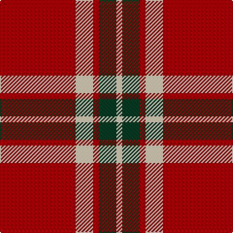

In pattern [RWRGW](/patterns/rwrgw/).

This was sourced from tartans-authority.  It is a [5 stripes tartan](/stripes/stripes5/).

Original link http://www.tartansauthority.com/tartan-ferret/display/8818/

## Thread count
DR/78 LR18 DR6 DG18 LR/6

## Palette
Each colour and its ΔE from the base-6 reference it is a variant of.

| Colour | Shade | Base | ΔE (OKLab) |
|---|---|---|---|
| DG | <code style="background-color:#003820;">#003820</code> `#003820` | G <code style="background-color:#006100;">#006100</code> | 0.15 |
| DR | <code style="background-color:#880000;">#880000</code> `#880000` | R <code style="background-color:#CC0000;">#CC0000</code> | 0.15 |
| LR | <code style="background-color:#E8CCB8;">#E8CCB8</code> `#E8CCB8` | W <code style="background-color:#F7F7F7;">#F7F7F7</code> | 0.12 |

# Sample pattern

## Nearest tartans

The nearest existing variants by ΔTartan distance.

1. [Loch Morar](/setts/s5/r38w9r3k9w3~k101010-r880000-wfcfcfc~x2/) — ΔT 0.81
1. [Auld Reekie](/setts/s6/b4r3b3r22g8r2~b000050-g003000-rc00000~x2/) — ΔT 0.88
1. [Dunbar (District)](/setts/s4/r28k4w2k13~k101010-rcc4438-we0e0e0~x2/) — ΔT 1.05
1. [MacGregor, Black (Personal)](/setts/s5/r41k19r7k9w3~k101010-rc80000-wfcfcfc~x2/) — ΔT 1.07
1. [Loch Morar](/setts/s5/r38w9r3b9w3~b401000-rc00000-we0e0e0~x2/) — ΔT 1.12
1. [Hopkins (Name)](/setts/s5/r36k18r4k7w2~k101010-rc80000-we0e0e0~x2/) — ΔT 1.12
1. [MacKeane](/setts/s5/r4k8r12k1y1~k101010-rc80000-ye8c000~x2/) — ΔT 1.15
1. [MacKintosh D](/setts/s6/r22b5r2g11r3b1~b000064-g004c00-rc80000~x2/) — ΔT 1.17
1. [Dunbar (Wilson's) District Tartan Tartan Number: 1236. Earliest known date: 1840 Restricted See products available Copyright © Blair Urquhart, Comrie, 2015](/setts/s4/r28k4w2k13~k101010-rc80000-we0e0e0~x2/) — ΔT 1.18
1. [Turner (Personal)](/setts/s5/r48k12ra7k5w3~k101010-rc80000-ra888888-wfcfcfc~x2/) — ΔT 1.18

## Neighbour map

Every grey dot is one of 15726 variants placed by the first two principal components of the ΔTartan feature space (44% of its variance). Red is this tartan; blue dots are its nearest — click one to open its page.

<svg viewBox="0 0 640 380" role="img" style="max-width:100%;height:auto;border:1px solid #e0e0e0;border-radius:4px;display:block" xmlns="http://www.w3.org/2000/svg"><image href="/nn/cloud.v1.png" width="640" height="380"/><a href="/setts/s5/r38w9r3k9w3~k101010-r880000-wfcfcfc~x2/"><circle cx="390.4" cy="192.4" r="4" fill="#3465a4"><title>Loch Morar</title></circle></a><a href="/setts/s6/b4r3b3r22g8r2~b000050-g003000-rc00000~x2/"><circle cx="400.2" cy="207.7" r="4" fill="#3465a4"><title>Auld Reekie</title></circle></a><a href="/setts/s4/r28k4w2k13~k101010-rcc4438-we0e0e0~x2/"><circle cx="375.0" cy="217.9" r="4" fill="#3465a4"><title>Dunbar (District)</title></circle></a><a href="/setts/s5/r41k19r7k9w3~k101010-rc80000-wfcfcfc~x2/"><circle cx="383.0" cy="210.0" r="4" fill="#3465a4"><title>MacGregor, Black (Personal)</title></circle></a><a href="/setts/s5/r38w9r3b9w3~b401000-rc00000-we0e0e0~x2/"><circle cx="413.8" cy="191.5" r="4" fill="#3465a4"><title>Loch Morar</title></circle></a><a href="/setts/s5/r36k18r4k7w2~k101010-rc80000-we0e0e0~x2/"><circle cx="399.8" cy="197.1" r="4" fill="#3465a4"><title>Hopkins (Name)</title></circle></a><a href="/setts/s5/r4k8r12k1y1~k101010-rc80000-ye8c000~x2/"><circle cx="385.3" cy="220.7" r="4" fill="#3465a4"><title>MacKeane</title></circle></a><a href="/setts/s6/r22b5r2g11r3b1~b000064-g004c00-rc80000~x2/"><circle cx="408.8" cy="182.4" r="4" fill="#3465a4"><title>MacKintosh D</title></circle></a><a href="/setts/s4/r28k4w2k13~k101010-rc80000-we0e0e0~x2/"><circle cx="383.5" cy="218.8" r="4" fill="#3465a4"><title>Dunbar (Wilson's) District Tartan Tartan Number: 1236. Earliest known date: 1840 Restricted See products available Copyright © Blair Urquhart, Comrie, 2015</title></circle></a><a href="/setts/s5/r48k12ra7k5w3~k101010-rc80000-ra888888-wfcfcfc~x2/"><circle cx="395.7" cy="168.2" r="4" fill="#3465a4"><title>Turner (Personal)</title></circle></a><circle cx="418.5" cy="199.8" r="5" fill="#c00000"/></svg>

ID: /setts/s5/r13w3r1g3w1~g003820-r880000-we8ccb8~x6/
