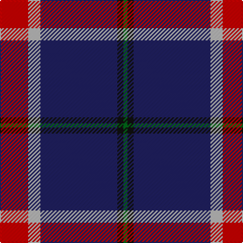

In pattern [GKBYR](/stripes/gkbyr/).

This was sourced from tartans-authority.  It is a [5 stripe tartan](/stripes/stripes5/).

Original link http://www.tartansauthority.com/tartan-ferret/display/10941/

## Thread count
R/28 N12 DB76 K6 G/4

## Palette
Each colour and the base-6 reference it is a variant of.

| Colour | Shade | Base |
|---|---|---|
| DB | <code style="background-color:#202060;">#202060</code> `oklch(28.9% 0.111 276.9)` <small>#202060</small> | B <code style="background-color:#2A418A;">#2A418A</code> |
| G | <code style="background-color:#006818;">#006818</code> `oklch(45.0% 0.142 145.0)` <small>#006818</small> | G <code style="background-color:#006100;">#006100</code> |
| K | <code style="background-color:#101010;">#101010</code> `oklch(17.3% 0.000 89.9)` <small>#101010</small> | K <code style="background-color:#000000;">#000000</code> |
| N | <code style="background-color:#B8B8B8;">#B8B8B8</code> `oklch(78.3% 0.000 89.9)` <small>#B8B8B8</small> | Y <code style="background-color:#F2BF00;">#F2BF00</code> |
| R | <code style="background-color:#C80000;">#C80000</code> `oklch(52.3% 0.215 29.2)` <small>#C80000</small> | R <code style="background-color:#CC0000;">#CC0000</code> |

# Sample pattern

## Nearest tartans

The nearest existing variants by ΔTartan distance, with this tartan at the top so the swatches line up against it.

ΔTartan

Tartan

Sett

—

<a href="/ttd/edit/#slug=r14lr6db38k3g2~x2">Doten (2013)</a> <a class="nn-out" href="/setts/s5/r14lr6db38k3g2~x2/" title="open its dictionary page">↗</a>

0.99

<a href="/ttd/edit/#slug=lb12g12k12g24dp75ly4">Widows Sons Scotland Dress</a> <a class="nn-out" href="/setts/s6/lb12g12k12g24dp75ly4/" title="open its dictionary page">↗</a>

1.06

<a href="/ttd/edit/#slug=lb12dg16k12dg24dp75lo4">Widows Sons Scotland Dress</a> <a class="nn-out" href="/setts/s6/lb12dg16k12dg24dp75lo4/" title="open its dictionary page">↗</a>

1.12

<a href="/ttd/edit/#slug=w2db15r3g3r3db1~x8">Lothian Buses (Corporate?)</a> <a class="nn-out" href="/setts/s6/w2db15r3g3r3db1~x8/" title="open its dictionary page">↗</a>

1.15

<a href="/ttd/edit/#slug=dp46k6g9lo9r4">Ayllu Thuban (Corporate)</a> <a class="nn-out" href="/setts/s5/dp46k6g9lo9r4/" title="open its dictionary page">↗</a>

1.19

<a href="/ttd/edit/#slug=lb9k16dg10k22dp67lo4">Widows Sons Scotland (MRA)</a> <a class="nn-out" href="/setts/s6/lb9k16dg10k22dp67lo4/" title="open its dictionary page">↗</a>

1.27

<a href="/ttd/edit/#slug=o9k16dg10k22dp67ly4">Widows Sons Scotland (MRA)</a> <a class="nn-out" href="/setts/s6/o9k16dg10k22dp67ly4/" title="open its dictionary page">↗</a>

1.30

<a href="/ttd/edit/#slug=r10db15g2db2w1db1w1~x4">Ikelman #4 (Personal)</a> <a class="nn-out" href="/setts/s7/r10db15g2db2w1db1w1~x4/" title="open its dictionary page">↗</a>

1.31

<a href="/ttd/edit/#slug=r10db4r6db30k10db5w2~x2">Heritage of Wales (Fashion)</a> <a class="nn-out" href="/setts/s7/r10db4r6db30k10db5w2~x2/" title="open its dictionary page">↗</a>

1.35

<a href="/ttd/edit/#slug=db18r9db2r3k1o1~x4">MacGregor, Modern</a> <a class="nn-out" href="/setts/s6/db18r9db2r3k1o1~x4/" title="open its dictionary page">↗</a>

1.38

<a href="/ttd/edit/#slug=db25r8db3r4k1w3~x2">Clan Gregor Tartan Tartan Number: 3089. Earliest known date: See products available Copyright © Blair Urquhart, Comrie, 2015</a> <a class="nn-out" href="/setts/s6/db25r8db3r4k1w3~x2/" title="open its dictionary page">↗</a>

## Neighbour map

Every grey dot is one of 14299 variants placed by the first two principal components of the ΔTartan feature space (44% of its variance). Red is this tartan; blue dots are its nearest — click one to open its page.

<svg viewBox="0 0 640 380" role="img" style="max-width:100%;height:auto;border:1px solid #e0e0e0;border-radius:4px;display:block" xmlns="http://www.w3.org/2000/svg"><image href="/nn/cloud.v1.png" width="640" height="380"/><a href="/setts/s6/lb12g12k12g24dp75ly4/"><circle cx="298.6" cy="149.7" r="4" fill="#3465a4"><title>Widows Sons Scotland Dress</title></circle></a><a href="/setts/s6/lb12dg16k12dg24dp75lo4/"><circle cx="292.3" cy="161.6" r="4" fill="#3465a4"><title>Widows Sons Scotland Dress</title></circle></a><a href="/setts/s6/w2db15r3g3r3db1~x8/"><circle cx="342.0" cy="176.6" r="4" fill="#3465a4"><title>Lothian Buses (Corporate?)</title></circle></a><a href="/setts/s5/dp46k6g9lo9r4/"><circle cx="346.7" cy="182.1" r="4" fill="#3465a4"><title>Ayllu Thuban (Corporate)</title></circle></a><a href="/setts/s6/lb9k16dg10k22dp67lo4/"><circle cx="292.6" cy="166.0" r="4" fill="#3465a4"><title>Widows Sons Scotland (MRA)</title></circle></a><a href="/setts/s6/o9k16dg10k22dp67ly4/"><circle cx="309.5" cy="168.6" r="4" fill="#3465a4"><title>Widows Sons Scotland (MRA)</title></circle></a><a href="/setts/s7/r10db15g2db2w1db1w1~x4/"><circle cx="340.3" cy="169.8" r="4" fill="#3465a4"><title>Ikelman #4 (Personal)</title></circle></a><a href="/setts/s7/r10db4r6db30k10db5w2~x2/"><circle cx="340.1" cy="187.2" r="4" fill="#3465a4"><title>Heritage of Wales (Fashion)</title></circle></a><a href="/setts/s6/db18r9db2r3k1o1~x4/"><circle cx="390.5" cy="175.4" r="4" fill="#3465a4"><title>MacGregor, Modern</title></circle></a><a href="/setts/s6/db25r8db3r4k1w3~x2/"><circle cx="416.5" cy="157.8" r="4" fill="#3465a4"><title>Clan Gregor Tartan Tartan Number: 3089. Earliest known date: See products available Copyright © Blair Urquhart, Comrie, 2015</title></circle></a><circle cx="348.3" cy="163.2" r="5" fill="#c00000"/></svg>

ID: /setts/s5/r14lr6db38k3g2~x2/
