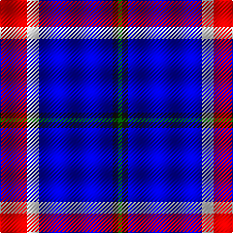

This page is one **sett** — a single exact thread-count. It belongs to the [tartan](/tartans/r14w6db38k3g2/)
(the same proportion at any scale), whose colour order is pattern [GKBWR](/stripes/gkbwr/).

Sourced from register-of-tartans.  It is a [5 stripe tartan](/stripes/stripes5/).

Original link https://www.tartanregister.gov.uk/tartanDetails.aspx?ref=10941

## Register references

External register numbers recorded for this tartan.

- Scottish Register of Tartans: [10941](https://www.tartanregister.gov.uk/tartanDetails.aspx?ref=10941)

## Thread count
R/28 W12 B76 K6 G/4

## Palette

Palette: <strong>Tartan Register</strong>
<table><thead><tr><th>Colour</th><th>Threads</th><th>Shade</th><th>Base</th><th>OKLCh</th></tr></thead><tbody><tr><td>R/</td><td style="text-align:right;font-variant-numeric:tabular-nums">28</td><td><code style="background-color:#FF0000;">#FF0000</code> <small style="color:#888">#FF0000</small></td><td>R <code style="background-color:#CC0000;">#CC0000</code></td><td><small style="color:#888">oklch(62.8% 0.258 29.2)</small></td></tr><tr><td>W</td><td style="text-align:right;font-variant-numeric:tabular-nums">12</td><td><code style="background-color:#FFFFFF;">#FFFFFF</code> <small style="color:#888">#FFFFFF</small></td><td>W <code style="background-color:#F7F7F7;">#F7F7F7</code></td><td><small style="color:#888">oklch(100.0% 0.000 89.9)</small></td></tr><tr><td>B</td><td style="text-align:right;font-variant-numeric:tabular-nums">76</td><td><code style="background-color:#0000CD;">#0000CD</code> <small style="color:#888">#0000CD</small></td><td>B <code style="background-color:#2A418A;">#2A418A</code></td><td><small style="color:#888">oklch(38.3% 0.266 264.1)</small></td></tr><tr><td>K</td><td style="text-align:right;font-variant-numeric:tabular-nums">6</td><td><code style="background-color:#101010;">#101010</code> <small style="color:#888">#101010</small></td><td>K <code style="background-color:#000000;">#000000</code></td><td><small style="color:#888">oklch(17.3% 0.000 89.9)</small></td></tr><tr><td>G/</td><td style="text-align:right;font-variant-numeric:tabular-nums">4</td><td><code style="background-color:#006400;">#006400</code> <small style="color:#888">#006400</small></td><td>G <code style="background-color:#006100;">#006100</code></td><td><small style="color:#888">oklch(43.6% 0.148 142.5)</small></td></tr></tbody></table>

# Sample pattern

## Nearest tartans

The nearest existing variants by ΔTartan distance, with this tartan at the top so the swatches line up against it.

ΔTartan

Tartan

Sett

—

<a href="/ttd/edit/#slug=r14w6db38k3g2~x2">Doten (2013)</a> <a class="nn-out" href="/setts/s5/r14w6db38k3g2~x2/" title="open its dictionary page">↗</a>

1.50

<a href="/ttd/edit/#slug=db4r2db40k11g2w16r2~x2">Sinclair, Blue (Personal)</a> <a class="nn-out" href="/setts/s7/db4r2db40k11g2w16r2~x2/" title="open its dictionary page">↗</a>

1.54

<a href="/ttd/edit/#slug=w2b35k9w3k9ly2~x2">Hannah (Personal)</a> <a class="nn-out" href="/setts/s6/w2b35k9w3k9ly2~x2/" title="open its dictionary page">↗</a>

1.59

<a href="/ttd/edit/#slug=b8w4b50k12b4k15r5~x2">Instakilt, Blue (Fashion)</a> <a class="nn-out" href="/setts/s7/b8w4b50k12b4k15r5~x2/" title="open its dictionary page">↗</a>

1.66

<a href="/ttd/edit/#slug=dbi10r1ly1db3ly2~x5">Lytley alias Parsons Hunting (Personal)</a> <a class="nn-out" href="/setts/s5/dbi10r1ly1db3ly2~x5/" title="open its dictionary page">↗</a>

1.80

<a href="/ttd/edit/#slug=lo3db4w10dg2w2dg5db34ly3~x2">Royal Troon Golf Club, The</a> <a class="nn-out" href="/setts/s8/lo3db4w10dg2w2dg5db34ly3~x2/" title="open its dictionary page">↗</a>

1.86

<a href="/ttd/edit/#slug=db40r3k10lo2lr15w2lr4~x2">U.S. Forces Thurso (Military)</a> <a class="nn-out" href="/setts/s7/db40r3k10lo2lr15w2lr4~x2/" title="open its dictionary page">↗</a>

1.86

<a href="/ttd/edit/#slug=db4r2db39k11g2w16r2~x2">Sinclair, The Jack</a> <a class="nn-out" href="/setts/s7/db4r2db39k11g2w16r2~x2/" title="open its dictionary page">↗</a>

1.86

<a href="/ttd/edit/#slug=p46k6g9ly9r4">Ayllu Thuban</a> <a class="nn-out" href="/setts/s5/p46k6g9ly9r4/" title="open its dictionary page">↗</a>

1.87

<a href="/ttd/edit/#slug=lo8w3db40k12w3lo3~x2">Wolverines (Corporate)</a> <a class="nn-out" href="/setts/s6/lo8w3db40k12w3lo3~x2/" title="open its dictionary page">↗</a>

1.88

<a href="/ttd/edit/#slug=p30db5p3db33lg8k3db8w2~x2">Saint Margaret of Scotland Youth Group</a> <a class="nn-out" href="/setts/s8/p30db5p3db33lg8k3db8w2~x2/" title="open its dictionary page">↗</a>

## Neighbour map

Every grey dot is one of 14359 variants placed by the first two principal components of the ΔTartan feature space (44% of its variance). Red is this tartan; blue dots are its nearest — click one to open its page.

<svg viewBox="0 0 640 380" role="img" style="max-width:100%;height:auto;border:1px solid #e0e0e0;border-radius:4px;display:block" xmlns="http://www.w3.org/2000/svg"><image href="/nn/cloud.v1.png" width="640" height="380"/><a href="/setts/s7/db4r2db40k11g2w16r2~x2/"><circle cx="290.2" cy="126.9" r="4" fill="#3465a4"><title>Sinclair, Blue (Personal)</title></circle></a><a href="/setts/s6/w2b35k9w3k9ly2~x2/"><circle cx="320.8" cy="163.6" r="4" fill="#3465a4"><title>Hannah (Personal)</title></circle></a><a href="/setts/s7/b8w4b50k12b4k15r5~x2/"><circle cx="350.9" cy="170.7" r="4" fill="#3465a4"><title>Instakilt, Blue (Fashion)</title></circle></a><a href="/setts/s5/dbi10r1ly1db3ly2~x5/"><circle cx="283.3" cy="197.9" r="4" fill="#3465a4"><title>Lytley alias Parsons Hunting (Personal)</title></circle></a><a href="/setts/s8/lo3db4w10dg2w2dg5db34ly3~x2/"><circle cx="303.1" cy="118.0" r="4" fill="#3465a4"><title>Royal Troon Golf Club, The</title></circle></a><a href="/setts/s7/db40r3k10lo2lr15w2lr4~x2/"><circle cx="259.3" cy="121.2" r="4" fill="#3465a4"><title>U.S. Forces Thurso (Military)</title></circle></a><a href="/setts/s7/db4r2db39k11g2w16r2~x2/"><circle cx="284.1" cy="128.7" r="4" fill="#3465a4"><title>Sinclair, The Jack</title></circle></a><a href="/setts/s5/p46k6g9ly9r4/"><circle cx="308.7" cy="158.0" r="4" fill="#3465a4"><title>Ayllu Thuban</title></circle></a><a href="/setts/s6/lo8w3db40k12w3lo3~x2/"><circle cx="306.2" cy="167.5" r="4" fill="#3465a4"><title>Wolverines (Corporate)</title></circle></a><a href="/setts/s8/p30db5p3db33lg8k3db8w2~x2/"><circle cx="279.6" cy="157.8" r="4" fill="#3465a4"><title>Saint Margaret of Scotland Youth Group</title></circle></a><circle cx="309.6" cy="148.5" r="5" fill="#c00000"/></svg>

ID: /setts/s5/r14w6db38k3g2~x2/
