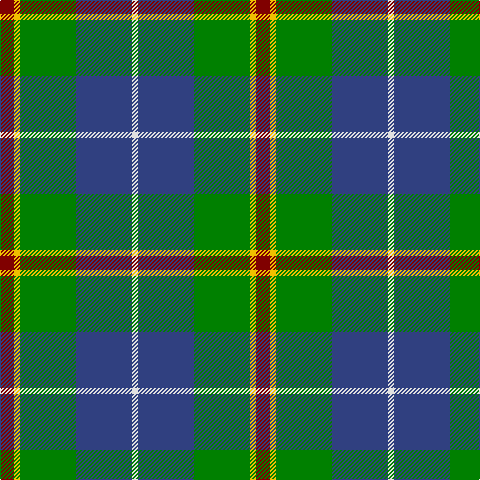

In pattern [RYGBW](/patterns/rygbw/).

This was sourced from weddslist.  It is a [5 stripes tartan](/stripes/stripes5/).

Original link http://www.weddslist.com/cgi-bin/tartans/pg.pl?source=sts

## Thread count
DR/14 Y6 G56 B56 LN/6

## Palette
Each colour and its ΔE from the base-6 reference it is a variant of.

| Colour | Shade | Base | ΔE (OKLab) |
|---|---|---|---|
| B | <code style="background-color:#304080;">#304080</code> `#304080` | B <code style="background-color:#2A418A;">#2A418A</code> | 0.02 |
| DR | <code style="background-color:#800000;">#800000</code> `#800000` | R <code style="background-color:#CC0000;">#CC0000</code> | 0.17 |
| G | <code style="background-color:#008000;">#008000</code> `#008000` | G <code style="background-color:#006100;">#006100</code> | 0.10 |
| LN | <code style="background-color:#E0E0E0;">#E0E0E0</code> `#E0E0E0` | W <code style="background-color:#F7F7F7;">#F7F7F7</code> | 0.07 |
| Y | <code style="background-color:#F0C000;">#F0C000</code> `#F0C000` | Y <code style="background-color:#F2BF00;">#F2BF00</code> | 0.00 |

# Sample pattern

## Nearest tartans

The nearest existing variants by ΔTartan distance.

1. [Alvis, of Lee](/setts/s5/b9w4g36ba36r4-b000050-ba5480b0-g008000-rc00000-we0e0e0/) — ΔT 0.65
1. [Turnbull Hunting (Name)](/setts/s5/r12y6g60b60w6-b2c2c80-g006818-rc80000-we0e0e0-ye8c000/) — ΔT 0.70
1. [Douglas](/setts/s5/k4b4g32ba32w4-b5480b0-ba304080-g008000-k000000-we0e0e0/) — ΔT 0.71
1. [Highlander, Highland Laddie Kilts](/setts/s5/k14r6g58b58w6-b304080-g008000-k000000-r802040-we0e0e0/) — ΔT 0.76
1. [Alvis of Lee Personal Tartan Tartan Number: 643. Earliest known date: 1985 Designed for the Baron of Lee See products available Copyright © Blair Urquhart, Comrie, 2015](/setts/s5/b9w4g36ba36r4-b202060-ba5c8ca8-g006818-rc80000-we0e0e0/) — ΔT 0.79
1. [Turnbull Hunting Clan Tartan Tartan Number: 1265. Earliest known date: pre 2003 An unusual dress tartan having no white. See products available Copyright © Blair Urquhart, Comrie, 2015](/setts/s5/k14y6g56b56w6-b2c2c80-g006818-k101010-we0e0e0-ye8c000/) — ΔT 0.85
1. [Turnbull, hunting](/setts/s5/k14y6g56b56w6-b304080-g008000-k000000-we0e0e0-yf0c000/) — ΔT 0.86
1. [Inglis](/setts/s6/w8g56b36r8b36y6-b304080-g008000-rc00000-we0e0e0-yf0c000/) — ΔT 0.88
1. [Turnbull Hunting (1983) #2](/setts/s5/k12y6g60b60w6-b2c2c80-g006818-k101010-wfcfcfc-ye8c000/) — ΔT 0.89
1. [MacLeod of Assynt](/setts/s6/r6k4g40k20b40y4-b1474b4-g006818-k101010-rc80000-ye8c000/) — ΔT 0.90

## Neighbour map

Every grey dot is one of 15726 variants placed by the first two principal components of the ΔTartan feature space (44% of its variance). Red is this tartan; blue dots are its nearest — click one to open its page.

<svg viewBox="0 0 640 380" role="img" style="max-width:100%;height:auto;border:1px solid #e0e0e0;border-radius:4px;display:block" xmlns="http://www.w3.org/2000/svg"><image href="/nn/cloud.v1.png" width="640" height="380"/><a href="/setts/s5/b9w4g36ba36r4-b000050-ba5480b0-g008000-rc00000-we0e0e0/"><circle cx="199.9" cy="209.7" r="4" fill="#3465a4"><title>Alvis, of Lee</title></circle></a><a href="/setts/s5/r12y6g60b60w6-b2c2c80-g006818-rc80000-we0e0e0-ye8c000/"><circle cx="217.6" cy="200.4" r="4" fill="#3465a4"><title>Turnbull Hunting (Name)</title></circle></a><a href="/setts/s5/k4b4g32ba32w4-b5480b0-ba304080-g008000-k000000-we0e0e0/"><circle cx="206.8" cy="209.4" r="4" fill="#3465a4"><title>Douglas</title></circle></a><a href="/setts/s5/k14r6g58b58w6-b304080-g008000-k000000-r802040-we0e0e0/"><circle cx="194.6" cy="203.1" r="4" fill="#3465a4"><title>Highlander, Highland Laddie Kilts</title></circle></a><a href="/setts/s5/b9w4g36ba36r4-b202060-ba5c8ca8-g006818-rc80000-we0e0e0/"><circle cx="216.2" cy="215.6" r="4" fill="#3465a4"><title>Alvis of Lee Personal Tartan Tartan Number: 643. Earliest known date: 1985 Designed for the Baron of Lee See products available Copyright © Blair Urquhart, Comrie, 2015</title></circle></a><a href="/setts/s5/k14y6g56b56w6-b2c2c80-g006818-k101010-we0e0e0-ye8c000/"><circle cx="200.6" cy="208.9" r="4" fill="#3465a4"><title>Turnbull Hunting Clan Tartan Tartan Number: 1265. Earliest known date: pre 2003 An unusual dress tartan having no white. See products available Copyright © Blair Urquhart, Comrie, 2015</title></circle></a><a href="/setts/s5/k14y6g56b56w6-b304080-g008000-k000000-we0e0e0-yf0c000/"><circle cx="182.1" cy="201.3" r="4" fill="#3465a4"><title>Turnbull, hunting</title></circle></a><a href="/setts/s6/w8g56b36r8b36y6-b304080-g008000-rc00000-we0e0e0-yf0c000/"><circle cx="226.5" cy="207.0" r="4" fill="#3465a4"><title>Inglis</title></circle></a><a href="/setts/s5/k12y6g60b60w6-b2c2c80-g006818-k101010-wfcfcfc-ye8c000/"><circle cx="211.8" cy="202.2" r="4" fill="#3465a4"><title>Turnbull Hunting (1983) #2</title></circle></a><a href="/setts/s6/r6k4g40k20b40y4-b1474b4-g006818-k101010-rc80000-ye8c000/"><circle cx="165.1" cy="199.7" r="4" fill="#3465a4"><title>MacLeod of Assynt</title></circle></a><circle cx="204.0" cy="206.6" r="5" fill="#c00000"/></svg>

ID: /setts/s5/r14y6g56b56w6-b304080-g008000-r800000-we0e0e0-yf0c000/
