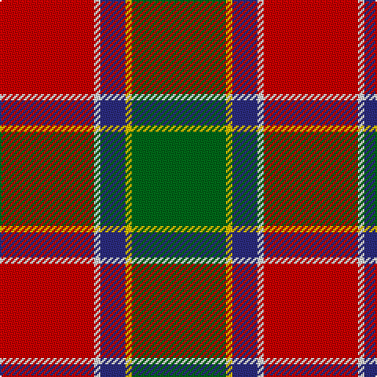

This page is one **sett** — a single exact thread-count. It belongs to the [tartan](/tartans/r15w1db4ly1g15/)
(the same proportion at any scale), whose colour order is pattern [GYBWR](/stripes/gybwr/).

Sourced from tartans-authority.  It is a [5 stripe tartan](/stripes/stripes5/).

Original link http://www.tartansauthority.com/tartan-ferret/display/7728/

## Register references

External register numbers recorded for this tartan.

- Scottish Tartans Authority (ITI): 7728

## Thread count
R/60 LN4 DB16 Y4 G/60

## Palette

Palette: <strong>Tartan Register</strong>
<table><thead><tr><th>Colour</th><th>Threads</th><th>Shade</th><th>Base</th><th>OKLCh</th></tr></thead><tbody><tr><td>R/</td><td style="text-align:right;font-variant-numeric:tabular-nums">60</td><td><code style="background-color:#C80000;">#C80000</code> <small style="color:#888">#C80000</small></td><td>R <code style="background-color:#CC0000;">#CC0000</code></td><td><small style="color:#888">oklch(52.3% 0.215 29.2)</small></td></tr><tr><td>LN</td><td style="text-align:right;font-variant-numeric:tabular-nums">4</td><td><code style="background-color:#E0E0E0;">#E0E0E0</code> <small style="color:#888">#E0E0E0</small></td><td>W <code style="background-color:#F7F7F7;">#F7F7F7</code></td><td><small style="color:#888">oklch(90.7% 0.000 89.9)</small></td></tr><tr><td>DB</td><td style="text-align:right;font-variant-numeric:tabular-nums">16</td><td><code style="background-color:#2C2C80;">#2C2C80</code> <small style="color:#888">#2C2C80</small></td><td>B <code style="background-color:#2A418A;">#2A418A</code></td><td><small style="color:#888">oklch(35.0% 0.138 276.6)</small></td></tr><tr><td>Y</td><td style="text-align:right;font-variant-numeric:tabular-nums">4</td><td><code style="background-color:#E8C000;">#E8C000</code> <small style="color:#888">#E8C000</small></td><td>Y <code style="background-color:#F2BF00;">#F2BF00</code></td><td><small style="color:#888">oklch(81.9% 0.168 93.7)</small></td></tr><tr><td>G/</td><td style="text-align:right;font-variant-numeric:tabular-nums">60</td><td><code style="background-color:#006818;">#006818</code> <small style="color:#888">#006818</small></td><td>G <code style="background-color:#006100;">#006100</code></td><td><small style="color:#888">oklch(45.0% 0.142 145.0)</small></td></tr></tbody></table>

# Sample pattern

## Nearest tartans

The nearest existing variants by ΔTartan distance, with this tartan at the top so the swatches line up against it.

ΔTartan

Tartan

Sett

—

<a href="/ttd/edit/#slug=r15w1db4ly1g15~x4">Eglinton, Duke of (Artefact)</a> <a class="nn-out" href="/setts/s5/r15w1db4ly1g15~x4/" title="open its dictionary page">↗</a>

0.69

<a href="/ttd/edit/#slug=k2db1g10r10ly1~x6">Turnbull Dress</a> <a class="nn-out" href="/setts/s5/k2db1g10r10ly1~x6/" title="open its dictionary page">↗</a>

0.84

<a href="/ttd/edit/#slug=g24b2r25ly2k3~x2">Bronte</a> <a class="nn-out" href="/setts/s5/g24b2r25ly2k3~x2/" title="open its dictionary page">↗</a>

1.06

<a href="/ttd/edit/#slug=w4dg20g10r25b2r2g2~x2">Caledonian Brewery</a> <a class="nn-out" href="/setts/s7/w4dg20g10r25b2r2g2~x2/" title="open its dictionary page">↗</a>

1.08

<a href="/ttd/edit/#slug=db6lo25dy16k2db3~x2">Prince of Orange #2</a> <a class="nn-out" href="/setts/s5/db6lo25dy16k2db3~x2/" title="open its dictionary page">↗</a>

1.13

<a href="/ttd/edit/#slug=db1r12g6ly1g6db1~x4">Cetoloni (Personal)</a> <a class="nn-out" href="/setts/s6/db1r12g6ly1g6db1~x4/" title="open its dictionary page">↗</a>

1.15

<a href="/ttd/edit/#slug=k6r2dg17r16k1t2~x2">Unidentified #15</a> <a class="nn-out" href="/setts/s6/k6r2dg17r16k1t2~x2/" title="open its dictionary page">↗</a>

1.17

<a href="/ttd/edit/#slug=k5db4g24r21w3~x2">Sachie Hara Scottish Check (Personal)</a> <a class="nn-out" href="/setts/s5/k5db4g24r21w3~x2/" title="open its dictionary page">↗</a>

1.18

<a href="/ttd/edit/#slug=ly2dg17g4r15dg1~x2">Christmas</a> <a class="nn-out" href="/setts/s5/ly2dg17g4r15dg1~x2/" title="open its dictionary page">↗</a>

1.18

<a href="/ttd/edit/#slug=w15lo98do72r25do8lg15">Afternoon Tea / Milk Tea</a> <a class="nn-out" href="/setts/s6/w15lo98do72r25do8lg15/" title="open its dictionary page">↗</a>

1.18

<a href="/ttd/edit/#slug=r20w1k1dp6ly1g18~x2">Gordon of Abergeldie, (Red..)</a> <a class="nn-out" href="/setts/s6/r20w1k1dp6ly1g18~x2/" title="open its dictionary page">↗</a>

## Neighbour map

Every grey dot is one of 14359 variants placed by the first two principal components of the ΔTartan feature space (44% of its variance). Red is this tartan; blue dots are its nearest — click one to open its page.

<svg viewBox="0 0 640 380" role="img" style="max-width:100%;height:auto;border:1px solid #e0e0e0;border-radius:4px;display:block" xmlns="http://www.w3.org/2000/svg"><image href="/nn/cloud.v1.png" width="640" height="380"/><a href="/setts/s5/k2db1g10r10ly1~x6/"><circle cx="235.2" cy="194.8" r="4" fill="#3465a4"><title>Turnbull Dress</title></circle></a><a href="/setts/s5/g24b2r25ly2k3~x2/"><circle cx="283.1" cy="183.3" r="4" fill="#3465a4"><title>Bronte</title></circle></a><a href="/setts/s7/w4dg20g10r25b2r2g2~x2/"><circle cx="206.6" cy="159.3" r="4" fill="#3465a4"><title>Caledonian Brewery</title></circle></a><a href="/setts/s5/db6lo25dy16k2db3~x2/"><circle cx="276.5" cy="201.1" r="4" fill="#3465a4"><title>Prince of Orange #2</title></circle></a><a href="/setts/s6/db1r12g6ly1g6db1~x4/"><circle cx="287.5" cy="198.5" r="4" fill="#3465a4"><title>Cetoloni (Personal)</title></circle></a><a href="/setts/s6/k6r2dg17r16k1t2~x2/"><circle cx="258.0" cy="179.2" r="4" fill="#3465a4"><title>Unidentified #15</title></circle></a><a href="/setts/s5/k5db4g24r21w3~x2/"><circle cx="193.5" cy="202.7" r="4" fill="#3465a4"><title>Sachie Hara Scottish Check (Personal)</title></circle></a><a href="/setts/s5/ly2dg17g4r15dg1~x2/"><circle cx="301.4" cy="200.9" r="4" fill="#3465a4"><title>Christmas</title></circle></a><a href="/setts/s6/w15lo98do72r25do8lg15/"><circle cx="227.2" cy="182.2" r="4" fill="#3465a4"><title>Afternoon Tea / Milk Tea</title></circle></a><a href="/setts/s6/r20w1k1dp6ly1g18~x2/"><circle cx="243.2" cy="129.3" r="4" fill="#3465a4"><title>Gordon of Abergeldie, (Red..)</title></circle></a><circle cx="249.6" cy="178.0" r="5" fill="#c00000"/></svg>

ID: /setts/s5/r15w1db4ly1g15~x4/
