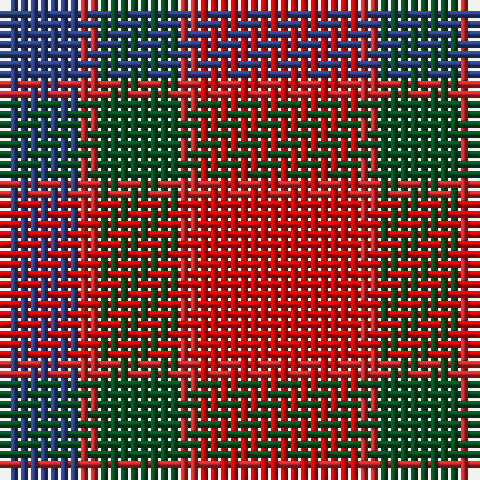

In pattern [BRGRR](/patterns/brgrr/).

This was sourced from register-of-tartans.  It is a [5 stripes tartan](/stripes/stripes5/).

Original link https://www.tartanregister.gov.uk/tartanDetails.aspx?ref=3009

## Thread count
B/8 R2 G8 R2 Ra/16

## Palette
Each colour and its ΔE from the base-6 reference it is a variant of.

| Colour | Shade | Base | ΔE (OKLab) |
|---|---|---|---|
| B | <code style="background-color:#2C4084;">#2C4084</code> `#2C4084` | B <code style="background-color:#2A418A;">#2A418A</code> | 0.01 |
| G | <code style="background-color:#005020;">#005020</code> `#005020` | G <code style="background-color:#006100;">#006100</code> | 0.07 |
| R | <code style="background-color:#C82828;">#C82828</code> `#C82828` | R <code style="background-color:#CC0000;">#CC0000</code> | 0.03 |
| Ra | <code style="background-color:#DC0000;">#DC0000</code> `#DC0000` | R <code style="background-color:#CC0000;">#CC0000</code> | 0.03 |

# Sample pattern

## Nearest tartans

The nearest existing variants by ΔTartan distance.

1. [Moray of Abercairney](/setts/s5/r16ra2g8ra2b8-b304080-g008000-rc00000-rad03030/) — ΔT 0.48
1. [Moray of Abercairney](/setts/s6/r16ra2g8ra2g2b4-b3c82af-g005020-rdc0000-rac82828/) — ΔT 0.97
1. [Plaid Wine](/setts/s6/r96b20ra36b8ra36w36-b5c5c5c-r880000-raa07c58-we8ccb8/) — ΔT 1.02
1. [Highland Pub Company](/setts/s5/b32k26b26r60y8-b4c3428-k101010-rc80000-yd09800/) — ΔT 1.09
1. [MacKintosh-Geddes (Personal?)](/setts/s7/b4r8g24r6b12r20w4-b780078-g006818-rc80000-wfcfcfc/) — ΔT 1.15
1. [Bronte House Check](/setts/s6/r10g60b13y24b24g8-b2c294f-g6b380d-rfc0fc0-yd4ad7d/) — ΔT 1.19
1. [Unidentified 16](/setts/s6/b8r6b52r52g52r8-b800080-g008000-rc00000/) — ΔT 1.20
1. [Unidentified Artifact Tartan Tartan Number: 463. Earliest known date: 0 Wilson's of Bannockburn 'New Broad Sett' perhaps. See products available Copyright © Blair Urquhart, Comrie, 2015](/setts/s6/b8r6b52r52g52r8-b780078-g006818-rc80000/) — ΔT 1.21
1. [Fiddes](/setts/s8/g24r22b24ra6r64b16g16b16-b800080-g008000-rc00000-rad03030/) — ΔT 1.21
1. [Finnigan (Estimated threadcount)](/setts/s6/r6b30r6g16r40k4-b2c2c80-g006818-k101010-rc80000/) — ΔT 1.23

## Neighbour map

Every grey dot is one of 15726 variants placed by the first two principal components of the ΔTartan feature space (44% of its variance). Red is this tartan; blue dots are its nearest — click one to open its page.

<svg viewBox="0 0 640 380" role="img" style="max-width:100%;height:auto;border:1px solid #e0e0e0;border-radius:4px;display:block" xmlns="http://www.w3.org/2000/svg"><image href="/nn/cloud.v1.png" width="640" height="380"/><a href="/setts/s5/r16ra2g8ra2b8-b304080-g008000-rc00000-rad03030/"><circle cx="242.3" cy="233.9" r="4" fill="#3465a4"><title>Moray of Abercairney</title></circle></a><a href="/setts/s6/r16ra2g8ra2g2b4-b3c82af-g005020-rdc0000-rac82828/"><circle cx="271.5" cy="207.6" r="4" fill="#3465a4"><title>Moray of Abercairney</title></circle></a><a href="/setts/s6/r96b20ra36b8ra36w36-b5c5c5c-r880000-raa07c58-we8ccb8/"><circle cx="233.9" cy="205.8" r="4" fill="#3465a4"><title>Plaid Wine</title></circle></a><a href="/setts/s5/b32k26b26r60y8-b4c3428-k101010-rc80000-yd09800/"><circle cx="218.7" cy="255.2" r="4" fill="#3465a4"><title>Highland Pub Company</title></circle></a><a href="/setts/s7/b4r8g24r6b12r20w4-b780078-g006818-rc80000-wfcfcfc/"><circle cx="201.6" cy="223.3" r="4" fill="#3465a4"><title>MacKintosh-Geddes (Personal?)</title></circle></a><a href="/setts/s6/r10g60b13y24b24g8-b2c294f-g6b380d-rfc0fc0-yd4ad7d/"><circle cx="248.2" cy="221.9" r="4" fill="#3465a4"><title>Bronte House Check</title></circle></a><a href="/setts/s6/b8r6b52r52g52r8-b800080-g008000-rc00000/"><circle cx="240.2" cy="231.0" r="4" fill="#3465a4"><title>Unidentified 16</title></circle></a><a href="/setts/s6/b8r6b52r52g52r8-b780078-g006818-rc80000/"><circle cx="249.5" cy="235.0" r="4" fill="#3465a4"><title>Unidentified Artifact Tartan Tartan Number: 463. Earliest known date: 0 Wilson's of Bannockburn 'New Broad Sett' perhaps. See products available Copyright © Blair Urquhart, Comrie, 2015</title></circle></a><a href="/setts/s8/g24r22b24ra6r64b16g16b16-b800080-g008000-rc00000-rad03030/"><circle cx="265.0" cy="204.4" r="4" fill="#3465a4"><title>Fiddes</title></circle></a><a href="/setts/s6/r6b30r6g16r40k4-b2c2c80-g006818-k101010-rc80000/"><circle cx="286.3" cy="207.4" r="4" fill="#3465a4"><title>Finnigan (Estimated threadcount)</title></circle></a><circle cx="240.0" cy="230.6" r="5" fill="#c00000"/></svg>

ID: /setts/s5/r16ra2g8ra2b8-b2c4084-g005020-rdc0000-rac82828/
