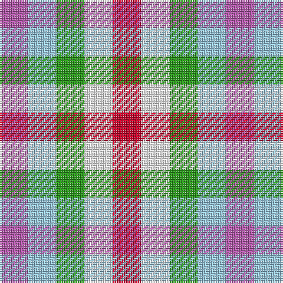

In pattern [RWGWR](/patterns/rwgwr/).

This was sourced from register-of-tartans.  It is a [5 stripes tartan](/stripes/stripes5/).

Original link https://www.tartanregister.gov.uk/tartanDetails.aspx?ref=11537

## Thread count
P/16 LB16 G16 W16 R/16

## Palette
Each colour and its ΔE from the base-6 reference it is a variant of.

| Colour | Shade | Base | ΔE (OKLab) |
|---|---|---|---|
| G | <code style="background-color:#289C18;">#289C18</code> `#289C18` | G <code style="background-color:#006400;">#006400</code> | 0.18 |
| LB | <code style="background-color:#98C8E8;">#98C8E8</code> `#98C8E8` | W <code style="background-color:#F4F4F0;">#F4F4F0</code> | 0.17 |
| P | <code style="background-color:#B458AC;">#B458AC</code> `#B458AC` | R <code style="background-color:#C80000;">#C80000</code> | 0.20 |
| R | <code style="background-color:#C80028;">#C80028</code> `#C80028` | R <code style="background-color:#C80000;">#C80000</code> | 0.02 |
| W | <code style="background-color:#F8F8F8;">#F8F8F8</code> `#F8F8F8` | W <code style="background-color:#F4F4F0;">#F4F4F0</code> | 0.01 |

# Sample pattern

## Nearest tartans

The nearest existing variants by ΔTartan distance.

1. [Algarve](/setts/s4/b20w20r20g20-b2c2c80-g285800-rc80000-we0e0e0/) — ΔT 1.82
1. [Highland Princess, The](/setts/s5/b30g30r22ra34rb30-b1870a4-g289c18-re86000-rac80000-rbec34c4/) — ΔT 2.12
1. [Highland Princess, The](/setts/s5/b30g30y22r34ra30-b1870a4-g006818-rc80000-rac04094-yd87c00/) — ΔT 2.48
1. [Antonelli (Oklahoma), John (Personal)](/setts/s6/b25g25b25r25w25k25-b000080-g008b00-k101010-rff0000-w82cffd/) — ΔT 2.82
1. [Aquascutum](/setts/s3/b22w22r22-b304080-rc00000-we0e0e0/) — ΔT 2.85
1. [Glen Moriston Estate Check](/setts/s3/b8w8wa8-b00243c-wd0d0d0-wad4dce0/) — ΔT 2.93
1. [Aquascutum Trade Tartan Tartan Number: 657. Earliest known date: pre 2003 Named after the district in which it was found. See products available Copyright © Blair Urquhart, Comrie, 2015](/setts/s3/b22w22r22-b2c2c80-rc80000-we0e0e0/) — ΔT 2.97
1. [Aquascutum](/setts/s3/b22w22r22-b2c2c80-rc80000-wfcfcfc/) — ΔT 2.98
1. [Mothers Pride](/setts/s3/r40b40y40-b304080-rc00000-yf0c000/) — ΔT 3.00
1. [Lochwood Estate Check](/setts/s7/g8y8b8y8g8y6r8-b1474b4-g006818-rc80000-yc4bc68/) — ΔT 3.01

## Neighbour map

Every grey dot is one of 15726 variants placed by the first two principal components of the ΔTartan feature space (44% of its variance). Red is this tartan; blue dots are its nearest — click one to open its page.

<svg viewBox="0 0 640 380" role="img" style="max-width:100%;height:auto;border:1px solid #e0e0e0;border-radius:4px;display:block" xmlns="http://www.w3.org/2000/svg"><image href="/nn/cloud.v1.png" width="640" height="380"/><a href="/setts/s4/b20w20r20g20-b2c2c80-g285800-rc80000-we0e0e0/"><circle cx="14.0" cy="366.0" r="4" fill="#3465a4"><title>Algarve</title></circle></a><a href="/setts/s5/b30g30r22ra34rb30-b1870a4-g289c18-re86000-rac80000-rbec34c4/"><circle cx="14.0" cy="344.5" r="4" fill="#3465a4"><title>Highland Princess, The</title></circle></a><a href="/setts/s5/b30g30y22r34ra30-b1870a4-g006818-rc80000-rac04094-yd87c00/"><circle cx="14.0" cy="357.1" r="4" fill="#3465a4"><title>Highland Princess, The</title></circle></a><a href="/setts/s6/b25g25b25r25w25k25-b000080-g008b00-k101010-rff0000-w82cffd/"><circle cx="14.0" cy="366.0" r="4" fill="#3465a4"><title>Antonelli (Oklahoma), John (Personal)</title></circle></a><a href="/setts/s3/b22w22r22-b304080-rc00000-we0e0e0/"><circle cx="14.0" cy="366.0" r="4" fill="#3465a4"><title>Aquascutum</title></circle></a><a href="/setts/s3/b8w8wa8-b00243c-wd0d0d0-wad4dce0/"><circle cx="14.0" cy="366.0" r="4" fill="#3465a4"><title>Glen Moriston Estate Check</title></circle></a><a href="/setts/s3/b22w22r22-b2c2c80-rc80000-we0e0e0/"><circle cx="14.0" cy="366.0" r="4" fill="#3465a4"><title>Aquascutum Trade Tartan Tartan Number: 657. Earliest known date: pre 2003 Named after the district in which it was found. See products available Copyright © Blair Urquhart, Comrie, 2015</title></circle></a><a href="/setts/s3/b22w22r22-b2c2c80-rc80000-wfcfcfc/"><circle cx="14.0" cy="366.0" r="4" fill="#3465a4"><title>Aquascutum</title></circle></a><a href="/setts/s3/r40b40y40-b304080-rc00000-yf0c000/"><circle cx="14.0" cy="366.0" r="4" fill="#3465a4"><title>Mothers Pride</title></circle></a><a href="/setts/s7/g8y8b8y8g8y6r8-b1474b4-g006818-rc80000-yc4bc68/"><circle cx="26.2" cy="366.0" r="4" fill="#3465a4"><title>Lochwood Estate Check</title></circle></a><circle cx="14.0" cy="366.0" r="5" fill="#c00000"/></svg>

ID: /setts/s5/r16w16g16wa16ra16-g289c18-rb458ac-rac80028-w98c8e8-waf8f8f8/
