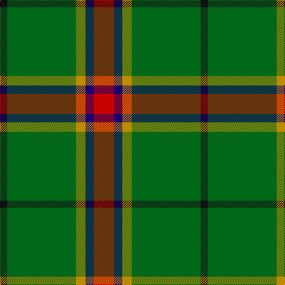

In pattern [KGYBR](/patterns/kgybr/).

This was sourced from tartans-authority.  It is a [5 stripes tartan](/stripes/stripes5/).

Original link http://www.tartansauthority.com/tartan-ferret/display/10400/

## Thread count
K/12 G116 DY16 DB14 R/34

## Palette
Each colour and its ΔE from the base-6 reference it is a variant of.

| Colour | Shade | Base | ΔE (OKLab) |
|---|---|---|---|
| DB | <code style="background-color:#1C0070;">#1C0070</code> `#1C0070` | B <code style="background-color:#2A418A;">#2A418A</code> | 0.14 |
| DY | <code style="background-color:#BC8C00;">#BC8C00</code> `#BC8C00` | Y <code style="background-color:#F2BF00;">#F2BF00</code> | 0.16 |
| G | <code style="background-color:#006818;">#006818</code> `#006818` | G <code style="background-color:#006100;">#006100</code> | 0.02 |
| K | <code style="background-color:#101010;">#101010</code> `#101010` | K <code style="background-color:#000000;">#000000</code> | 0.17 |
| R | <code style="background-color:#C80000;">#C80000</code> `#C80000` | R <code style="background-color:#CC0000;">#CC0000</code> | 0.01 |

# Sample pattern

## Nearest tartans

The nearest existing variants by ΔTartan distance.

1. [Asheville Firefighters, The](/setts/s6/k17g48y4r10b12g4~b202060-g006818-k101010-rc80000-ye8c000/) — ΔT 1.07
1. [Tulloch Homes](/setts/s7/g6ga14r9b7r9ga54y6~b102040-g30a010-ga004010-r800000-yffe000/) — ΔT 1.11
1. [Tulloch Homes](/setts/s7/g6ga14r9b7r9ga54y6~b14283c-g289c18-ga006818-rc80000-ye8c000/) — ΔT 1.12
1. [Dundhuin Hunting (Personal)](/setts/s5/g62ga17y12b8r8~b5f749c-g23321b-ga649848-r905966-yf8e38c~x2/) — ΔT 1.15
1. [Wilson's No.192](/setts/s4/b4g10r1y1~b440044-g006818-rc80000-ye8c000~x2/) — ΔT 1.22
1. [O'Neill (Name)](/setts/s8/w6g5r5g45k4y24k4g5~g006818-k101010-ra00024-we0e0e0-ya08858~x2/) — ΔT 1.27
1. [Crieff and Strathearn District Tartan Tartan Number: 664. Earliest known date: 1988 A branch of the Stewart clan from Galloway and the South West of Scotland. See products available Copyright © Blair Urquhart, Comrie, 2015](/setts/s7/g55b7r24g12ba4y3ba4~b780078-ba2c2c80-g006818-rc80000-ye8c000~x2/) — ΔT 1.29
1. [Bacon, Green (Fashion)](/setts/s4/g14k3r3y2~g006818-k101010-r880000-yb8b8b8~x2/) — ΔT 1.31
1. [Clare (Prince George) (Personal)](/setts/s5/b5y5g13ga41r3~b433a5a-g5d321f-ga649848-rca2625-ye0a126~x2/) — ΔT 1.35
1. [Crieff, and Strathearn](/setts/s7/g55b7r24g12ba4y3ba4~b800080-ba304080-g008000-rc00000-yf0c000~x2/) — ΔT 1.35

## Neighbour map

Every grey dot is one of 15726 variants placed by the first two principal components of the ΔTartan feature space (44% of its variance). Red is this tartan; blue dots are its nearest — click one to open its page.

<svg viewBox="0 0 640 380" role="img" style="max-width:100%;height:auto;border:1px solid #e0e0e0;border-radius:4px;display:block" xmlns="http://www.w3.org/2000/svg"><image href="/nn/cloud.v1.png" width="640" height="380"/><a href="/setts/s6/k17g48y4r10b12g4~b202060-g006818-k101010-rc80000-ye8c000/"><circle cx="276.3" cy="188.1" r="4" fill="#3465a4"><title>Asheville Firefighters, The</title></circle></a><a href="/setts/s7/g6ga14r9b7r9ga54y6~b102040-g30a010-ga004010-r800000-yffe000/"><circle cx="350.5" cy="192.5" r="4" fill="#3465a4"><title>Tulloch Homes</title></circle></a><a href="/setts/s7/g6ga14r9b7r9ga54y6~b14283c-g289c18-ga006818-rc80000-ye8c000/"><circle cx="355.5" cy="190.7" r="4" fill="#3465a4"><title>Tulloch Homes</title></circle></a><a href="/setts/s5/g62ga17y12b8r8~b5f749c-g23321b-ga649848-r905966-yf8e38c~x2/"><circle cx="267.0" cy="201.2" r="4" fill="#3465a4"><title>Dundhuin Hunting (Personal)</title></circle></a><a href="/setts/s4/b4g10r1y1~b440044-g006818-rc80000-ye8c000~x2/"><circle cx="355.5" cy="232.4" r="4" fill="#3465a4"><title>Wilson's No.192</title></circle></a><a href="/setts/s8/w6g5r5g45k4y24k4g5~g006818-k101010-ra00024-we0e0e0-ya08858~x2/"><circle cx="297.4" cy="165.2" r="4" fill="#3465a4"><title>O'Neill (Name)</title></circle></a><a href="/setts/s7/g55b7r24g12ba4y3ba4~b780078-ba2c2c80-g006818-rc80000-ye8c000~x2/"><circle cx="364.5" cy="157.2" r="4" fill="#3465a4"><title>Crieff and Strathearn District Tartan Tartan Number: 664. Earliest known date: 1988 A branch of the Stewart clan from Galloway and the South West of Scotland. See products available Copyright © Blair Urquhart, Comrie, 2015</title></circle></a><a href="/setts/s4/g14k3r3y2~g006818-k101010-r880000-yb8b8b8~x2/"><circle cx="345.5" cy="251.0" r="4" fill="#3465a4"><title>Bacon, Green (Fashion)</title></circle></a><a href="/setts/s5/b5y5g13ga41r3~b433a5a-g5d321f-ga649848-rca2625-ye0a126~x2/"><circle cx="364.3" cy="188.4" r="4" fill="#3465a4"><title>Clare (Prince George) (Personal)</title></circle></a><a href="/setts/s7/g55b7r24g12ba4y3ba4~b800080-ba304080-g008000-rc00000-yf0c000~x2/"><circle cx="357.2" cy="154.3" r="4" fill="#3465a4"><title>Crieff, and Strathearn</title></circle></a><circle cx="323.9" cy="199.6" r="5" fill="#c00000"/></svg>

ID: /setts/s5/r17b7y8g58k6~b1c0070-g006818-k101010-rc80000-ybc8c00~x2/
