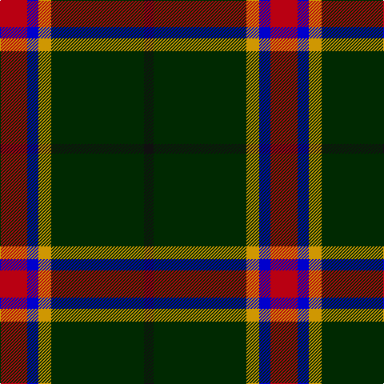

In pattern [KGYBR](/stripes/kgybr/).

This was sourced from register-of-tartans.  It is a [5 stripe tartan](/stripes/stripes5/).

Original link https://www.tartanregister.gov.uk/tartanDetails.aspx?ref=10400

## Register references

External register numbers recorded for this tartan.

- Scottish Register of Tartans: [10400](https://www.tartanregister.gov.uk/tartanDetails.aspx?ref=10400)

## Thread count
R/34 B14 DY16 DG116 K/12

## Palette
Each colour and the base-6 reference it is a variant of.

| Colour | Shade | Base |
|---|---|---|
| B | <code style="background-color:#0000CD;">#0000CD</code> `oklch(38.3% 0.266 264.1)` <small>#0000CD</small> | B <code style="background-color:#2A418A;">#2A418A</code> |
| DG | <code style="background-color:#002901;">#002901</code> `oklch(24.4% 0.082 143.0)` <small>#002901</small> | G <code style="background-color:#006100;">#006100</code> |
| DY | <code style="background-color:#CF9702;">#CF9702</code> `oklch(71.1% 0.146 81.9)` <small>#CF9702</small> | Y <code style="background-color:#F2BF00;">#F2BF00</code> |
| K | <code style="background-color:#101010;">#101010</code> `oklch(17.3% 0.000 89.9)` <small>#101010</small> | K <code style="background-color:#000000;">#000000</code> |
| R | <code style="background-color:#B90012;">#B90012</code> `oklch(49.4% 0.201 27.0)` <small>#B90012</small> | R <code style="background-color:#CC0000;">#CC0000</code> |

# Sample pattern

## Nearest tartans

The nearest existing variants by ΔTartan distance.

1. [MacShimsi](/setts/s5/r11r5g5k40ly3~x2/) — ΔT 1.05
1. [Drambuie Dress](/setts/s6/w6dy36k48r4k5ly6/) — ΔT 1.15
1. [Arkansas](/setts/s7/dg3w1dg12r6dg3k3g2~x4/) — ΔT 1.17
1. [Asheville Firefighters, The](/setts/s6/k17dg48ly4r10lb12dg4/) — ΔT 1.18
1. [MacShimsi Personal Tartan Tartan Number: 7318. Earliest known date: 2007 Designed for the MacShimsi Clan in Dundee See products available Copyright © Blair Urquhart, Comrie, 2015](/setts/s5/m11dr5dg5k40ly3~x2/) — ΔT 1.19
1. [Brotherhood of the Kilt](/setts/s5/k10y4k1t2r1~x10/) — ΔT 1.21
1. [Coalfields Regeneration Trust, The](/setts/s7/k2r1ly1g8k15g2dp1~x2/) — ΔT 1.23
1. [Dundhuin Hunting (Personal)](/setts/s5/dg62g17ly12t8o8~x2/) — ΔT 1.27
1. [Asheville Firefighters, The](/setts/s6/k17g48ly4r10db12g4/) — ΔT 1.33
1. [Highlands of Durham (Corporate)](/setts/s6/r6dt4w2g27dt37ly2~x2/) — ΔT 1.39

## Neighbour map

Every grey dot is one of 14299 variants placed by the first two principal components of the ΔTartan feature space (44% of its variance). Red is this tartan; blue dots are its nearest — click one to open its page.

<svg viewBox="0 0 640 380" role="img" style="max-width:100%;height:auto;border:1px solid #e0e0e0;border-radius:4px;display:block" xmlns="http://www.w3.org/2000/svg"><image href="/nn/cloud.v1.png" width="640" height="380"/><a href="/setts/s5/r11r5g5k40ly3~x2/"><circle cx="349.7" cy="179.4" r="4" fill="#3465a4"><title>MacShimsi</title></circle></a><a href="/setts/s6/w6dy36k48r4k5ly6/"><circle cx="266.9" cy="173.8" r="4" fill="#3465a4"><title>Drambuie Dress</title></circle></a><a href="/setts/s7/dg3w1dg12r6dg3k3g2~x4/"><circle cx="295.0" cy="190.5" r="4" fill="#3465a4"><title>Arkansas</title></circle></a><a href="/setts/s6/k17dg48ly4r10lb12dg4/"><circle cx="262.0" cy="178.0" r="4" fill="#3465a4"><title>Asheville Firefighters, The</title></circle></a><a href="/setts/s5/m11dr5dg5k40ly3~x2/"><circle cx="366.4" cy="191.4" r="4" fill="#3465a4"><title>MacShimsi Personal Tartan Tartan Number: 7318. Earliest known date: 2007 Designed for the MacShimsi Clan in Dundee See products available Copyright © Blair Urquhart, Comrie, 2015</title></circle></a><a href="/setts/s5/k10y4k1t2r1~x10/"><circle cx="357.1" cy="227.3" r="4" fill="#3465a4"><title>Brotherhood of the Kilt</title></circle></a><a href="/setts/s7/k2r1ly1g8k15g2dp1~x2/"><circle cx="320.3" cy="157.4" r="4" fill="#3465a4"><title>Coalfields Regeneration Trust, The</title></circle></a><a href="/setts/s5/dg62g17ly12t8o8~x2/"><circle cx="269.4" cy="199.6" r="4" fill="#3465a4"><title>Dundhuin Hunting (Personal)</title></circle></a><a href="/setts/s6/k17g48ly4r10db12g4/"><circle cx="278.8" cy="189.6" r="4" fill="#3465a4"><title>Asheville Firefighters, The</title></circle></a><a href="/setts/s6/r6dt4w2g27dt37ly2~x2/"><circle cx="301.7" cy="159.2" r="4" fill="#3465a4"><title>Highlands of Durham (Corporate)</title></circle></a><circle cx="317.4" cy="197.5" r="5" fill="#c00000"/></svg>

ID: /setts/s5/r17db7lo8dg58k6~x2/
