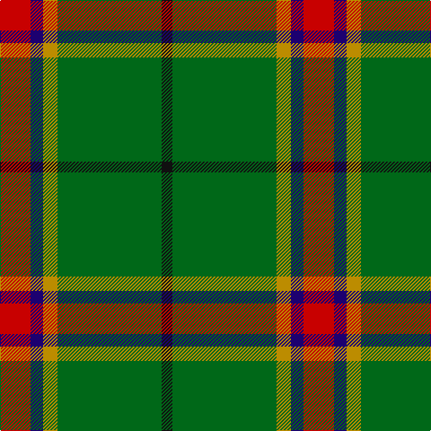

This page is one **sett** — a single exact thread-count. It belongs to the [tartan](/tartans/r17db7dy8g58k6/)
(the same proportion at any scale), whose colour order is pattern [KGYBR](/stripes/kgybr/).

Sourced from tartans-authority.  It is a [5 stripe tartan](/stripes/stripes5/).

Original link http://www.tartansauthority.com/tartan-ferret/display/10400/

## Thread count
R/34 DB14 DY16 G116 K/12

## Palette
Each colour and the base-6 reference it is a variant of.

| Colour | Shade | Base |
|---|---|---|
| DB | <code style="background-color:#1C0070;">#1C0070</code> `oklch(26.3% 0.162 277.1)` <small>#1C0070</small> | B <code style="background-color:#2A418A;">#2A418A</code> |
| DY | <code style="background-color:#BC8C00;">#BC8C00</code> `oklch(66.8% 0.137 84.1)` <small>#BC8C00</small> | Y <code style="background-color:#F2BF00;">#F2BF00</code> |
| G | <code style="background-color:#006818;">#006818</code> `oklch(45.0% 0.142 145.0)` <small>#006818</small> | G <code style="background-color:#006100;">#006100</code> |
| K | <code style="background-color:#101010;">#101010</code> `oklch(17.3% 0.000 89.9)` <small>#101010</small> | K <code style="background-color:#000000;">#000000</code> |
| R | <code style="background-color:#C80000;">#C80000</code> `oklch(52.3% 0.215 29.2)` <small>#C80000</small> | R <code style="background-color:#CC0000;">#CC0000</code> |

# Sample pattern

## Nearest tartans

The nearest existing variants by ΔTartan distance, with this tartan at the top so the swatches line up against it.

ΔTartan

Tartan

Sett

—

<a href="/ttd/edit/#slug=r17db7lo8g58k6~x2">St Johns County Sheriff Office (Cor)</a> <a class="nn-out" href="/setts/s5/r17db7lo8g58k6~x2/" title="open its dictionary page">↗</a>

1.07

<a href="/ttd/edit/#slug=k17g48ly4r10db12g4">Asheville Firefighters, The</a> <a class="nn-out" href="/setts/s6/k17g48ly4r10db12g4/" title="open its dictionary page">↗</a>

1.11

<a href="/ttd/edit/#slug=g6dg14r9dt7r9dg54ly6">Tulloch Homes</a> <a class="nn-out" href="/setts/s7/g6dg14r9dt7r9dg54ly6/" title="open its dictionary page">↗</a>

1.12

<a href="/ttd/edit/#slug=g6g14r9dt7r9g54ly6">Tulloch Homes</a> <a class="nn-out" href="/setts/s7/g6g14r9dt7r9g54ly6/" title="open its dictionary page">↗</a>

1.14

<a href="/ttd/edit/#slug=dg62g17ly12t8o8~x2">Dundhuin Hunting (Personal)</a> <a class="nn-out" href="/setts/s5/dg62g17ly12t8o8~x2/" title="open its dictionary page">↗</a>

1.22

<a href="/ttd/edit/#slug=dp4g10r1ly1~x2">Wilson's No.192</a> <a class="nn-out" href="/setts/s4/dp4g10r1ly1~x2/" title="open its dictionary page">↗</a>

1.27

<a href="/ttd/edit/#slug=w6g5r5g45k4lo24k4g5~x2">O'Neill (Name)</a> <a class="nn-out" href="/setts/s8/w6g5r5g45k4lo24k4g5~x2/" title="open its dictionary page">↗</a>

1.29

<a href="/ttd/edit/#slug=g55dp7r24g12db4ly3db4~x2">Crieff and Strathearn District Tartan Tartan Number: 664. Earliest known date: 1988 A branch of the Stewart clan from Galloway and the South West of Scotland. See products available Copyright © Blair Urquhart, Comrie, 2015</a> <a class="nn-out" href="/setts/s7/g55dp7r24g12db4ly3db4~x2/" title="open its dictionary page">↗</a>

1.31

<a href="/ttd/edit/#slug=g14k3r3lr2~x2">Bacon, Green (Fashion)</a> <a class="nn-out" href="/setts/s4/g14k3r3lr2~x2/" title="open its dictionary page">↗</a>

1.35

<a href="/ttd/edit/#slug=dp5lo5dy13g41r3~x2">Clare (Prince George) (Personal)</a> <a class="nn-out" href="/setts/s5/dp5lo5dy13g41r3~x2/" title="open its dictionary page">↗</a>

1.35

<a href="/ttd/edit/#slug=g55p7r24g12db4ly3db4~x2">Crieff, and Strathearn</a> <a class="nn-out" href="/setts/s7/g55p7r24g12db4ly3db4~x2/" title="open its dictionary page">↗</a>

## Neighbour map

Every grey dot is one of 14299 variants placed by the first two principal components of the ΔTartan feature space (44% of its variance). Red is this tartan; blue dots are its nearest — click one to open its page.

<svg viewBox="0 0 640 380" role="img" style="max-width:100%;height:auto;border:1px solid #e0e0e0;border-radius:4px;display:block" xmlns="http://www.w3.org/2000/svg"><image href="/nn/cloud.v1.png" width="640" height="380"/><a href="/setts/s6/k17g48ly4r10db12g4/"><circle cx="278.8" cy="189.6" r="4" fill="#3465a4"><title>Asheville Firefighters, The</title></circle></a><a href="/setts/s7/g6dg14r9dt7r9dg54ly6/"><circle cx="352.6" cy="193.5" r="4" fill="#3465a4"><title>Tulloch Homes</title></circle></a><a href="/setts/s7/g6g14r9dt7r9g54ly6/"><circle cx="357.1" cy="192.1" r="4" fill="#3465a4"><title>Tulloch Homes</title></circle></a><a href="/setts/s5/dg62g17ly12t8o8~x2/"><circle cx="269.4" cy="199.6" r="4" fill="#3465a4"><title>Dundhuin Hunting (Personal)</title></circle></a><a href="/setts/s4/dp4g10r1ly1~x2/"><circle cx="357.4" cy="230.6" r="4" fill="#3465a4"><title>Wilson's No.192</title></circle></a><a href="/setts/s8/w6g5r5g45k4lo24k4g5~x2/"><circle cx="299.6" cy="167.3" r="4" fill="#3465a4"><title>O'Neill (Name)</title></circle></a><a href="/setts/s7/g55dp7r24g12db4ly3db4~x2/"><circle cx="365.9" cy="158.0" r="4" fill="#3465a4"><title>Crieff and Strathearn District Tartan Tartan Number: 664. Earliest known date: 1988 A branch of the Stewart clan from Galloway and the South West of Scotland. See products available Copyright © Blair Urquhart, Comrie, 2015</title></circle></a><a href="/setts/s4/g14k3r3lr2~x2/"><circle cx="347.5" cy="250.5" r="4" fill="#3465a4"><title>Bacon, Green (Fashion)</title></circle></a><a href="/setts/s5/dp5lo5dy13g41r3~x2/"><circle cx="365.4" cy="190.7" r="4" fill="#3465a4"><title>Clare (Prince George) (Personal)</title></circle></a><a href="/setts/s7/g55p7r24g12db4ly3db4~x2/"><circle cx="358.7" cy="154.8" r="4" fill="#3465a4"><title>Crieff, and Strathearn</title></circle></a><circle cx="325.7" cy="200.2" r="5" fill="#c00000"/></svg>

ID: /setts/s5/r17db7lo8g58k6~x2/
