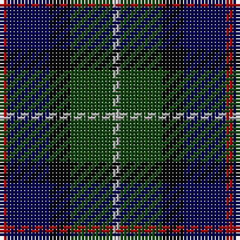

In pattern [RBKGY](/patterns/rbkgy/).

This was sourced from weddslist.  It is a [5 stripes tartan](/stripes/stripes5/).

Original link http://www.weddslist.com/cgi-bin/tartans/pg.pl?source=tinsel

## Attestations

This cloth appears in 2 source records; the oldest owns this page.

- undated — Davidson of Tulloch (weddslist, [record](http://www.weddslist.com/cgi-bin/tartans/pg.pl?source=tinsel))
- undated — Davidson of Tulloch (weddslist, [record](http://www.weddslist.com/cgi-bin/tartans/pg.pl?source=x))

## Thread count
DR/2 DB12 K6 DG12 N/2

## Palette
Each colour and its ΔE from the base-6 reference it is a variant of.

| Colour | Shade | Base | ΔE (OKLab) |
|---|---|---|---|
| DB | <code style="background-color:#000052;">#000052</code> `#000052` | B <code style="background-color:#2A418A;">#2A418A</code> | 0.20 |
| DG | <code style="background-color:#11450D;">#11450D</code> `#11450D` | G <code style="background-color:#006100;">#006100</code> | 0.09 |
| DR | <code style="background-color:#AA0000;">#AA0000</code> `#AA0000` | R <code style="background-color:#CC0000;">#CC0000</code> | 0.07 |
| K | <code style="background-color:#000000;">#000000</code> `#000000` | K <code style="background-color:#000000;">#000000</code> | 0.00 |
| N | <code style="background-color:#AAAAAA;">#AAAAAA</code> `#AAAAAA` | Y <code style="background-color:#F2BF00;">#F2BF00</code> | 0.19 |

# Sample pattern

## Nearest tartans

The nearest existing variants by ΔTartan distance.

1. [Davidson of Tulloch](/setts/s5/r1b6k3g6w1~b00004c-g004c00-k000000-rc80000-wd0d0d0/) — ΔT 0.51
1. [Dougles Green](/setts/s5/k4b2g8ba8y1~b4367ae-ba000052-g11450d-k000000-yaaaaaa~x2/) — ΔT 0.61
1. [Dougles Green](/setts/s5/k4b2g8ba8y1~b4367ae-ba000052-g11450d-k000000-yaaaaaa/) — ΔT 0.61
1. [Forbo Nairn](/setts/s5/b2g8k7ba12r2~b5480b0-ba000050-g008000-k000000-r800000~x4/) — ΔT 0.71
1. [Leslie Hunting](/setts/s6/r2b8k8y1g8k1~b000052-g11450d-k000000-raa0000-yaaaaaa~x2/) — ΔT 0.82
1. [Leslie Hunting](/setts/s6/r2b8k8y1g8k1~b000052-g11450d-k000000-raa0000-yaaaaaa/) — ΔT 0.82
1. [Leslie Hunting](/setts/s6/r2b8k8w1g8k1~b000064-g004c00-k000000-rc80000-wd0d0d0~x2/) — ΔT 0.88
1. [MacNiel of Barra](/setts/s6/y3k2g12k12b14ya3~b000052-g11450d-k000000-yaaaa00-yaaaaaaa~x2/) — ΔT 0.88
1. [MacNiel of Barra](/setts/s6/y3k2g12k12b14ya3~b000052-g11450d-k000000-yaaaa00-yaaaaaaa/) — ΔT 0.88
1. [Douglas](/setts/s5/k2b2g8ba8y1~b4367ae-ba000052-g11450d-k000000-yaaaaaa~x2/) — ΔT 0.89

## Neighbour map

Every grey dot is one of 15726 variants placed by the first two principal components of the ΔTartan feature space (44% of its variance). Red is this tartan; blue dots are its nearest — click one to open its page.

<svg viewBox="0 0 640 380" role="img" style="max-width:100%;height:auto;border:1px solid #e0e0e0;border-radius:4px;display:block" xmlns="http://www.w3.org/2000/svg"><image href="/nn/cloud.v1.png" width="640" height="380"/><a href="/setts/s5/r1b6k3g6w1~b00004c-g004c00-k000000-rc80000-wd0d0d0/"><circle cx="122.0" cy="240.3" r="4" fill="#3465a4"><title>Davidson of Tulloch</title></circle></a><a href="/setts/s5/k4b2g8ba8y1~b4367ae-ba000052-g11450d-k000000-yaaaaaa~x2/"><circle cx="142.9" cy="240.9" r="4" fill="#3465a4"><title>Dougles Green</title></circle></a><a href="/setts/s5/k4b2g8ba8y1~b4367ae-ba000052-g11450d-k000000-yaaaaaa/"><circle cx="142.9" cy="240.9" r="4" fill="#3465a4"><title>Dougles Green</title></circle></a><a href="/setts/s5/b2g8k7ba12r2~b5480b0-ba000050-g008000-k000000-r800000~x4/"><circle cx="120.1" cy="244.6" r="4" fill="#3465a4"><title>Forbo Nairn</title></circle></a><a href="/setts/s6/r2b8k8y1g8k1~b000052-g11450d-k000000-raa0000-yaaaaaa~x2/"><circle cx="135.2" cy="222.9" r="4" fill="#3465a4"><title>Leslie Hunting</title></circle></a><a href="/setts/s6/r2b8k8y1g8k1~b000052-g11450d-k000000-raa0000-yaaaaaa/"><circle cx="135.2" cy="222.9" r="4" fill="#3465a4"><title>Leslie Hunting</title></circle></a><a href="/setts/s6/r2b8k8w1g8k1~b000064-g004c00-k000000-rc80000-wd0d0d0~x2/"><circle cx="120.8" cy="216.9" r="4" fill="#3465a4"><title>Leslie Hunting</title></circle></a><a href="/setts/s6/y3k2g12k12b14ya3~b000052-g11450d-k000000-yaaaa00-yaaaaaaa~x2/"><circle cx="96.0" cy="226.2" r="4" fill="#3465a4"><title>MacNiel of Barra</title></circle></a><a href="/setts/s6/y3k2g12k12b14ya3~b000052-g11450d-k000000-yaaaa00-yaaaaaaa/"><circle cx="96.0" cy="226.2" r="4" fill="#3465a4"><title>MacNiel of Barra</title></circle></a><a href="/setts/s5/k2b2g8ba8y1~b4367ae-ba000052-g11450d-k000000-yaaaaaa~x2/"><circle cx="178.5" cy="233.1" r="4" fill="#3465a4"><title>Douglas</title></circle></a><circle cx="136.3" cy="246.1" r="5" fill="#c00000"/></svg>

ID: /setts/s5/r1b6k3g6y1~b000052-g11450d-k000000-raa0000-yaaaaaa~x2/
