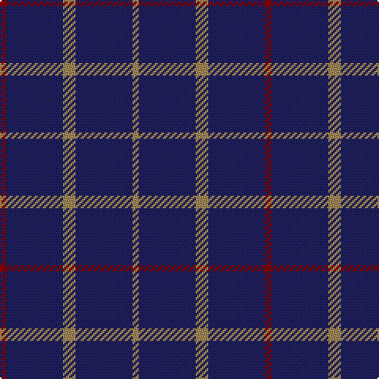

In pattern [RBYBY](/patterns/rbyby/).

This was sourced from register-of-tartans.  It is a [5 stripes tartan](/stripes/stripes5/).

Original link https://www.tartanregister.gov.uk/tartanDetails.aspx?ref=382

## Attestations

This cloth appears in 2 source records; the oldest owns this page.

- 01/01/2005 — Brooks Brothers Tattersall Blue (register-of-tartans, [record](https://www.tartanregister.gov.uk/tartanDetails.aspx?ref=382))
- pre 2005 — Brooks Bros Tattersall Blue (Fashion (tartans-authority, [record](http://www.tartansauthority.com/tartan-ferret/display/6573/))

## Register references

External register numbers recorded for this tartan.

- Scottish Register of Tartans: [382](https://www.tartanregister.gov.uk/tartanDetails.aspx?ref=382)
- Scottish Tartans Authority (ITI): 6573

## Thread count
DR/4 DB36 LT8 DB36 LT/4

## Palette
Each colour and its ΔE from the base-6 reference it is a variant of.

| Colour | Shade | Base | ΔE (OKLab) |
|---|---|---|---|
| DB | <code style="background-color:#202060;">#202060</code> `#202060` | B <code style="background-color:#2A418A;">#2A418A</code> | 0.11 |
| DR | <code style="background-color:#880000;">#880000</code> `#880000` | R <code style="background-color:#CC0000;">#CC0000</code> | 0.15 |
| LT | <code style="background-color:#A08858;">#A08858</code> `#A08858` | Y <code style="background-color:#F2BF00;">#F2BF00</code> | 0.21 |

# Sample pattern

## Nearest tartans

The nearest existing variants by ΔTartan distance.

1. [Hebridean (Old..) District Tartan Tartan Number: 414. Earliest known date: pre 2003 The design 'Heather Tartan' has been produced at the request of the Royal Society for Prevention of Cruelty to Children, as the Society's corporate tartan. The colours of the design are taken from the Society's badge and lettrhead. Dark Pink Mix, Light Pink Mix, Kingfisher and Emerald. See products available Copyright © Blair Urquhart, Comrie, 2015](/setts/s7/b10r1b10r2b10r1g2~b2c2c80-g006818-rc80000~x2/) — ΔT 1.16
1. [Elliott](/setts/s4/b16r4b3ra1~b000064-r900000-rac80000~x2/) — ΔT 1.42
1. [Coinean Dubh](/setts/s4/b50k12b21w5~b003c64-k101010-wffffff~x2/) — ΔT 1.43
1. [Hebridean, (Old..)](/setts/s7/b10r1b10r2b10r1g2~b304080-g008000-rc00000~x2/) — ΔT 1.47
1. [MacLaine of Lochbuie](/setts/s4/b32r3b4y3~b304080-rc00000-yf0c000~x2/) — ΔT 1.49
1. [MacLaine of Lochbuie](/setts/s4/b32r3b4y3~b2c4084-rdc0000-ye8c000~x2/) — ΔT 1.55
1. [Sultan of Qaboo's Air Force](/setts/s6/b24ba6b10ba6b32y3~b1c0070-ba5c8ca8-ye8c000~x2/) — ΔT 1.56
1. [Dollar Academy](/setts/s6/b9k9b9k9b42w5~b2c2c80-k101010-wc0c0c0~x2/) — ΔT 1.57
1. [Crombie House Check](/setts/s6/k4k12k3r7k26r3~k000030-r806050~x2/) — ΔT 1.59
1. [Dollar Academy (1930s) (Corporate)](/setts/s6/b9k9b9k9b42w5~b2c2c80-k101010-we0e0e0~x2/) — ΔT 1.67

## Neighbour map

Every grey dot is one of 15726 variants placed by the first two principal components of the ΔTartan feature space (44% of its variance). Red is this tartan; blue dots are its nearest — click one to open its page.

<svg viewBox="0 0 640 380" role="img" style="max-width:100%;height:auto;border:1px solid #e0e0e0;border-radius:4px;display:block" xmlns="http://www.w3.org/2000/svg"><image href="/nn/cloud.v1.png" width="640" height="380"/><a href="/setts/s7/b10r1b10r2b10r1g2~b2c2c80-g006818-rc80000~x2/"><circle cx="568.6" cy="262.9" r="4" fill="#3465a4"><title>Hebridean (Old..) District Tartan Tartan Number: 414. Earliest known date: pre 2003 The design 'Heather Tartan' has been produced at the request of the Royal Society for Prevention of Cruelty to Children, as the Society's corporate tartan. The colours of the design are taken from the Society's badge and lettrhead. Dark Pink Mix, Light Pink Mix, Kingfisher and Emerald. See products available Copyright © Blair Urquhart, Comrie, 2015</title></circle></a><a href="/setts/s4/b16r4b3ra1~b000064-r900000-rac80000~x2/"><circle cx="552.6" cy="253.1" r="4" fill="#3465a4"><title>Elliott</title></circle></a><a href="/setts/s4/b50k12b21w5~b003c64-k101010-wffffff~x2/"><circle cx="506.3" cy="279.9" r="4" fill="#3465a4"><title>Coinean Dubh</title></circle></a><a href="/setts/s7/b10r1b10r2b10r1g2~b304080-g008000-rc00000~x2/"><circle cx="577.7" cy="266.2" r="4" fill="#3465a4"><title>Hebridean, (Old..)</title></circle></a><a href="/setts/s4/b32r3b4y3~b304080-rc00000-yf0c000~x2/"><circle cx="594.6" cy="246.5" r="4" fill="#3465a4"><title>MacLaine of Lochbuie</title></circle></a><a href="/setts/s4/b32r3b4y3~b2c4084-rdc0000-ye8c000~x2/"><circle cx="589.3" cy="244.9" r="4" fill="#3465a4"><title>MacLaine of Lochbuie</title></circle></a><a href="/setts/s6/b24ba6b10ba6b32y3~b1c0070-ba5c8ca8-ye8c000~x2/"><circle cx="508.8" cy="256.1" r="4" fill="#3465a4"><title>Sultan of Qaboo's Air Force</title></circle></a><a href="/setts/s6/b9k9b9k9b42w5~b2c2c80-k101010-wc0c0c0~x2/"><circle cx="461.9" cy="257.5" r="4" fill="#3465a4"><title>Dollar Academy</title></circle></a><a href="/setts/s6/k4k12k3r7k26r3~k000030-r806050~x2/"><circle cx="550.6" cy="283.6" r="4" fill="#3465a4"><title>Crombie House Check</title></circle></a><a href="/setts/s6/b9k9b9k9b42w5~b2c2c80-k101010-we0e0e0~x2/"><circle cx="446.1" cy="251.1" r="4" fill="#3465a4"><title>Dollar Academy (1930s) (Corporate)</title></circle></a><circle cx="542.4" cy="271.6" r="5" fill="#c00000"/></svg>

ID: /setts/s5/r1b9y2b9y1~b202060-r880000-ya08858~x4/
