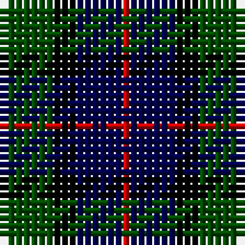

**Bands:** [RBKGW](/stripes/rbkgw/) · **Stripes:** [R DB K DG LB](/stripes/stripes5/) R DB K DG LB

This was sourced from weddslist.  It is a [5 band tartan](/bands/bands5/).

Original link http://www.weddslist.com/cgi-bin/tartans/pg.pl?source=rb

## Register references

External register numbers recorded for this tartan.

- Scottish Register of Tartans: [1166](https://www.tartanregister.gov.uk/tartanDetails.aspx?ref=1166)
- Scottish Register of Tartans: [1758](https://www.tartanregister.gov.uk/tartanDetails.aspx?ref=1758)
- Scottish Register of Tartans: [2307](https://www.tartanregister.gov.uk/tartanDetails.aspx?ref=2307)
- Scottish Register of Tartans: [2540](https://www.tartanregister.gov.uk/tartanDetails.aspx?ref=2540)
- Scottish Register of Tartans: [2666](https://www.tartanregister.gov.uk/tartanDetails.aspx?ref=2666)
- Scottish Register of Tartans: [2862](https://www.tartanregister.gov.uk/tartanDetails.aspx?ref=2862)
- Scottish Register of Tartans: [3808](https://www.tartanregister.gov.uk/tartanDetails.aspx?ref=3808)
- Scottish Register of Tartans: [982](https://www.tartanregister.gov.uk/tartanDetails.aspx?ref=982)
- Scottish Tartans Authority (ITI): 218
- Scottish Tartans World Register: 1010
- Scottish Tartans World Register: 1042
- Scottish Tartans World Register: 127
- Scottish Tartans World Register: 1585
- Scottish Tartans World Register: 218
- Scottish Tartans World Register: 2218
- Scottish Tartans World Register: 737
- Scottish Tartans World Register: 897

## Thread count
N/1 G6 K3 DB6 R/1

## Palette
Each colour and its ΔE from the base-6 reference it is a variant of.

| Colour | Shade | Base | ΔE (OKLab) |
|---|---|---|---|
| DB | <code style="background-color:#00004C;">#00004C</code> `#00004C` | B <code style="background-color:#2A418A;">#2A418A</code> | 0.21 |
| G | <code style="background-color:#004C00;">#004C00</code> `#004C00` | G <code style="background-color:#006100;">#006100</code> | 0.07 |
| K | <code style="background-color:#000000;">#000000</code> `#000000` | K <code style="background-color:#000000;">#000000</code> | 0.00 |
| N | <code style="background-color:#D0D0D0;">#D0D0D0</code> `#D0D0D0` | W <code style="background-color:#F7F7F7;">#F7F7F7</code> | 0.12 |
| R | <code style="background-color:#C80000;">#C80000</code> `#C80000` | R <code style="background-color:#CC0000;">#CC0000</code> | 0.01 |

# Sample pattern

## Nearest tartans

The nearest existing variants by ΔTartan distance.

1. [Davidson of Tulloch](/setts/s5/r1db6k3dg6lr1~x2/) — ΔT 0.51
1. [MacNiel of Barra](/setts/s6/lr3db14k12dg12k2ly3~x2/) — ΔT 0.69
1. [MacNiel of Barra](/setts/s6/lr3db14k12dg12k2ly3/) — ΔT 0.69
1. [Gaines Center for the Humanities](/setts/s6/r1k1g6k6db6lb1~x4/) — ΔT 0.72
1. [Leslie Hunting](/setts/s6/r2db8k8lb1dg8k1/) — ΔT 0.78
1. [MacNeil of Barra](/setts/s6/ly3k2dg12k12db14lb3/) — ΔT 0.81
1. [Royal Highland](/setts/s6/lr4g17k17db17r3db3~x2/) — ΔT 0.89
1. [Dougles Green](/setts/s5/k4b2dg8db8lr1~x2/) — ΔT 0.90
1. [Dougles Green](/setts/s5/k4b2dg8db8lr1/) — ΔT 0.90
1. [Wellington](/setts/s6/db1r1db6k6g6w1~x2/) — ΔT 0.93

## Neighbour map

Every grey dot is one of 14299 variants placed by the first two principal components of the ΔTartan feature space (44% of its variance). Red is this tartan; blue dots are its nearest — click one to open its page.

<svg viewBox="0 0 640 380" role="img" style="max-width:100%;height:auto;border:1px solid #e0e0e0;border-radius:4px;display:block" xmlns="http://www.w3.org/2000/svg"><image href="/nn/cloud.v1.png" width="640" height="380"/><a href="/setts/s5/r1db6k3dg6lr1~x2/"><circle cx="140.2" cy="249.2" r="4" fill="#3465a4"><title>Davidson of Tulloch</title></circle></a><a href="/setts/s6/lr3db14k12dg12k2ly3~x2/"><circle cx="100.4" cy="228.5" r="4" fill="#3465a4"><title>MacNiel of Barra</title></circle></a><a href="/setts/s6/lr3db14k12dg12k2ly3/"><circle cx="100.4" cy="228.5" r="4" fill="#3465a4"><title>MacNiel of Barra</title></circle></a><a href="/setts/s6/r1k1g6k6db6lb1~x4/"><circle cx="103.0" cy="222.6" r="4" fill="#3465a4"><title>Gaines Center for the Humanities</title></circle></a><a href="/setts/s6/r2db8k8lb1dg8k1/"><circle cx="124.9" cy="219.0" r="4" fill="#3465a4"><title>Leslie Hunting</title></circle></a><a href="/setts/s6/ly3k2dg12k12db14lb3/"><circle cx="87.8" cy="222.1" r="4" fill="#3465a4"><title>MacNeil of Barra</title></circle></a><a href="/setts/s6/lr4g17k17db17r3db3~x2/"><circle cx="93.4" cy="223.9" r="4" fill="#3465a4"><title>Royal Highland</title></circle></a><a href="/setts/s5/k4b2dg8db8lr1~x2/"><circle cx="147.0" cy="245.0" r="4" fill="#3465a4"><title>Dougles Green</title></circle></a><a href="/setts/s5/k4b2dg8db8lr1/"><circle cx="147.0" cy="245.0" r="4" fill="#3465a4"><title>Dougles Green</title></circle></a><a href="/setts/s6/db1r1db6k6g6w1~x2/"><circle cx="101.9" cy="217.1" r="4" fill="#3465a4"><title>Wellington</title></circle></a><circle cx="126.0" cy="241.9" r="5" fill="#c00000"/></svg>

ID: /setts/s5/r1db6k3dg6lb1/
