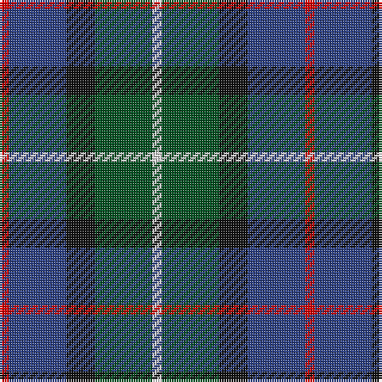

In pattern [RBKGW](/stripes/rbkgw/).

This was sourced from register-of-tartans.  It is a [5 stripe tartan](/stripes/stripes5/).

Original link https://www.tartanregister.gov.uk/tartanDetails.aspx?ref=894

## Also known as

This cloth is also recorded under:

- Davidson of Tulloch #2

## Register references

External register numbers recorded for this tartan.

- Scottish Register of Tartans: [894](https://www.tartanregister.gov.uk/tartanDetails.aspx?ref=894)
- Scottish Tartans World Register: 1364

## Thread count
R/4 B24 K12 G24 LN/4

## Palette
Each colour and its ΔE from the base-6 reference it is a variant of.

| Colour | Shade | Base | ΔE (OKLab) |
|---|---|---|---|
| B | <code style="background-color:#2C4084;">#2C4084</code> `#2C4084` | B <code style="background-color:#2A418A;">#2A418A</code> | 0.01 |
| G | <code style="background-color:#005020;">#005020</code> `#005020` | G <code style="background-color:#006100;">#006100</code> | 0.07 |
| K | <code style="background-color:#101010;">#101010</code> `#101010` | K <code style="background-color:#000000;">#000000</code> | 0.17 |
| LN | <code style="background-color:#E0E0E0;">#E0E0E0</code> `#E0E0E0` | W <code style="background-color:#F7F7F7;">#F7F7F7</code> | 0.07 |
| R | <code style="background-color:#DC0000;">#DC0000</code> `#DC0000` | R <code style="background-color:#CC0000;">#CC0000</code> | 0.03 |

# Sample pattern

## Nearest tartans

The nearest existing variants by ΔTartan distance.

1. [Wellington](/setts/s6/db1r1db6k6dg6w1~x2/) — ΔT 0.54
1. [Davidson of Tulloch (Clan)](/setts/s5/r1db7k7g7w1~x6/) — ΔT 0.61
1. [Forbo Nairn](/setts/s5/r2db12k7g8t2~x4/) — ΔT 0.61
1. [Dyce #3](/setts/s6/k2ly1dg6k6db6w1~x4/) — ΔT 0.62
1. [Bath](/setts/s5/k4b2g13db13w2~x4/) — ΔT 0.77
1. [MacEachain (Clan)](/setts/s6/r2k1db6k2g6m2~x4/) — ΔT 0.77
1. [Birse](/setts/s6/k4g16k14lo3n16r4~x2/) — ΔT 0.83
1. [Wellington No 229](/setts/s5/k4t3dp11dg14w2~x2/) — ΔT 0.85
1. [MacPhail Hunting #2](/setts/s6/r4db24k12g14k4lb3~x2/) — ΔT 0.87
1. [Hogarth of Firhill (Clan)](/setts/s7/t4g14ly2k14db14k2db3~x2/) — ΔT 0.90

## Neighbour map

Every grey dot is one of 14299 variants placed by the first two principal components of the ΔTartan feature space (44% of its variance). Red is this tartan; blue dots are its nearest — click one to open its page.

<svg viewBox="0 0 640 380" role="img" style="max-width:100%;height:auto;border:1px solid #e0e0e0;border-radius:4px;display:block" xmlns="http://www.w3.org/2000/svg"><image href="/nn/cloud.v1.png" width="640" height="380"/><a href="/setts/s6/db1r1db6k6dg6w1~x2/"><circle cx="142.2" cy="236.4" r="4" fill="#3465a4"><title>Wellington</title></circle></a><a href="/setts/s5/r1db7k7g7w1~x6/"><circle cx="126.6" cy="241.4" r="4" fill="#3465a4"><title>Davidson of Tulloch (Clan)</title></circle></a><a href="/setts/s5/r2db12k7g8t2~x4/"><circle cx="159.8" cy="256.9" r="4" fill="#3465a4"><title>Forbo Nairn</title></circle></a><a href="/setts/s6/k2ly1dg6k6db6w1~x4/"><circle cx="135.4" cy="239.1" r="4" fill="#3465a4"><title>Dyce #3</title></circle></a><a href="/setts/s5/k4b2g13db13w2~x4/"><circle cx="170.3" cy="235.6" r="4" fill="#3465a4"><title>Bath</title></circle></a><a href="/setts/s6/r2k1db6k2g6m2~x4/"><circle cx="118.5" cy="240.6" r="4" fill="#3465a4"><title>MacEachain (Clan)</title></circle></a><a href="/setts/s6/k4g16k14lo3n16r4~x2/"><circle cx="127.2" cy="254.5" r="4" fill="#3465a4"><title>Birse</title></circle></a><a href="/setts/s5/k4t3dp11dg14w2~x2/"><circle cx="173.1" cy="231.0" r="4" fill="#3465a4"><title>Wellington No 229</title></circle></a><a href="/setts/s6/r4db24k12g14k4lb3~x2/"><circle cx="172.5" cy="220.7" r="4" fill="#3465a4"><title>MacPhail Hunting #2</title></circle></a><a href="/setts/s7/t4g14ly2k14db14k2db3~x2/"><circle cx="134.8" cy="220.9" r="4" fill="#3465a4"><title>Hogarth of Firhill (Clan)</title></circle></a><circle cx="146.7" cy="247.1" r="5" fill="#c00000"/></svg>

ID: /setts/s5/r1db6k3dg6w1~x4/
