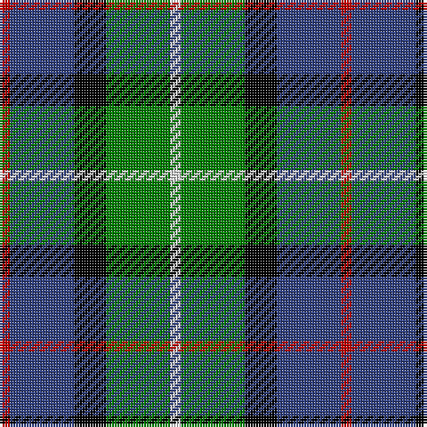

This page is one **sett** — a single exact thread-count. It belongs to the [tartan](/tartans/r1db6k3g6w1/)
(the same proportion at any scale), whose colour order is pattern [RBKGW](/stripes/rbkgw/).

Sourced from weddslist.  It is a [5 stripe tartan](/stripes/stripes5/).

Original link http://www.weddslist.com/cgi-bin/tartans/pg.pl?source=sts

## Also known as

This cloth is also recorded under:

- Davidson of Tulloch #2

## Thread count
R/4 B24 K12 G24 LN/4

## Palette

Palette: <strong>Tartan Register</strong> <small style="color:#888">(2 of 5 colours)</small>
<table><thead><tr><th>Colour</th><th>Threads</th><th>Shade</th><th>Base</th><th>OKLCh</th></tr></thead><tbody><tr><td>R/</td><td style="text-align:right;font-variant-numeric:tabular-nums">4</td><td><code style="background-color:#C00000;">#C00000</code> <small style="color:#888">#C00000</small></td><td>R <code style="background-color:#CC0000;">#CC0000</code></td><td><small style="color:#888">oklch(50.7% 0.208 29.2)</small></td></tr><tr><td>B</td><td style="text-align:right;font-variant-numeric:tabular-nums">24</td><td><code style="background-color:#304080;">#304080</code> <small style="color:#888">#304080</small></td><td>B <code style="background-color:#2A418A;">#2A418A</code></td><td><small style="color:#888">oklch(39.4% 0.109 270.2)</small></td></tr><tr><td>K</td><td style="text-align:right;font-variant-numeric:tabular-nums">12</td><td><code style="background-color:#000000;">#000000</code> <small style="color:#888">#000000</small></td><td>K <code style="background-color:#000000;">#000000</code></td><td><small style="color:#888">oklch(0.0% 0.000 0.0)</small></td></tr><tr><td>G</td><td style="text-align:right;font-variant-numeric:tabular-nums">24</td><td><code style="background-color:#008000;">#008000</code> <small style="color:#888">#008000</small></td><td>G <code style="background-color:#006100;">#006100</code></td><td><small style="color:#888">oklch(52.0% 0.177 142.5)</small></td></tr><tr><td>LN/</td><td style="text-align:right;font-variant-numeric:tabular-nums">4</td><td><code style="background-color:#E0E0E0;">#E0E0E0</code> <small style="color:#888">#E0E0E0</small></td><td>W <code style="background-color:#F7F7F7;">#F7F7F7</code></td><td><small style="color:#888">oklch(90.7% 0.000 89.9)</small></td></tr></tbody></table>

# Sample pattern

## Nearest tartans

The nearest existing variants by ΔTartan distance, with this tartan at the top so the swatches line up against it.

ΔTartan

Tartan

Sett

—

<a href="/ttd/edit/#slug=r1db6k3g6w1~x4">Davidson</a> <a class="nn-out" href="/setts/s5/r1db6k3g6w1~x4/" title="open its dictionary page">↗</a>

0.64

<a href="/ttd/edit/#slug=r2db10k5g12w2~x2">Davidson of Tulloch</a> <a class="nn-out" href="/setts/s5/r2db10k5g12w2~x2/" title="open its dictionary page">↗</a>

0.71

<a href="/ttd/edit/#slug=lr4g17k17db17r3db3~x2">Royal Highland</a> <a class="nn-out" href="/setts/s6/lr4g17k17db17r3db3~x2/" title="open its dictionary page">↗</a>

0.73

<a href="/ttd/edit/#slug=db1r1db6k6g6w1~x2">Wellington</a> <a class="nn-out" href="/setts/s6/db1r1db6k6g6w1~x2/" title="open its dictionary page">↗</a>

0.79

<a href="/ttd/edit/#slug=w3b14k12g12k2ly3~x4">MacNeil of Barra (Clan)</a> <a class="nn-out" href="/setts/s6/w3b14k12g12k2ly3~x4/" title="open its dictionary page">↗</a>

0.81

<a href="/ttd/edit/#slug=w3db14k12g12k2ly3~x2">MacNeil 6</a> <a class="nn-out" href="/setts/s6/w3db14k12g12k2ly3~x2/" title="open its dictionary page">↗</a>

0.85

<a href="/ttd/edit/#slug=k2ly1g6k6db6w1~x4">Dyce</a> <a class="nn-out" href="/setts/s6/k2ly1g6k6db6w1~x4/" title="open its dictionary page">↗</a>

0.91

<a href="/ttd/edit/#slug=r2db16k11g19ly2~x2">Sanix Modern</a> <a class="nn-out" href="/setts/s5/r2db16k11g19ly2~x2/" title="open its dictionary page">↗</a>

0.91

<a href="/ttd/edit/#slug=k4g16k14ly3db16r4~x2">Birse</a> <a class="nn-out" href="/setts/s6/k4g16k14ly3db16r4~x2/" title="open its dictionary page">↗</a>

0.95

<a href="/ttd/edit/#slug=r4g11k11g2db11y3~x4">Casely</a> <a class="nn-out" href="/setts/s6/r4g11k11g2db11y3~x4/" title="open its dictionary page">↗</a>

0.98

<a href="/ttd/edit/#slug=k4t3p11g14ly2~x2">Wellington, No 122</a> <a class="nn-out" href="/setts/s5/k4t3p11g14ly2~x2/" title="open its dictionary page">↗</a>

## Neighbour map

Every grey dot is one of 14299 variants placed by the first two principal components of the ΔTartan feature space (44% of its variance). Red is this tartan; blue dots are its nearest — click one to open its page.

<svg viewBox="0 0 640 380" role="img" style="max-width:100%;height:auto;border:1px solid #e0e0e0;border-radius:4px;display:block" xmlns="http://www.w3.org/2000/svg"><image href="/nn/cloud.v1.png" width="640" height="380"/><a href="/setts/s5/r2db10k5g12w2~x2/"><circle cx="119.5" cy="224.9" r="4" fill="#3465a4"><title>Davidson of Tulloch</title></circle></a><a href="/setts/s6/lr4g17k17db17r3db3~x2/"><circle cx="93.4" cy="223.9" r="4" fill="#3465a4"><title>Royal Highland</title></circle></a><a href="/setts/s6/db1r1db6k6g6w1~x2/"><circle cx="101.9" cy="217.1" r="4" fill="#3465a4"><title>Wellington</title></circle></a><a href="/setts/s6/w3b14k12g12k2ly3~x4/"><circle cx="86.5" cy="215.4" r="4" fill="#3465a4"><title>MacNeil of Barra (Clan)</title></circle></a><a href="/setts/s6/w3db14k12g12k2ly3~x2/"><circle cx="78.0" cy="212.1" r="4" fill="#3465a4"><title>MacNeil 6</title></circle></a><a href="/setts/s6/k2ly1g6k6db6w1~x4/"><circle cx="100.9" cy="223.2" r="4" fill="#3465a4"><title>Dyce</title></circle></a><a href="/setts/s5/r2db16k11g19ly2~x2/"><circle cx="136.0" cy="206.3" r="4" fill="#3465a4"><title>Sanix Modern</title></circle></a><a href="/setts/s6/k4g16k14ly3db16r4~x2/"><circle cx="77.6" cy="229.3" r="4" fill="#3465a4"><title>Birse</title></circle></a><a href="/setts/s6/r4g11k11g2db11y3~x4/"><circle cx="73.5" cy="236.1" r="4" fill="#3465a4"><title>Casely</title></circle></a><a href="/setts/s5/k4t3p11g14ly2~x2/"><circle cx="147.9" cy="213.5" r="4" fill="#3465a4"><title>Wellington, No 122</title></circle></a><circle cx="111.2" cy="229.6" r="5" fill="#c00000"/></svg>

ID: /setts/s5/r1db6k3g6w1~x4/
