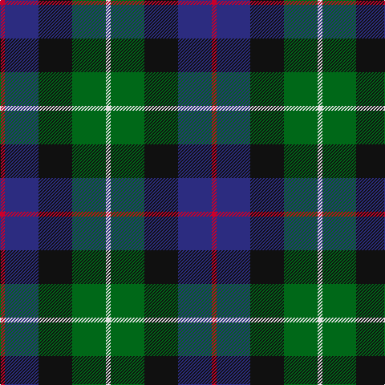

**Bands:** [RBKGW](/stripes/rbkgw/) · **Stripes:** [R DB K G W](/stripes/stripes5/) R DB K G W

This was sourced from tartans-authority.  It is a [5 band tartan](/bands/bands5/).

Original link http://www.tartansauthority.com/tartan-ferret/display/8613/

## Variants

Other setts woven to the same stripe pattern.

- [Davidson](/setts/s5/r1db6k3g6w1~x4/)
- [Davidson of Tulloch](/setts/s5/r2db10k5g12w2~x2/)

## Thread count
R/6 DB42 K42 G42 LN/6

## Palette
Each colour and its ΔE from the base-6 reference it is a variant of.

| Colour | Shade | Base | ΔE (OKLab) |
|---|---|---|---|
| DB | <code style="background-color:#2C2C80;">#2C2C80</code> `#2C2C80` | B <code style="background-color:#2A418A;">#2A418A</code> | 0.06 |
| G | <code style="background-color:#006818;">#006818</code> `#006818` | G <code style="background-color:#006100;">#006100</code> | 0.02 |
| K | <code style="background-color:#101010;">#101010</code> `#101010` | K <code style="background-color:#000000;">#000000</code> | 0.17 |
| LN | <code style="background-color:#E0E0E0;">#E0E0E0</code> `#E0E0E0` | W <code style="background-color:#F7F7F7;">#F7F7F7</code> | 0.07 |
| R | <code style="background-color:#C8002C;">#C8002C</code> `#C8002C` | R <code style="background-color:#CC0000;">#CC0000</code> | 0.03 |

# Sample pattern

## Nearest tartans

The nearest existing variants by ΔTartan distance.

1. [Davidson of Tulloch #2](/setts/s5/r1db6k3dg6w1~x4/) — ΔT 0.61
1. [Dyce #3](/setts/s6/k2ly1dg6k6db6w1~x4/) — ΔT 0.66
1. [Wellington](/setts/s6/db1r1db6k6dg6w1~x2/) — ΔT 0.70
1. [MacEachain (Clan)](/setts/s6/r2k1db6k2g6m2~x4/) — ΔT 0.75
1. [Galbraith](/setts/s6/k2g17k16r2db17w2~x2/) — ΔT 0.76
1. [Selkirk (Personal)](/setts/s5/dp27db4k27g27lo4~x2/) — ΔT 0.79
1. [Leslie Hunting](/setts/s6/k1g8w1k8db8r1~x4/) — ΔT 0.83
1. [Hogarth of Firhill](/setts/s7/t2g6ly1k6db6k1db1~x2/) — ΔT 0.84
1. [Hogarth of Firhill (Clan)](/setts/s7/t4g14ly2k14db14k2db3~x2/) — ΔT 0.86
1. [MacCaughan, or MacEachain](/setts/s6/dp2g6k2db6k1r2~x4/) — ΔT 0.90

## Neighbour map

Every grey dot is one of 14299 variants placed by the first two principal components of the ΔTartan feature space (44% of its variance). Red is this tartan; blue dots are its nearest — click one to open its page.

<svg viewBox="0 0 640 380" role="img" style="max-width:100%;height:auto;border:1px solid #e0e0e0;border-radius:4px;display:block" xmlns="http://www.w3.org/2000/svg"><image href="/nn/cloud.v1.png" width="640" height="380"/><a href="/setts/s5/r1db6k3dg6w1~x4/"><circle cx="146.7" cy="247.1" r="4" fill="#3465a4"><title>Davidson of Tulloch #2</title></circle></a><a href="/setts/s6/k2ly1dg6k6db6w1~x4/"><circle cx="135.4" cy="239.1" r="4" fill="#3465a4"><title>Dyce #3</title></circle></a><a href="/setts/s6/db1r1db6k6dg6w1~x2/"><circle cx="142.2" cy="236.4" r="4" fill="#3465a4"><title>Wellington</title></circle></a><a href="/setts/s6/r2k1db6k2g6m2~x4/"><circle cx="118.5" cy="240.6" r="4" fill="#3465a4"><title>MacEachain (Clan)</title></circle></a><a href="/setts/s6/k2g17k16r2db17w2~x2/"><circle cx="151.3" cy="213.2" r="4" fill="#3465a4"><title>Galbraith</title></circle></a><a href="/setts/s5/dp27db4k27g27lo4~x2/"><circle cx="136.1" cy="243.2" r="4" fill="#3465a4"><title>Selkirk (Personal)</title></circle></a><a href="/setts/s6/k1g8w1k8db8r1~x4/"><circle cx="160.6" cy="221.4" r="4" fill="#3465a4"><title>Leslie Hunting</title></circle></a><a href="/setts/s7/t2g6ly1k6db6k1db1~x2/"><circle cx="116.1" cy="225.7" r="4" fill="#3465a4"><title>Hogarth of Firhill</title></circle></a><a href="/setts/s7/t4g14ly2k14db14k2db3~x2/"><circle cx="134.8" cy="220.9" r="4" fill="#3465a4"><title>Hogarth of Firhill (Clan)</title></circle></a><a href="/setts/s6/dp2g6k2db6k1r2~x4/"><circle cx="94.2" cy="225.7" r="4" fill="#3465a4"><title>MacCaughan, or MacEachain</title></circle></a><circle cx="126.6" cy="241.4" r="5" fill="#c00000"/></svg>

ID: /setts/s5/r1db7k7g7w1~x6/
