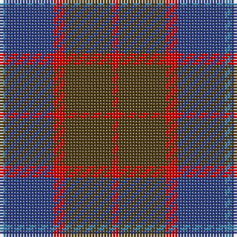

**Bands:** [RGRBB](/stripes/rgrbb/) · **Stripes:** [R DY R DB T](/stripes/stripes5/) R DY R DB T

This was sourced from register-of-tartans.  It is a [5 band tartan](/bands/bands5/).

Original link https://www.tartanregister.gov.uk/tartanDetails.aspx?ref=4198

## Register references

External register numbers recorded for this tartan.

- Scottish Register of Tartans: [4198](https://www.tartanregister.gov.uk/tartanDetails.aspx?ref=4198)
- Scottish Tartans World Register: 78

## Thread count
R/2 T16 R4 Ba16 B/2

## Palette
Each colour and its ΔE from the base-6 reference it is a variant of.

| Colour | Shade | Base | ΔE (OKLab) |
|---|---|---|---|
| B | <code style="background-color:#3C82AF;">#3C82AF</code> `#3C82AF` | B <code style="background-color:#2A418A;">#2A418A</code> | 0.19 |
| Ba | <code style="background-color:#2C4084;">#2C4084</code> `#2C4084` | B <code style="background-color:#2A418A;">#2A418A</code> | 0.01 |
| R | <code style="background-color:#DC0000;">#DC0000</code> `#DC0000` | R <code style="background-color:#CC0000;">#CC0000</code> | 0.03 |
| T | <code style="background-color:#503C14;">#503C14</code> `#503C14` | G <code style="background-color:#006100;">#006100</code> | 0.14 |

# Sample pattern

## Nearest tartans

The nearest existing variants by ΔTartan distance.

1. [Unamed, Riding cloak 1745](/setts/s5/r1o8r2db8t1~x2/) — ΔT 1.12
1. [McCarthy, Old](/setts/s5/db7r26db7dg24ly2~x2/) — ΔT 1.22
1. [Little's Chauffeur Drive](/setts/s6/db1n8w1db4m8w1~x6/) — ΔT 1.25
1. [Balfour blue & brown](/setts/s6/db18ly2o6ly2o19r3~x2/) — ΔT 1.26
1. [Bristol Gramar School Check (School)](/setts/s6/r4n3n12db8n2r4/) — ΔT 1.27
1. [Thompson/Thomson/MacTavish Hunting](/setts/s6/t4dy28dg6t12k12t3~x2/) — ΔT 1.38
1. [Edinburgh International Conference Centre, The](/setts/s6/dy4dt20dy3k20o24dt3~x2/) — ΔT 1.41
1. [Harmony, 6](/setts/s5/dp2g10o15dp10g2~x4/) — ΔT 1.43
1. [Douglas, (Brown)](/setts/s5/k7t3dy30db30w3~x2/) — ΔT 1.43
1. [Harbour Town Hilton Head, The](/setts/s6/dt3g11dt3dr11dt18lo3~x2/) — ΔT 1.44

## Neighbour map

Every grey dot is one of 14299 variants placed by the first two principal components of the ΔTartan feature space (44% of its variance). Red is this tartan; blue dots are its nearest — click one to open its page.

<svg viewBox="0 0 640 380" role="img" style="max-width:100%;height:auto;border:1px solid #e0e0e0;border-radius:4px;display:block" xmlns="http://www.w3.org/2000/svg"><image href="/nn/cloud.v1.png" width="640" height="380"/><a href="/setts/s5/r1o8r2db8t1~x2/"><circle cx="299.5" cy="263.6" r="4" fill="#3465a4"><title>Unamed, Riding cloak 1745</title></circle></a><a href="/setts/s5/db7r26db7dg24ly2~x2/"><circle cx="274.2" cy="240.7" r="4" fill="#3465a4"><title>McCarthy, Old</title></circle></a><a href="/setts/s6/db1n8w1db4m8w1~x6/"><circle cx="208.4" cy="228.8" r="4" fill="#3465a4"><title>Little's Chauffeur Drive</title></circle></a><a href="/setts/s6/db18ly2o6ly2o19r3~x2/"><circle cx="317.3" cy="226.5" r="4" fill="#3465a4"><title>Balfour blue &amp; brown</title></circle></a><a href="/setts/s6/r4n3n12db8n2r4/"><circle cx="197.5" cy="265.4" r="4" fill="#3465a4"><title>Bristol Gramar School Check (School)</title></circle></a><a href="/setts/s6/t4dy28dg6t12k12t3~x2/"><circle cx="249.9" cy="241.5" r="4" fill="#3465a4"><title>Thompson/Thomson/MacTavish Hunting</title></circle></a><a href="/setts/s6/dy4dt20dy3k20o24dt3~x2/"><circle cx="217.7" cy="255.7" r="4" fill="#3465a4"><title>Edinburgh International Conference Centre, The</title></circle></a><a href="/setts/s5/dp2g10o15dp10g2~x4/"><circle cx="253.8" cy="277.7" r="4" fill="#3465a4"><title>Harmony, 6</title></circle></a><a href="/setts/s5/k7t3dy30db30w3~x2/"><circle cx="259.5" cy="228.9" r="4" fill="#3465a4"><title>Douglas, (Brown)</title></circle></a><a href="/setts/s6/dt3g11dt3dr11dt18lo3~x2/"><circle cx="278.0" cy="277.7" r="4" fill="#3465a4"><title>Harbour Town Hilton Head, The</title></circle></a><circle cx="274.0" cy="253.0" r="5" fill="#c00000"/></svg>

ID: /setts/s5/r1dy8r2db8t1~x2/
