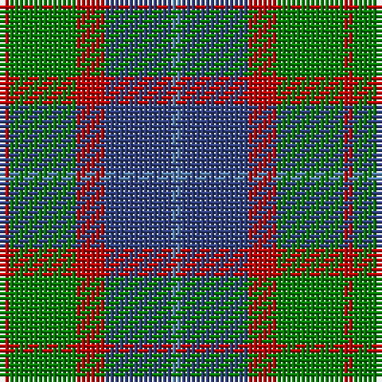

This page is one **sett** — a single exact thread-count. It belongs to the [tartan](/tartans/r1g7r3b7ba1/)
(the same proportion at any scale), whose colour order is pattern [BBRGR](/stripes/bbrgr/).

Sourced from weddslist.  It is a [5 stripe tartan](/stripes/stripes5/).

Original link http://www.weddslist.com/cgi-bin/tartans/pg.pl?source=sts

## Thread count
R/2 G14 R6 B14 Ba/2

## Palette
Each colour and the base-6 reference it is a variant of.

| Colour | Shade | Base |
|---|---|---|
| B | <code style="background-color:#304080;">#304080</code> `oklch(39.4% 0.109 270.2)` <small>#304080</small> | B <code style="background-color:#2A418A;">#2A418A</code> |
| Ba | <code style="background-color:#5480B0;">#5480B0</code> `oklch(58.8% 0.089 251.5)` <small>#5480B0</small> | B <code style="background-color:#2A418A;">#2A418A</code> |
| G | <code style="background-color:#008000;">#008000</code> `oklch(52.0% 0.177 142.5)` <small>#008000</small> | G <code style="background-color:#006100;">#006100</code> |
| R | <code style="background-color:#C00000;">#C00000</code> `oklch(50.7% 0.208 29.2)` <small>#C00000</small> | R <code style="background-color:#CC0000;">#CC0000</code> |

# Sample pattern

## Nearest tartans

The nearest existing variants by ΔTartan distance, with this tartan at the top so the swatches line up against it.

ΔTartan

Tartan

Sett

—

<a href="/ttd/edit/#slug=r1g7r3db7t1~x2">Hebridean 4</a> <a class="nn-out" href="/setts/s5/r1g7r3db7t1~x2/" title="open its dictionary page">↗</a>

0.97

<a href="/ttd/edit/#slug=t4dy28g6t12k12t3~x2">MacTavish Hunting</a> <a class="nn-out" href="/setts/s6/t4dy28g6t12k12t3~x2/" title="open its dictionary page">↗</a>

1.10

<a href="/ttd/edit/#slug=r3db12r4g18r6k2~x2">Eyre (Personal)</a> <a class="nn-out" href="/setts/s6/r3db12r4g18r6k2~x2/" title="open its dictionary page">↗</a>

1.21

<a href="/ttd/edit/#slug=g14db2g2k8dp9k2~x2">MacArthur of Milton Hunting Clan Tartan Tartan Number: 700. Earliest known date: 1823 This is the older of the two MacArthur setts, which links the clan with the Campbells. See products available Copyright © Blair Urquhart, Comrie, 2015</a> <a class="nn-out" href="/setts/s6/g14db2g2k8dp9k2~x2/" title="open its dictionary page">↗</a>

1.23

<a href="/ttd/edit/#slug=o6r1k6r1g6~x6">Timespan</a> <a class="nn-out" href="/setts/s5/o6r1k6r1g6~x6/" title="open its dictionary page">↗</a>

1.23

<a href="/ttd/edit/#slug=k3g14k14g2b14r3~x2">Morrison Society</a> <a class="nn-out" href="/setts/s6/k3g14k14g2b14r3~x2/" title="open its dictionary page">↗</a>

1.23

<a href="/ttd/edit/#slug=r2ly1b8r1g7ly1r2~x6">Cercle de Fermieres de St-Elie . . .</a> <a class="nn-out" href="/setts/s7/r2ly1b8r1g7ly1r2~x6/" title="open its dictionary page">↗</a>

1.24

<a href="/ttd/edit/#slug=t4dy28dg6t12k12t3~x2">Thompson/Thomson/MacTavish Hunting</a> <a class="nn-out" href="/setts/s6/t4dy28dg6t12k12t3~x2/" title="open its dictionary page">↗</a>

1.25

<a href="/ttd/edit/#slug=dg3r1dg9o10db3~x4">Bethlehem, City of</a> <a class="nn-out" href="/setts/s5/dg3r1dg9o10db3~x4/" title="open its dictionary page">↗</a>

1.26

<a href="/ttd/edit/#slug=y3dg6k6y4r1y1~x2">Waterloo</a> <a class="nn-out" href="/setts/s6/y3dg6k6y4r1y1~x2/" title="open its dictionary page">↗</a>

1.26

<a href="/setts/s8/g6k1r1t2r2~x4/">Wilson's No.193</a>

## Neighbour map

Every grey dot is one of 14299 variants placed by the first two principal components of the ΔTartan feature space (44% of its variance). Red is this tartan; blue dots are its nearest — click one to open its page.

<svg viewBox="0 0 640 380" role="img" style="max-width:100%;height:auto;border:1px solid #e0e0e0;border-radius:4px;display:block" xmlns="http://www.w3.org/2000/svg"><image href="/nn/cloud.v1.png" width="640" height="380"/><a href="/setts/s6/t4dy28g6t12k12t3~x2/"><circle cx="237.9" cy="230.6" r="4" fill="#3465a4"><title>MacTavish Hunting</title></circle></a><a href="/setts/s6/r3db12r4g18r6k2~x2/"><circle cx="215.7" cy="223.8" r="4" fill="#3465a4"><title>Eyre (Personal)</title></circle></a><a href="/setts/s6/g14db2g2k8dp9k2~x2/"><circle cx="221.3" cy="245.2" r="4" fill="#3465a4"><title>MacArthur of Milton Hunting Clan Tartan Tartan Number: 700. Earliest known date: 1823 This is the older of the two MacArthur setts, which links the clan with the Campbells. See products available Copyright © Blair Urquhart, Comrie, 2015</title></circle></a><a href="/setts/s5/o6r1k6r1g6~x6/"><circle cx="129.5" cy="256.2" r="4" fill="#3465a4"><title>Timespan</title></circle></a><a href="/setts/s6/k3g14k14g2b14r3~x2/"><circle cx="163.1" cy="247.3" r="4" fill="#3465a4"><title>Morrison Society</title></circle></a><a href="/setts/s7/r2ly1b8r1g7ly1r2~x6/"><circle cx="185.4" cy="203.4" r="4" fill="#3465a4"><title>Cercle de Fermieres de St-Elie . . .</title></circle></a><a href="/setts/s6/t4dy28dg6t12k12t3~x2/"><circle cx="249.9" cy="241.5" r="4" fill="#3465a4"><title>Thompson/Thomson/MacTavish Hunting</title></circle></a><a href="/setts/s5/dg3r1dg9o10db3~x4/"><circle cx="256.4" cy="242.7" r="4" fill="#3465a4"><title>Bethlehem, City of</title></circle></a><a href="/setts/s6/y3dg6k6y4r1y1~x2/"><circle cx="157.5" cy="254.1" r="4" fill="#3465a4"><title>Waterloo</title></circle></a><a href="/setts/s8/g6k1r1t2r2~x4/"><circle cx="164.3" cy="218.3" r="4" fill="#3465a4"><title>Wilson's No.193</title></circle></a><circle cx="201.1" cy="250.4" r="5" fill="#c00000"/></svg>

ID: /setts/s5/r1g7r3db7t1~x2/
