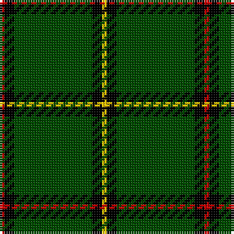

In pattern [RKGKY](/patterns/rkgky/).

This was sourced from weddslist.  It is a [5 stripes tartan](/stripes/stripes5/).

Original link http://www.weddslist.com/cgi-bin/tartans/pg.pl?source=rb

## Thread count
R/2 K4 G32 K4 Y/2

## Palette
Each colour and its ΔE from the base-6 reference it is a variant of.

| Colour | Shade | Base | ΔE (OKLab) |
|---|---|---|---|
| G | <code style="background-color:#004C00;">#004C00</code> `#004C00` | G <code style="background-color:#006100;">#006100</code> | 0.07 |
| K | <code style="background-color:#000000;">#000000</code> `#000000` | K <code style="background-color:#000000;">#000000</code> | 0.00 |
| R | <code style="background-color:#C80000;">#C80000</code> `#C80000` | R <code style="background-color:#CC0000;">#CC0000</code> | 0.01 |
| Y | <code style="background-color:#FFC800;">#FFC800</code> `#FFC800` | Y <code style="background-color:#F2BF00;">#F2BF00</code> | 0.03 |

# Sample pattern

## Nearest tartans

The nearest existing variants by ΔTartan distance.

1. [Skene or Tribe of Mar](/setts/s5/r1k2g16k2y1x2~g005020-k101010-rdc0000-ye8c000/) — ΔT 1.33
1. [Skene, or Tribe of Mar](/setts/s5/r1k2g16k2y1x2~g008000-k000000-rc00000-yf0c000/) — ΔT 1.37
1. [Childers Regimental Tartan Tartan Number: 1090. Earliest known date: 1907 1s Battalion, 1st Gurkha Rifles is recorded as using this tartan for plaids, ribbons and bag-covers. See products available Copyright © Blair Urquhart, Comrie, 2015](/setts/s6/k88g17k8ga28k8r6x2~g289c18-ga006818-k101010-rc80000/) — ΔT 1.52
1. [Inman (2016)](/setts/s7/r2g24k2g12y6k1r2x2~g005020-k101010-rdc0000-ye0a126/) — ΔT 1.55
1. [Childers (Personal)](/setts/s6/k44g8k4ga13k4w3x2~g408060-ga006818-k101010-we0e0e0/) — ΔT 1.58
1. [Military Medical Memorial (USA)](/setts/s6/b6w3r3g55k10r3x4~b292e7f-g016819-k101010-rec1a1b-wffffff/) — ΔT 1.59
1. [Birmingham Irish Pipes & Drums](/setts/s8/g48y3k6w4g3k15y3g4x2~g285800-k000000-wf8f8f8-yc88c00/) — ΔT 1.61
1. [Tyrconnell](/setts/s5/g44b9r2b9g2x2~b000050-g008000-rc00000/) — ΔT 1.64
1. [Military Medical Memorial (USA)(Corp](/setts/s6/b6w3r3g55k10r3x4~b2c2c80-g006818-k101010-rc80000-we0e0e0/) — ΔT 1.67
1. [Tough (Personal)](/setts/s6/b4y1k4g32k4r2x2~b646464-g004c00-k000000-r8c0000-ydcbc00/) — ΔT 1.70

## Neighbour map

Every grey dot is one of 15726 variants placed by the first two principal components of the ΔTartan feature space (44% of its variance). Red is this tartan; blue dots are its nearest — click one to open its page.

<svg viewBox="0 0 640 380" role="img" style="max-width:100%;height:auto;border:1px solid #e0e0e0;border-radius:4px;display:block" xmlns="http://www.w3.org/2000/svg"><image href="/nn/cloud.v1.png" width="640" height="380"/><a href="/setts/s5/r1k2g16k2y1x2~g005020-k101010-rdc0000-ye8c000/"><circle cx="487.6" cy="201.0" r="4" fill="#3465a4"><title>Skene or Tribe of Mar</title></circle></a><a href="/setts/s5/r1k2g16k2y1x2~g008000-k000000-rc00000-yf0c000/"><circle cx="430.2" cy="179.9" r="4" fill="#3465a4"><title>Skene, or Tribe of Mar</title></circle></a><a href="/setts/s6/k88g17k8ga28k8r6x2~g289c18-ga006818-k101010-rc80000/"><circle cx="407.2" cy="198.0" r="4" fill="#3465a4"><title>Childers Regimental Tartan Tartan Number: 1090. Earliest known date: 1907 1s Battalion, 1st Gurkha Rifles is recorded as using this tartan for plaids, ribbons and bag-covers. See products available Copyright © Blair Urquhart, Comrie, 2015</title></circle></a><a href="/setts/s7/r2g24k2g12y6k1r2x2~g005020-k101010-rdc0000-ye0a126/"><circle cx="471.2" cy="173.4" r="4" fill="#3465a4"><title>Inman (2016)</title></circle></a><a href="/setts/s6/k44g8k4ga13k4w3x2~g408060-ga006818-k101010-we0e0e0/"><circle cx="411.0" cy="194.7" r="4" fill="#3465a4"><title>Childers (Personal)</title></circle></a><a href="/setts/s6/b6w3r3g55k10r3x4~b292e7f-g016819-k101010-rec1a1b-wffffff/"><circle cx="409.2" cy="151.2" r="4" fill="#3465a4"><title>Military Medical Memorial (USA)</title></circle></a><a href="/setts/s8/g48y3k6w4g3k15y3g4x2~g285800-k000000-wf8f8f8-yc88c00/"><circle cx="364.9" cy="153.8" r="4" fill="#3465a4"><title>Birmingham Irish Pipes &amp; Drums</title></circle></a><a href="/setts/s5/g44b9r2b9g2x2~b000050-g008000-rc00000/"><circle cx="456.5" cy="200.2" r="4" fill="#3465a4"><title>Tyrconnell</title></circle></a><a href="/setts/s6/b6w3r3g55k10r3x4~b2c2c80-g006818-k101010-rc80000-we0e0e0/"><circle cx="420.1" cy="156.0" r="4" fill="#3465a4"><title>Military Medical Memorial (USA)(Corp</title></circle></a><a href="/setts/s6/b4y1k4g32k4r2x2~b646464-g004c00-k000000-r8c0000-ydcbc00/"><circle cx="439.9" cy="142.5" r="4" fill="#3465a4"><title>Tough (Personal)</title></circle></a><circle cx="453.4" cy="189.6" r="5" fill="#c00000"/></svg>

ID: /setts/s5/r1k2g16k2y1x2~g004c00-k000000-rc80000-yffc800/
