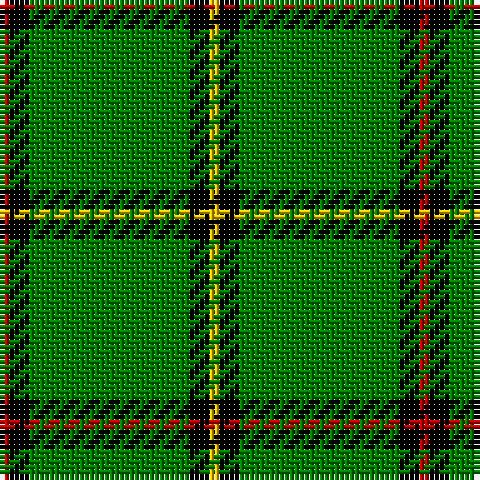

In pattern [RKGKY](/patterns/rkgky/).

This was sourced from weddslist.  It is a [5 stripes tartan](/stripes/stripes5/).

Original link http://www.weddslist.com/cgi-bin/tartans/pg.pl?source=sts

## Thread count
R/2 K4 G32 K4 Y/2

## Palette
Each colour and its ΔE from the base-6 reference it is a variant of.

| Colour | Shade | Base | ΔE (OKLab) |
|---|---|---|---|
| G | <code style="background-color:#008000;">#008000</code> `#008000` | G <code style="background-color:#006100;">#006100</code> | 0.10 |
| K | <code style="background-color:#000000;">#000000</code> `#000000` | K <code style="background-color:#000000;">#000000</code> | 0.00 |
| R | <code style="background-color:#C00000;">#C00000</code> `#C00000` | R <code style="background-color:#CC0000;">#CC0000</code> | 0.03 |
| Y | <code style="background-color:#F0C000;">#F0C000</code> `#F0C000` | Y <code style="background-color:#F2BF00;">#F2BF00</code> | 0.00 |

# Sample pattern

## Nearest tartans

The nearest existing variants by ΔTartan distance.

1. [Mar District](/setts/s5/r1k2g16k2y1x2~g004c00-k000000-rc80000-yffc800/) — ΔT 1.37
1. [Mar, (Tribe of..)](/setts/s5/r2k4g45k3y2~g008000-k000000-rc00000-yf0c000/) — ΔT 1.39
1. [Leach Htg (Name)](/setts/s6/k3w1g21k2b3w2x2~b501400-g289c18-k101010-wc0c0c0/) — ΔT 1.45
1. [Marshall University](/setts/s8/g25w1ga2w1g6k2w2ga3x2~g146400-ga003c14-k101010-wffffff/) — ΔT 1.50
1. [Instakilt, Green (Fashion)](/setts/s7/g8w4g50k12g4k15y5x2~g289c18-k101010-wf8f8f8-ybc8c00/) — ΔT 1.57
1. [Tyrconnell](/setts/s5/g44b9r2b9g2x2~b000050-g008000-rc00000/) — ΔT 1.58
1. [Tahrir - Liberation (Fashion)](/setts/s6/k5w4r15g70k4w5x2~g289c18-k101010-rc80000-we0e0e0/) — ΔT 1.62
1. [Fife, Duke of..](/setts/s6/g32k6g4k8r1k2x2~g008000-k000000-rc00000/) — ΔT 1.65
1. [Sir Billi (Corporate)](/setts/s6/r8g12w5k11g42k3x2~g347400-k101010-rc80000-wf4f8c8/) — ΔT 1.68
1. [Loch Rannoch](/setts/s5/g37w9g3k9w3~g008000-k000000-we0e0e0/) — ΔT 1.71

## Neighbour map

Every grey dot is one of 15726 variants placed by the first two principal components of the ΔTartan feature space (44% of its variance). Red is this tartan; blue dots are its nearest — click one to open its page.

<svg viewBox="0 0 640 380" role="img" style="max-width:100%;height:auto;border:1px solid #e0e0e0;border-radius:4px;display:block" xmlns="http://www.w3.org/2000/svg"><image href="/nn/cloud.v1.png" width="640" height="380"/><a href="/setts/s5/r1k2g16k2y1x2~g004c00-k000000-rc80000-yffc800/"><circle cx="453.4" cy="189.6" r="4" fill="#3465a4"><title>Mar District</title></circle></a><a href="/setts/s5/r2k4g45k3y2~g008000-k000000-rc00000-yf0c000/"><circle cx="523.1" cy="167.8" r="4" fill="#3465a4"><title>Mar, (Tribe of..)</title></circle></a><a href="/setts/s6/k3w1g21k2b3w2x2~b501400-g289c18-k101010-wc0c0c0/"><circle cx="385.1" cy="156.7" r="4" fill="#3465a4"><title>Leach Htg (Name)</title></circle></a><a href="/setts/s8/g25w1ga2w1g6k2w2ga3x2~g146400-ga003c14-k101010-wffffff/"><circle cx="470.0" cy="146.0" r="4" fill="#3465a4"><title>Marshall University</title></circle></a><a href="/setts/s7/g8w4g50k12g4k15y5x2~g289c18-k101010-wf8f8f8-ybc8c00/"><circle cx="335.9" cy="180.1" r="4" fill="#3465a4"><title>Instakilt, Green (Fashion)</title></circle></a><a href="/setts/s5/g44b9r2b9g2x2~b000050-g008000-rc00000/"><circle cx="456.5" cy="200.2" r="4" fill="#3465a4"><title>Tyrconnell</title></circle></a><a href="/setts/s6/k5w4r15g70k4w5x2~g289c18-k101010-rc80000-we0e0e0/"><circle cx="404.5" cy="156.9" r="4" fill="#3465a4"><title>Tahrir - Liberation (Fashion)</title></circle></a><a href="/setts/s6/g32k6g4k8r1k2x2~g008000-k000000-rc00000/"><circle cx="439.1" cy="172.0" r="4" fill="#3465a4"><title>Fife, Duke of..</title></circle></a><a href="/setts/s6/r8g12w5k11g42k3x2~g347400-k101010-rc80000-wf4f8c8/"><circle cx="371.9" cy="194.9" r="4" fill="#3465a4"><title>Sir Billi (Corporate)</title></circle></a><a href="/setts/s5/g37w9g3k9w3~g008000-k000000-we0e0e0/"><circle cx="354.7" cy="209.3" r="4" fill="#3465a4"><title>Loch Rannoch</title></circle></a><circle cx="430.2" cy="179.9" r="5" fill="#c00000"/></svg>

ID: /setts/s5/r1k2g16k2y1x2~g008000-k000000-rc00000-yf0c000/
