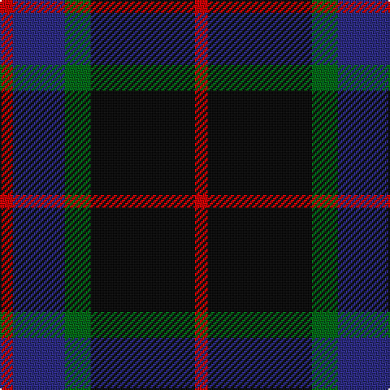

In pattern [RBGKR](/patterns/rbgkr/).

This was sourced from register-of-tartans.  It is a [5 stripes tartan](/stripes/stripes5/).

Original link https://www.tartanregister.gov.uk/tartanDetails.aspx?ref=3089

## Attestations

This cloth appears in 2 source records; the oldest owns this page.

- 01/01/1930 — Nairn (register-of-tartans, [record](https://www.tartanregister.gov.uk/tartanDetails.aspx?ref=3089))
- 1930 — Nairn (Name) (tartans-authority, [record](http://www.tartansauthority.com/tartan-ferret/display/1331/))

## Thread count
R/8 DB32 G16 K64 R/8

## Palette
Each colour and its ΔE from the base-6 reference it is a variant of.

| Colour | Shade | Base | ΔE (OKLab) |
|---|---|---|---|
| DB | <code style="background-color:#2C2C80;">#2C2C80</code> `#2C2C80` | B <code style="background-color:#2A418A;">#2A418A</code> | 0.06 |
| G | <code style="background-color:#006818;">#006818</code> `#006818` | G <code style="background-color:#006100;">#006100</code> | 0.02 |
| K | <code style="background-color:#101010;">#101010</code> `#101010` | K <code style="background-color:#000000;">#000000</code> | 0.17 |
| R | <code style="background-color:#C80000;">#C80000</code> `#C80000` | R <code style="background-color:#CC0000;">#CC0000</code> | 0.01 |

# Sample pattern

## Nearest tartans

The nearest existing variants by ΔTartan distance.

1. [Nairn Family Tartan Tartan Number: 1331. Earliest known date: c.1930 The exact date of this design is uncertain. We know that it appeared around 1930 in the collection of Messrs. Anderson of Edinburgh. (Later Kinloch Anderson). A note on the weavers scale in the STS collection states '..worn by the Spencer-Nairn family. (done)'. The design is similar to the Hunting Brodie sett without the yellow. Nairns were first recorded in Fife and later in Moray. There is also a family called Nairne of Dunsinnan in Perthshire of MacBeth fame. See products available Copyright © Blair Urquhart, Comrie, 2015](/setts/s5/r1k8g2b4r1~b2c2c80-g006818-k101010-rc80000~x4/) — ΔT 0.00
1. [MacArthur of Milton (Clan)](/setts/s6/g7b1g1k4ba4k1~b28287c-ba700070-g006c3c-k101010~x4/) — ΔT 1.04
1. [Britannia](/setts/s5/k14r4k25b30w4~b202060-k101010-rc80000-we0e0e0~x2/) — ΔT 1.05
1. [Mayer, Chris (Personal)](/setts/s4/b1ba6k6r1~b1c0070-ba5c5c5c-k101010-rc80000~x10/) — ΔT 1.06
1. [MacArthur of Milton Hunting Clan Tartan Tartan Number: 700. Earliest known date: 1823 This is the older of the two MacArthur setts, which links the clan with the Campbells. See products available Copyright © Blair Urquhart, Comrie, 2015](/setts/s6/g14b2g2k8ba9k2~b2c2c80-ba780078-g006818-k101010~x2/) — ΔT 1.11
1. [Givens (Arizona)](/setts/s6/k42w5g16k5k5b21~b202060-g003820-k101010-wfcfcfc~x2/) — ΔT 1.12
1. [The Harbour Town, Hilton Head](/setts/s6/k3g11k3b11k18r3~b600030-g004010-k000030-r906030~x2/) — ΔT 1.23
1. [Fibonacci7](/setts/s7/b13g8r5b3g2r1y1~b141e46-g004c00-rb03000-yffe600~x4/) — ΔT 1.28
1. [Glen Nevis #1 (Fashion)](/setts/s8/g8r2g2r3g8b12g2y2~b1c0070-g003820-r880000-ye8c000~x2/) — ΔT 1.28
1. [Givens (Arizona)](/setts/s6/k42w5k5g16k5b21~b141e46-g004028-k101010-wffffff~x2/) — ΔT 1.28

## Neighbour map

Every grey dot is one of 15726 variants placed by the first two principal components of the ΔTartan feature space (44% of its variance). Red is this tartan; blue dots are its nearest — click one to open its page.

<svg viewBox="0 0 640 380" role="img" style="max-width:100%;height:auto;border:1px solid #e0e0e0;border-radius:4px;display:block" xmlns="http://www.w3.org/2000/svg"><image href="/nn/cloud.v1.png" width="640" height="380"/><a href="/setts/s5/r1k8g2b4r1~b2c2c80-g006818-k101010-rc80000~x4/"><circle cx="271.9" cy="241.9" r="4" fill="#3465a4"><title>Nairn Family Tartan Tartan Number: 1331. Earliest known date: c.1930 The exact date of this design is uncertain. We know that it appeared around 1930 in the collection of Messrs. Anderson of Edinburgh. (Later Kinloch Anderson). A note on the weavers scale in the STS collection states '..worn by the Spencer-Nairn family. (done)'. The design is similar to the Hunting Brodie sett without the yellow. Nairns were first recorded in Fife and later in Moray. There is also a family called Nairne of Dunsinnan in Perthshire of MacBeth fame. See products available Copyright © Blair Urquhart, Comrie, 2015</title></circle></a><a href="/setts/s6/g7b1g1k4ba4k1~b28287c-ba700070-g006c3c-k101010~x4/"><circle cx="230.6" cy="245.0" r="4" fill="#3465a4"><title>MacArthur of Milton (Clan)</title></circle></a><a href="/setts/s5/k14r4k25b30w4~b202060-k101010-rc80000-we0e0e0~x2/"><circle cx="283.0" cy="260.8" r="4" fill="#3465a4"><title>Britannia</title></circle></a><a href="/setts/s4/b1ba6k6r1~b1c0070-ba5c5c5c-k101010-rc80000~x10/"><circle cx="251.5" cy="272.4" r="4" fill="#3465a4"><title>Mayer, Chris (Personal)</title></circle></a><a href="/setts/s6/g14b2g2k8ba9k2~b2c2c80-ba780078-g006818-k101010~x2/"><circle cx="218.6" cy="242.3" r="4" fill="#3465a4"><title>MacArthur of Milton Hunting Clan Tartan Tartan Number: 700. Earliest known date: 1823 This is the older of the two MacArthur setts, which links the clan with the Campbells. See products available Copyright © Blair Urquhart, Comrie, 2015</title></circle></a><a href="/setts/s6/k42w5g16k5k5b21~b202060-g003820-k101010-wfcfcfc~x2/"><circle cx="303.6" cy="238.7" r="4" fill="#3465a4"><title>Givens (Arizona)</title></circle></a><a href="/setts/s6/k3g11k3b11k18r3~b600030-g004010-k000030-r906030~x2/"><circle cx="265.5" cy="269.0" r="4" fill="#3465a4"><title>The Harbour Town, Hilton Head</title></circle></a><a href="/setts/s7/b13g8r5b3g2r1y1~b141e46-g004c00-rb03000-yffe600~x4/"><circle cx="281.4" cy="204.8" r="4" fill="#3465a4"><title>Fibonacci7</title></circle></a><a href="/setts/s8/g8r2g2r3g8b12g2y2~b1c0070-g003820-r880000-ye8c000~x2/"><circle cx="261.3" cy="242.6" r="4" fill="#3465a4"><title>Glen Nevis #1 (Fashion)</title></circle></a><a href="/setts/s6/k42w5k5g16k5b21~b141e46-g004028-k101010-wffffff~x2/"><circle cx="306.7" cy="240.9" r="4" fill="#3465a4"><title>Givens (Arizona)</title></circle></a><circle cx="271.9" cy="241.9" r="5" fill="#c00000"/></svg>

ID: /setts/s5/r1k8g2b4r1~b2c2c80-g006818-k101010-rc80000~x8/
