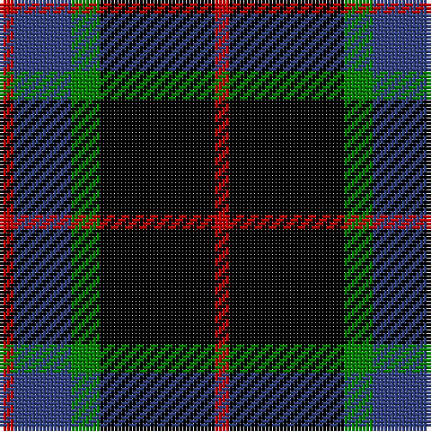

In pattern [RBGKR](/patterns/rbgkr/).

This was sourced from weddslist.  It is a [5 stripes tartan](/stripes/stripes5/).

Original link http://www.weddslist.com/cgi-bin/tartans/pg.pl?source=sts

## Thread count
R/4 B16 G8 K32 R/4

## Palette
Each colour and its ΔE from the base-6 reference it is a variant of.

| Colour | Shade | Base | ΔE (OKLab) |
|---|---|---|---|
| B | <code style="background-color:#304080;">#304080</code> `#304080` | B <code style="background-color:#2A418A;">#2A418A</code> | 0.02 |
| G | <code style="background-color:#008000;">#008000</code> `#008000` | G <code style="background-color:#006100;">#006100</code> | 0.10 |
| K | <code style="background-color:#000000;">#000000</code> `#000000` | K <code style="background-color:#000000;">#000000</code> | 0.00 |
| R | <code style="background-color:#C00000;">#C00000</code> `#C00000` | R <code style="background-color:#CC0000;">#CC0000</code> | 0.03 |

# Sample pattern

## Nearest tartans

The nearest existing variants by ΔTartan distance.

1. [Melville](/setts/s6/k5w2g18k17b16k3~b5a3094-g004c00-k000000-wd0d0d0/) — ΔT 1.10
1. [Wcwm 1106-2](/setts/s5/k4g3b18k18w2~b4c1864-g004c00-k000000-wc8c8c8~x2/) — ΔT 1.13
1. [College of Radiographers](/setts/s5/k15g2k10b18w3~b304080-g908000-k000000-we0e0e0~x2/) — ΔT 1.22
1. [Graham W](/setts/s6/g21w2g4k17b14k3~b5a3094-g004c00-k000000-wd0d0d0/) — ΔT 1.23
1. [Melville](/setts/s6/k5y2g18k17b16k3~b6e5058-g11450d-k000000-yaaaaaa~x2/) — ΔT 1.23
1. [Melville](/setts/s6/k5y2g18k17b16k3~b6e5058-g11450d-k000000-yaaaaaa/) — ΔT 1.23
1. [LP Cover (Dance)](/setts/s7/y3k9y1k1k6k2y3~k000000-yc89800~x4/) — ΔT 1.26
1. [Scott, Sir Walter](/setts/s6/k3b9k11ba2g9k3~b800080-ba5480b0-g008000-k000000~x2/) — ΔT 1.27
1. [Guthrie](/setts/s9/k1g8k9r1k1r1k9b8r1~b304080-g008000-k000000-rc00000~x6/) — ΔT 1.31
1. [Forbes Ancient](/setts/s7/b1k6b6k6g6k1w1~b304080-g008000-k000000-we0e0e0~x2/) — ΔT 1.36

## Neighbour map

Every grey dot is one of 15726 variants placed by the first two principal components of the ΔTartan feature space (44% of its variance). Red is this tartan; blue dots are its nearest — click one to open its page.

<svg viewBox="0 0 640 380" role="img" style="max-width:100%;height:auto;border:1px solid #e0e0e0;border-radius:4px;display:block" xmlns="http://www.w3.org/2000/svg"><image href="/nn/cloud.v1.png" width="640" height="380"/><a href="/setts/s6/k5w2g18k17b16k3~b5a3094-g004c00-k000000-wd0d0d0/"><circle cx="183.8" cy="231.9" r="4" fill="#3465a4"><title>Melville</title></circle></a><a href="/setts/s5/k4g3b18k18w2~b4c1864-g004c00-k000000-wc8c8c8~x2/"><circle cx="268.8" cy="232.9" r="4" fill="#3465a4"><title>Wcwm 1106-2</title></circle></a><a href="/setts/s5/k15g2k10b18w3~b304080-g908000-k000000-we0e0e0~x2/"><circle cx="247.2" cy="243.3" r="4" fill="#3465a4"><title>College of Radiographers</title></circle></a><a href="/setts/s6/g21w2g4k17b14k3~b5a3094-g004c00-k000000-wd0d0d0/"><circle cx="197.2" cy="222.2" r="4" fill="#3465a4"><title>Graham W</title></circle></a><a href="/setts/s6/k5y2g18k17b16k3~b6e5058-g11450d-k000000-yaaaaaa~x2/"><circle cx="192.1" cy="234.3" r="4" fill="#3465a4"><title>Melville</title></circle></a><a href="/setts/s6/k5y2g18k17b16k3~b6e5058-g11450d-k000000-yaaaaaa/"><circle cx="192.1" cy="234.3" r="4" fill="#3465a4"><title>Melville</title></circle></a><a href="/setts/s7/y3k9y1k1k6k2y3~k000000-yc89800~x4/"><circle cx="207.5" cy="212.9" r="4" fill="#3465a4"><title>LP Cover (Dance)</title></circle></a><a href="/setts/s6/k3b9k11ba2g9k3~b800080-ba5480b0-g008000-k000000~x2/"><circle cx="165.1" cy="253.5" r="4" fill="#3465a4"><title>Scott, Sir Walter</title></circle></a><a href="/setts/s9/k1g8k9r1k1r1k9b8r1~b304080-g008000-k000000-rc00000~x6/"><circle cx="229.7" cy="198.4" r="4" fill="#3465a4"><title>Guthrie</title></circle></a><a href="/setts/s7/b1k6b6k6g6k1w1~b304080-g008000-k000000-we0e0e0~x2/"><circle cx="180.6" cy="242.4" r="4" fill="#3465a4"><title>Forbes Ancient</title></circle></a><circle cx="230.6" cy="229.2" r="5" fill="#c00000"/></svg>

ID: /setts/s5/r1k8g2b4r1~b304080-g008000-k000000-rc00000~x4/
